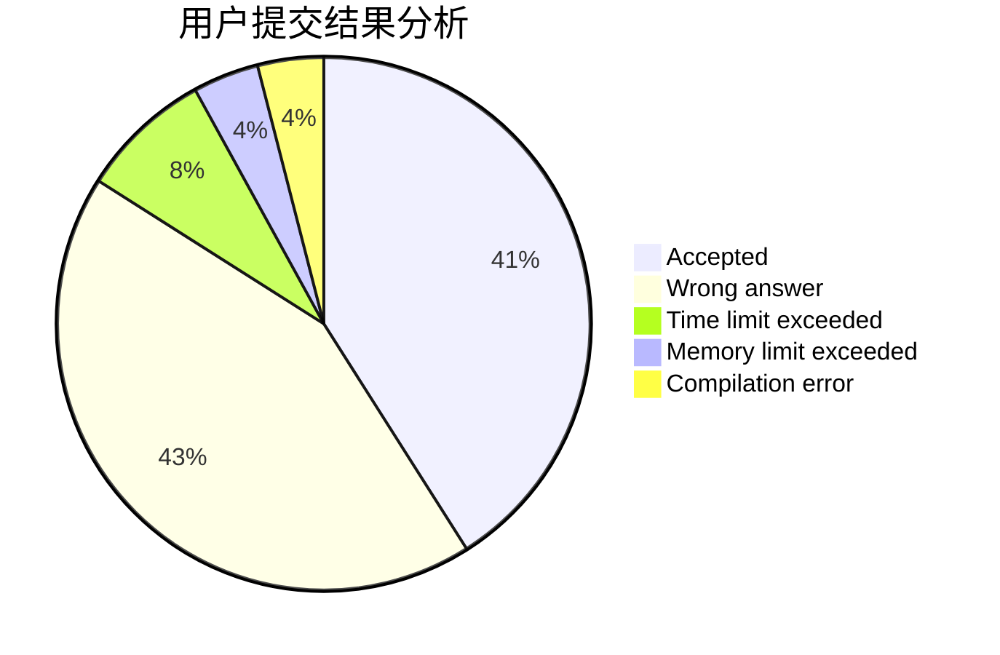
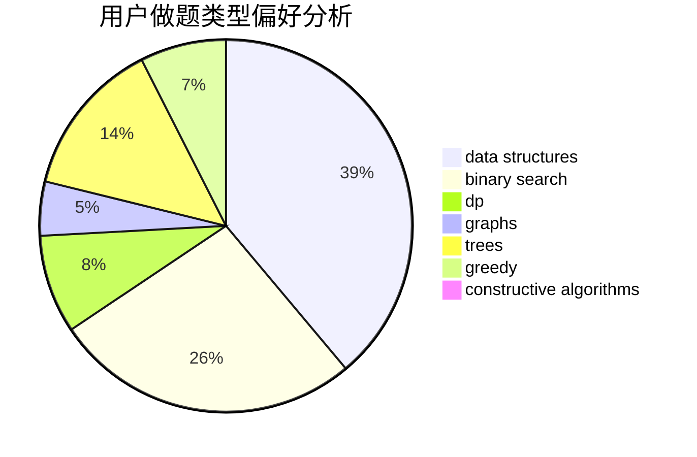
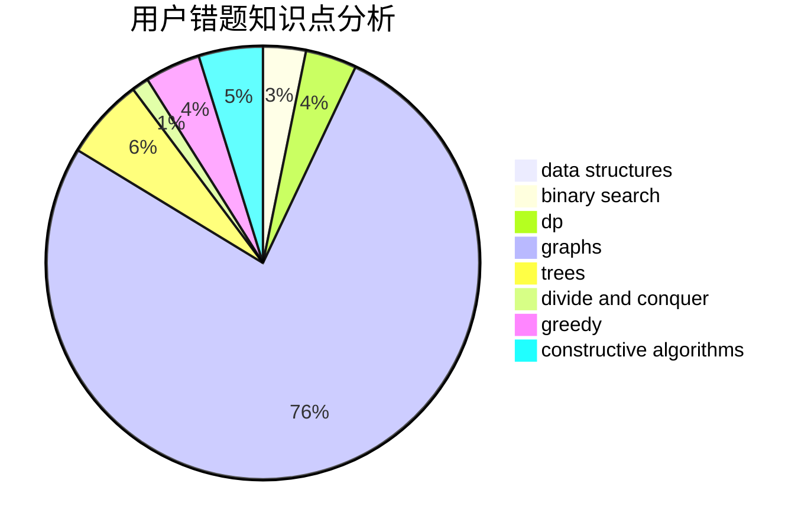

# GavinZheng
<!-- tabs:start -->
#### **用户提交结果分析**

#### **用户做题类型偏好分析**

#### **用户错题知识点分析**

<!-- tabs:end -->
# 推荐题目
[Find Divisible](http://codeforces.com/problemset/problem/1096/A)		greedy,
                        implementation,
                        math		  
[Dwarves, Hats and Extrasensory Abilities](https://codeforces.com/contest/1064/problem/E)		binary search,
                        constructive algorithms,
                        geometry,
                        interactive		  
[Quantum Classification - Dataset 5](http://codeforces.com/problemset/problem/1357/D3)		nan		  
[Andryusha and Socks](https://codeforces.com/contest/782/problem/A)		implementation		  
[Tourist's Notes](http://codeforces.com/problemset/problem/538/C)		binary search,
                        brute force,
                        greedy,
                        implementation,
                        math		  
[Beru-taxi](http://codeforces.com/problemset/problem/706/A)		brute force,
                        geometry,
                        implementation		  
[IQ test](http://codeforces.com/problemset/problem/25/A)		brute force		  
[Spaceship Solitaire](http://codeforces.com/problemset/problem/1266/E)		data structures,
                        greedy,
                        implementation		  
[Out of Controls](http://codeforces.com/problemset/problem/656/E)		*special problem		  
[Doe Graphs](http://codeforces.com/problemset/problem/232/C)		constructive algorithms,
                        divide and conquer,
                        dp,
                        graphs,
                        shortest paths		  
<!-- tabs:start -->
#### **data structures**
[Spaceship Solitaire](http://codeforces.com/problemset/problem/1266/E)		data structures,
                        greedy,
                        implementation		  
[High Cry](https://codeforces.com/contest/876/problem/F)		binary search,
                        bitmasks,
                        combinatorics,
                        data structures,
                        divide and conquer		  
[Pair of Topics](http://codeforces.com/problemset/problem/1324/D)		binary search,
                        data structures,
                        sortings,
                        two pointers		  
[GCD of an Array](http://codeforces.com/problemset/problem/1493/D)		brute force,
                        data structures,
                        hashing,
                        implementation,
                        math,
                        number theory,
                        sortings,
                        two pointers		  
[Journey Planning](https://codeforces.com/contest/1321/problem/B)		data structures,
                        dp,
                        greedy,
                        math,
                        sortings		  
[New Year and Conference](http://codeforces.com/problemset/problem/1284/D)		binary search,
                        data structures,
                        hashing,
                        sortings		  
[Welfare State](https://codeforces.com/contest/1199/problem/D)		binary search,
                        brute force,
                        data structures,
                        sortings		  
[Maximum width](http://codeforces.com/problemset/problem/1492/C)		binary search,
                        data structures,
                        dp,
                        greedy,
                        two pointers		  
[Old Floppy Drive](http://codeforces.com/problemset/problem/1490/G)		binary search,
                        data structures,
                        math		  
[Odd Mineral Resource](http://codeforces.com/problemset/problem/1479/D)		binary search,
                        bitmasks,
                        brute force,
                        data structures,
                        probabilities,
                        trees		  
#### **binary search**
[Dwarves, Hats and Extrasensory Abilities](https://codeforces.com/contest/1064/problem/E)		binary search,
                        constructive algorithms,
                        geometry,
                        interactive		  
[Tourist's Notes](http://codeforces.com/problemset/problem/538/C)		binary search,
                        brute force,
                        greedy,
                        implementation,
                        math		  
[High Cry](https://codeforces.com/contest/876/problem/F)		binary search,
                        bitmasks,
                        combinatorics,
                        data structures,
                        divide and conquer		  
[Michael and Charging Stations](http://codeforces.com/problemset/problem/853/D)		binary search,
                        dp,
                        greedy		  
[Photo Processing](http://codeforces.com/problemset/problem/883/I)		binary search,
                        dp		  
[Pair of Topics](http://codeforces.com/problemset/problem/1324/D)		binary search,
                        data structures,
                        sortings,
                        two pointers		  
[MST Company](http://codeforces.com/problemset/problem/125/E)		binary search,
                        graphs		  
[New Year and Conference](http://codeforces.com/problemset/problem/1284/D)		binary search,
                        data structures,
                        hashing,
                        sortings		  
[Welfare State](https://codeforces.com/contest/1199/problem/D)		binary search,
                        brute force,
                        data structures,
                        sortings		  
[Maximum width](http://codeforces.com/problemset/problem/1492/C)		binary search,
                        data structures,
                        dp,
                        greedy,
                        two pointers		  
#### **dp**
[Doe Graphs](http://codeforces.com/problemset/problem/232/C)		constructive algorithms,
                        divide and conquer,
                        dp,
                        graphs,
                        shortest paths		  
[Jeff and Furik](http://codeforces.com/problemset/problem/351/B)		combinatorics,
                        dp,
                        probabilities		  
[Double Elimination](https://codeforces.com/contest/1314/problem/B)		dp,
                        implementation		  
[Michael and Charging Stations](http://codeforces.com/problemset/problem/853/D)		binary search,
                        dp,
                        greedy		  
[Photo Processing](http://codeforces.com/problemset/problem/883/I)		binary search,
                        dp		  
[Journey Planning](https://codeforces.com/contest/1321/problem/B)		data structures,
                        dp,
                        greedy,
                        math,
                        sortings		  
[Maximum width](http://codeforces.com/problemset/problem/1492/C)		binary search,
                        data structures,
                        dp,
                        greedy,
                        two pointers		  
[Bouncing Ball](https://codeforces.com/contest/1457/problem/C)		brute force,
                        dp,
                        implementation		  
[Pekora and Trampoline](http://codeforces.com/problemset/problem/1491/C)		brute force,
                        data structures,
                        dp,
                        greedy,
                        implementation		  
[Chef Monocarp](http://codeforces.com/problemset/problem/1437/C)		dp,
                        flows,
                        graph matchings,
                        greedy,
                        math,
                        sortings		  
#### **graph**
[Doe Graphs](http://codeforces.com/problemset/problem/232/C)		constructive algorithms,
                        divide and conquer,
                        dp,
                        graphs,
                        shortest paths		  
[MST Company](http://codeforces.com/problemset/problem/125/E)		binary search,
                        graphs		  
[Useful Edges](https://codeforces.com/contest/1483/problem/D)		graphs,
                        shortest paths		  
[Minimum Ties](http://codeforces.com/problemset/problem/1487/C)		brute force,
                        constructive algorithms,
                        dfs and similar,
                        graphs,
                        greedy,
                        implementation,
                        math		  
[Chef Monocarp](http://codeforces.com/problemset/problem/1437/C)		dp,
                        flows,
                        graph matchings,
                        greedy,
                        math,
                        sortings		  
[Strange Housing](http://codeforces.com/problemset/problem/1470/D)		constructive algorithms,
                        dfs and similar,
                        graph matchings,
                        graphs,
                        greedy		  
[Longest Simple Cycle](http://codeforces.com/problemset/problem/1476/C)		dp,
                        graphs,
                        greedy		  
[Shortest and Longest LIS](http://codeforces.com/problemset/problem/1304/D)		constructive algorithms,
                        graphs,
                        greedy,
                        two pointers		  
[Ball in Berland](http://codeforces.com/problemset/problem/1475/C)		combinatorics,
                        graphs,
                        math		  
[Kyoya and Train](http://codeforces.com/problemset/problem/553/E)		dp,
                        fft,
                        graphs,
                        math,
                        probabilities		  
#### **trees**
[Edge Weight Assignment](https://codeforces.com/contest/1339/problem/D)		bitmasks,
                        constructive algorithms,
                        dfs and similar,
                        greedy,
                        math,
                        trees		  
[Minimum Diameter Tree](https://codeforces.com/contest/1087/problem/D)		constructive algorithms,
                        implementation,
                        trees		  
[Odd Mineral Resource](http://codeforces.com/problemset/problem/1479/D)		binary search,
                        bitmasks,
                        brute force,
                        data structures,
                        probabilities,
                        trees		  
[Yet Another Card Deck](http://codeforces.com/problemset/problem/1511/C)		brute force,
                        data structures,
                        implementation,
                        trees		  
[Diameter Cuts](http://codeforces.com/problemset/problem/1499/F)		combinatorics,
                        dfs and similar,
                        dp,
                        trees		  
[Fib-tree](http://codeforces.com/problemset/problem/1491/E)		brute force,
                        dfs and similar,
                        divide and conquer,
                        number theory,
                        trees		  
[13th Labour of Heracles](http://codeforces.com/problemset/problem/1466/D)		data structures,
                        greedy,
                        sortings,
                        trees		  
[BFS Trees](http://codeforces.com/problemset/problem/1495/D)		combinatorics,
                        dfs and similar,
                        graphs,
                        math,
                        shortest paths,
                        trees		  
[Sum of Prefix Sums](http://codeforces.com/problemset/problem/1303/G)		data structures,
                        divide and conquer,
                        geometry,
                        trees		  
[Number of Simple Paths](http://codeforces.com/problemset/problem/1454/E)		combinatorics,
                        dfs and similar,
                        graphs,
                        trees		  
#### **divide and conquer**
[Doe Graphs](http://codeforces.com/problemset/problem/232/C)		constructive algorithms,
                        divide and conquer,
                        dp,
                        graphs,
                        shortest paths		  
[High Cry](https://codeforces.com/contest/876/problem/F)		binary search,
                        bitmasks,
                        combinatorics,
                        data structures,
                        divide and conquer		  
[Divide and Summarize](http://codeforces.com/problemset/problem/1461/D)		binary search,
                        brute force,
                        data structures,
                        divide and conquer,
                        implementation,
                        sortings		  
[Song of the Sirens](http://codeforces.com/problemset/problem/1466/G)		combinatorics,
                        divide and conquer,
                        hashing,
                        math,
                        string suffix structures,
                        strings		  
[Permutation Transformation](http://codeforces.com/problemset/problem/1490/D)		dfs and similar,
                        divide and conquer,
                        implementation		  
[Skyline Photo](https://codeforces.com/contest/1483/problem/C)		data structures,
                        divide and conquer,
                        dp		  
[Fib-tree](http://codeforces.com/problemset/problem/1491/E)		brute force,
                        dfs and similar,
                        divide and conquer,
                        number theory,
                        trees		  
[Sum of Prefix Sums](http://codeforces.com/problemset/problem/1303/G)		data structures,
                        divide and conquer,
                        geometry,
                        trees		  
[Dogeforces](http://codeforces.com/problemset/problem/1494/D)		constructive algorithms,
                        data structures,
                        dfs and similar,
                        divide and conquer,
                        dsu,
                        greedy,
                        sortings,
                        trees		  
[Logistical Questions](http://codeforces.com/problemset/problem/566/C)		dfs and similar,
                        divide and conquer,
                        trees		  
#### **greedy**
[Find Divisible](http://codeforces.com/problemset/problem/1096/A)		greedy,
                        implementation,
                        math		  
[Tourist's Notes](http://codeforces.com/problemset/problem/538/C)		binary search,
                        brute force,
                        greedy,
                        implementation,
                        math		  
[Spaceship Solitaire](http://codeforces.com/problemset/problem/1266/E)		data structures,
                        greedy,
                        implementation		  
[Travel Cards](http://codeforces.com/problemset/problem/847/K)		greedy,
                        implementation,
                        sortings		  
[OR in Matrix](http://codeforces.com/problemset/problem/486/B)		greedy,
                        hashing,
                        implementation		  
[Michael and Charging Stations](http://codeforces.com/problemset/problem/853/D)		binary search,
                        dp,
                        greedy		  
[Turn the Rectangles](http://codeforces.com/problemset/problem/1008/B)		greedy,
                        sortings		  
[Edge Weight Assignment](https://codeforces.com/contest/1339/problem/D)		bitmasks,
                        constructive algorithms,
                        dfs and similar,
                        greedy,
                        math,
                        trees		  
[Journey Planning](https://codeforces.com/contest/1321/problem/B)		data structures,
                        dp,
                        greedy,
                        math,
                        sortings		  
[Maximum width](http://codeforces.com/problemset/problem/1492/C)		binary search,
                        data structures,
                        dp,
                        greedy,
                        two pointers		  
#### **constructive algorithms**
[Dwarves, Hats and Extrasensory Abilities](https://codeforces.com/contest/1064/problem/E)		binary search,
                        constructive algorithms,
                        geometry,
                        interactive		  
[Doe Graphs](http://codeforces.com/problemset/problem/232/C)		constructive algorithms,
                        divide and conquer,
                        dp,
                        graphs,
                        shortest paths		  
[Edge Weight Assignment](https://codeforces.com/contest/1339/problem/D)		bitmasks,
                        constructive algorithms,
                        dfs and similar,
                        greedy,
                        math,
                        trees		  
[Minimum Diameter Tree](https://codeforces.com/contest/1087/problem/D)		constructive algorithms,
                        implementation,
                        trees		  
[Anti-knapsack](http://codeforces.com/problemset/problem/1493/A)		constructive algorithms,
                        greedy		  
[Pairs](http://codeforces.com/problemset/problem/1463/D)		binary search,
                        constructive algorithms,
                        greedy,
                        two pointers		  
[XOR-gun](https://codeforces.com/contest/1456/problem/B)		bitmasks,
                        brute force,
                        constructive algorithms		  
[Genius's Gambit](http://codeforces.com/problemset/problem/1492/D)		bitmasks,
                        constructive algorithms,
                        greedy,
                        math		  
[3-Coloring](https://codeforces.com/contest/1504/problem/D)		constructive algorithms,
                        games,
                        interactive		  
[Basic Diplomacy](https://codeforces.com/contest/1483/problem/A)		brute force,
                        constructive algorithms,
                        greedy,
                        implementation		  
#### **sortings**
[Travel Cards](http://codeforces.com/problemset/problem/847/K)		greedy,
                        implementation,
                        sortings		  
[Turn the Rectangles](http://codeforces.com/problemset/problem/1008/B)		greedy,
                        sortings		  
[Pair of Topics](http://codeforces.com/problemset/problem/1324/D)		binary search,
                        data structures,
                        sortings,
                        two pointers		  
[GCD of an Array](http://codeforces.com/problemset/problem/1493/D)		brute force,
                        data structures,
                        hashing,
                        implementation,
                        math,
                        number theory,
                        sortings,
                        two pointers		  
[Journey Planning](https://codeforces.com/contest/1321/problem/B)		data structures,
                        dp,
                        greedy,
                        math,
                        sortings		  
[New Year and Conference](http://codeforces.com/problemset/problem/1284/D)		binary search,
                        data structures,
                        hashing,
                        sortings		  
[Welfare State](https://codeforces.com/contest/1199/problem/D)		binary search,
                        brute force,
                        data structures,
                        sortings		  
[Diamond Miner](https://codeforces.com/contest/1496/problem/C)		geometry,
                        greedy,
                        math,
                        sortings		  
[Meximization](http://codeforces.com/problemset/problem/1497/A)		brute force,
                        data structures,
                        greedy,
                        sortings		  
[Avoiding Zero](http://codeforces.com/problemset/problem/1427/A)		math,
                        sortings		  
<!-- tabs:end -->
