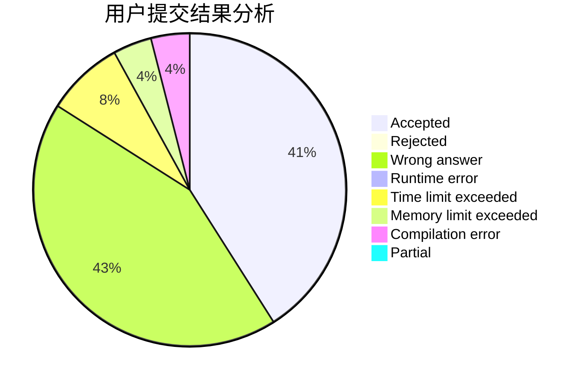
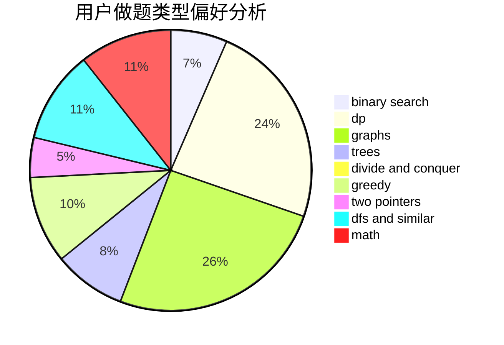

# GavinZheng

<!-- tabs:start -->

#### **用户提交结果分析**

#### **用户做题类型偏好分析**

<!-- tabs:end -->
# 推荐题目
[1096D](https://codeforces.com/contest/1096/problem/D)
[1065B](https://codeforces.com/contest/1065/problem/B)
[7E](https://codeforces.com/contest/7/problem/E)
[559D](https://codeforces.com/contest/559/problem/D)
[901C](https://codeforces.com/contest/901/problem/C)
[866C](https://codeforces.com/contest/866/problem/C)
[897B](https://codeforces.com/contest/897/problem/B)
[1085G](https://codeforces.com/contest/1085/problem/G)
[254B](https://codeforces.com/contest/254/problem/B)
[1008E](https://codeforces.com/contest/1008/problem/E)
