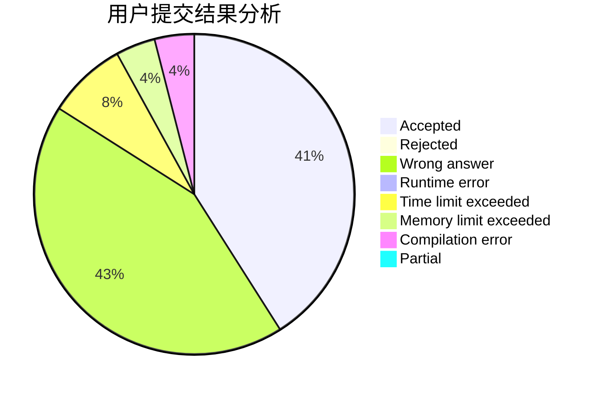
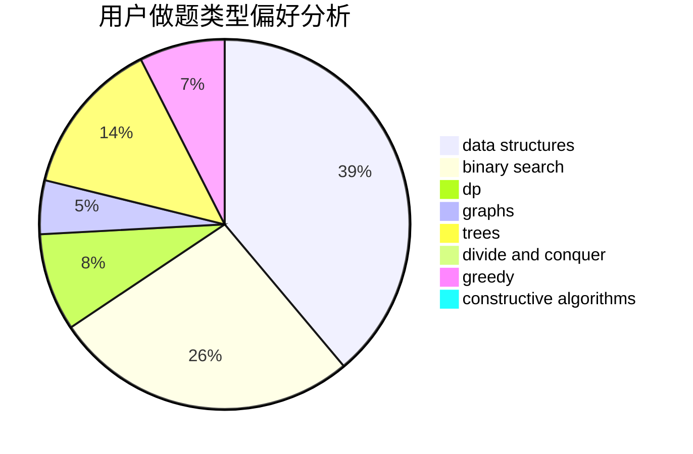
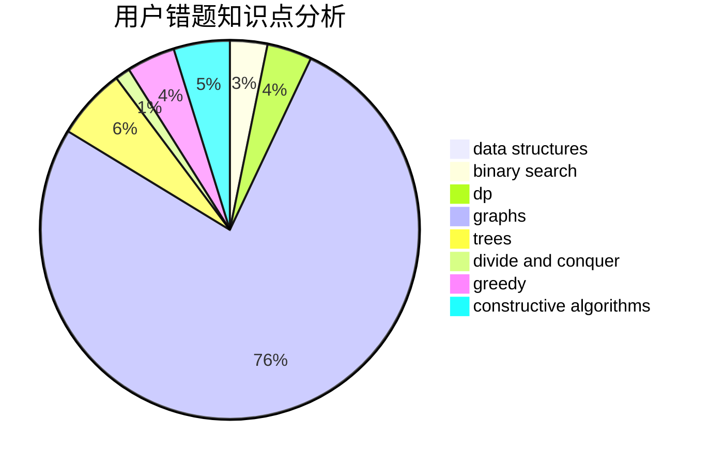

# GavinZheng
<!-- tabs:start -->
#### **用户提交结果分析**

#### **用户做题类型偏好分析**

#### **用户错题知识点分析**

<!-- tabs:end -->
# 推荐题目
[Find Divisible](http://codeforces.com/problemset/problem/1096/A)		greedy,
                        implementation,
                        math		  
[Dwarves, Hats and Extrasensory Abilities](https://codeforces.com/contest/1064/problem/E)		binary search,
                        constructive algorithms,
                        geometry,
                        interactive		  
[Quantum Classification - Dataset 5](http://codeforces.com/problemset/problem/1357/D3)		nan		  
[Andryusha and Socks](https://codeforces.com/contest/782/problem/A)		implementation		  
[Tourist's Notes](http://codeforces.com/problemset/problem/538/C)		binary search,
                        brute force,
                        greedy,
                        implementation,
                        math		  
[Beru-taxi](http://codeforces.com/problemset/problem/706/A)		brute force,
                        geometry,
                        implementation		  
[IQ test](http://codeforces.com/problemset/problem/25/A)		brute force		  
[Spaceship Solitaire](http://codeforces.com/problemset/problem/1266/E)		data structures,
                        greedy,
                        implementation		  
[Out of Controls](http://codeforces.com/problemset/problem/656/E)		*special problem		  
[Doe Graphs](http://codeforces.com/problemset/problem/232/C)		constructive algorithms,
                        divide and conquer,
                        dp,
                        graphs,
                        shortest paths		  
<!-- tabs:start -->
#### **data structures**
[Find Divisible](http://codeforces.com/problemset/problem/1266/E)		data structures,
                        greedy,
                        implementation		  
[Dwarves, Hats and Extrasensory Abilities](https://codeforces.com/contest/876/problem/F)		binary search,
                        bitmasks,
                        combinatorics,
                        data structures,
                        divide and conquer		  
[Quantum Classification - Dataset 5](http://codeforces.com/problemset/problem/1324/D)		binary search,
                        data structures,
                        sortings,
                        two pointers		  
[Andryusha and Socks](http://codeforces.com/problemset/problem/1493/D)		brute force,
                        data structures,
                        hashing,
                        implementation,
                        math,
                        number theory,
                        sortings,
                        two pointers		  
[Tourist's Notes](https://codeforces.com/contest/1321/problem/B)		data structures,
                        dp,
                        greedy,
                        math,
                        sortings		  
[Beru-taxi](http://codeforces.com/problemset/problem/1284/D)		binary search,
                        data structures,
                        hashing,
                        sortings		  
[IQ test](https://codeforces.com/contest/1199/problem/D)		binary search,
                        brute force,
                        data structures,
                        sortings		  
[Spaceship Solitaire](http://codeforces.com/problemset/problem/1492/C)		binary search,
                        data structures,
                        dp,
                        greedy,
                        two pointers		  
[Out of Controls](http://codeforces.com/problemset/problem/1490/G)		binary search,
                        data structures,
                        math		  
[Doe Graphs](http://codeforces.com/problemset/problem/1479/D)		binary search,
                        bitmasks,
                        brute force,
                        data structures,
                        probabilities,
                        trees		  
#### **binary search**
[Find Divisible](https://codeforces.com/contest/1064/problem/E)		binary search,
                        constructive algorithms,
                        geometry,
                        interactive		  
[Dwarves, Hats and Extrasensory Abilities](http://codeforces.com/problemset/problem/538/C)		binary search,
                        brute force,
                        greedy,
                        implementation,
                        math		  
[Quantum Classification - Dataset 5](https://codeforces.com/contest/876/problem/F)		binary search,
                        bitmasks,
                        combinatorics,
                        data structures,
                        divide and conquer		  
[Andryusha and Socks](http://codeforces.com/problemset/problem/853/D)		binary search,
                        dp,
                        greedy		  
[Tourist's Notes](http://codeforces.com/problemset/problem/883/I)		binary search,
                        dp		  
[Beru-taxi](http://codeforces.com/problemset/problem/1324/D)		binary search,
                        data structures,
                        sortings,
                        two pointers		  
[IQ test](http://codeforces.com/problemset/problem/125/E)		binary search,
                        graphs		  
[Spaceship Solitaire](http://codeforces.com/problemset/problem/1284/D)		binary search,
                        data structures,
                        hashing,
                        sortings		  
[Out of Controls](https://codeforces.com/contest/1199/problem/D)		binary search,
                        brute force,
                        data structures,
                        sortings		  
[Doe Graphs](http://codeforces.com/problemset/problem/1492/C)		binary search,
                        data structures,
                        dp,
                        greedy,
                        two pointers		  
#### **dp**
[Find Divisible](http://codeforces.com/problemset/problem/232/C)		constructive algorithms,
                        divide and conquer,
                        dp,
                        graphs,
                        shortest paths		  
[Dwarves, Hats and Extrasensory Abilities](http://codeforces.com/problemset/problem/351/B)		combinatorics,
                        dp,
                        probabilities		  
[Quantum Classification - Dataset 5](https://codeforces.com/contest/1314/problem/B)		dp,
                        implementation		  
[Andryusha and Socks](http://codeforces.com/problemset/problem/853/D)		binary search,
                        dp,
                        greedy		  
[Tourist's Notes](http://codeforces.com/problemset/problem/883/I)		binary search,
                        dp		  
[Beru-taxi](https://codeforces.com/contest/1321/problem/B)		data structures,
                        dp,
                        greedy,
                        math,
                        sortings		  
[IQ test](http://codeforces.com/problemset/problem/1492/C)		binary search,
                        data structures,
                        dp,
                        greedy,
                        two pointers		  
[Spaceship Solitaire](https://codeforces.com/contest/1457/problem/C)		brute force,
                        dp,
                        implementation		  
[Out of Controls](http://codeforces.com/problemset/problem/1491/C)		brute force,
                        data structures,
                        dp,
                        greedy,
                        implementation		  
[Doe Graphs](http://codeforces.com/problemset/problem/1437/C)		dp,
                        flows,
                        graph matchings,
                        greedy,
                        math,
                        sortings		  
#### **graph**
[Find Divisible](http://codeforces.com/problemset/problem/232/C)		constructive algorithms,
                        divide and conquer,
                        dp,
                        graphs,
                        shortest paths		  
[Dwarves, Hats and Extrasensory Abilities](http://codeforces.com/problemset/problem/125/E)		binary search,
                        graphs		  
[Quantum Classification - Dataset 5](https://codeforces.com/contest/1483/problem/D)		graphs,
                        shortest paths		  
[Andryusha and Socks](http://codeforces.com/problemset/problem/1487/C)		brute force,
                        constructive algorithms,
                        dfs and similar,
                        graphs,
                        greedy,
                        implementation,
                        math		  
[Tourist's Notes](http://codeforces.com/problemset/problem/1437/C)		dp,
                        flows,
                        graph matchings,
                        greedy,
                        math,
                        sortings		  
[Beru-taxi](http://codeforces.com/problemset/problem/1470/D)		constructive algorithms,
                        dfs and similar,
                        graph matchings,
                        graphs,
                        greedy		  
[IQ test](http://codeforces.com/problemset/problem/1476/C)		dp,
                        graphs,
                        greedy		  
[Spaceship Solitaire](http://codeforces.com/problemset/problem/1304/D)		constructive algorithms,
                        graphs,
                        greedy,
                        two pointers		  
[Out of Controls](http://codeforces.com/problemset/problem/1475/C)		combinatorics,
                        graphs,
                        math		  
[Doe Graphs](http://codeforces.com/problemset/problem/553/E)		dp,
                        fft,
                        graphs,
                        math,
                        probabilities		  
#### **trees**
[Find Divisible](https://codeforces.com/contest/1339/problem/D)		bitmasks,
                        constructive algorithms,
                        dfs and similar,
                        greedy,
                        math,
                        trees		  
[Dwarves, Hats and Extrasensory Abilities](https://codeforces.com/contest/1087/problem/D)		constructive algorithms,
                        implementation,
                        trees		  
[Quantum Classification - Dataset 5](http://codeforces.com/problemset/problem/1479/D)		binary search,
                        bitmasks,
                        brute force,
                        data structures,
                        probabilities,
                        trees		  
[Andryusha and Socks](http://codeforces.com/problemset/problem/1511/C)		brute force,
                        data structures,
                        implementation,
                        trees		  
[Tourist's Notes](http://codeforces.com/problemset/problem/1499/F)		combinatorics,
                        dfs and similar,
                        dp,
                        trees		  
[Beru-taxi](http://codeforces.com/problemset/problem/1491/E)		brute force,
                        dfs and similar,
                        divide and conquer,
                        number theory,
                        trees		  
[IQ test](http://codeforces.com/problemset/problem/1466/D)		data structures,
                        greedy,
                        sortings,
                        trees		  
[Spaceship Solitaire](http://codeforces.com/problemset/problem/1495/D)		combinatorics,
                        dfs and similar,
                        graphs,
                        math,
                        shortest paths,
                        trees		  
[Out of Controls](http://codeforces.com/problemset/problem/1303/G)		data structures,
                        divide and conquer,
                        geometry,
                        trees		  
[Doe Graphs](http://codeforces.com/problemset/problem/1454/E)		combinatorics,
                        dfs and similar,
                        graphs,
                        trees		  
#### **divide and conquer**
[Find Divisible](http://codeforces.com/problemset/problem/232/C)		constructive algorithms,
                        divide and conquer,
                        dp,
                        graphs,
                        shortest paths		  
[Dwarves, Hats and Extrasensory Abilities](https://codeforces.com/contest/876/problem/F)		binary search,
                        bitmasks,
                        combinatorics,
                        data structures,
                        divide and conquer		  
[Quantum Classification - Dataset 5](http://codeforces.com/problemset/problem/1461/D)		binary search,
                        brute force,
                        data structures,
                        divide and conquer,
                        implementation,
                        sortings		  
[Andryusha and Socks](http://codeforces.com/problemset/problem/1466/G)		combinatorics,
                        divide and conquer,
                        hashing,
                        math,
                        string suffix structures,
                        strings		  
[Tourist's Notes](http://codeforces.com/problemset/problem/1490/D)		dfs and similar,
                        divide and conquer,
                        implementation		  
[Beru-taxi](https://codeforces.com/contest/1483/problem/C)		data structures,
                        divide and conquer,
                        dp		  
[IQ test](http://codeforces.com/problemset/problem/1491/E)		brute force,
                        dfs and similar,
                        divide and conquer,
                        number theory,
                        trees		  
[Spaceship Solitaire](http://codeforces.com/problemset/problem/1303/G)		data structures,
                        divide and conquer,
                        geometry,
                        trees		  
[Out of Controls](http://codeforces.com/problemset/problem/1494/D)		constructive algorithms,
                        data structures,
                        dfs and similar,
                        divide and conquer,
                        dsu,
                        greedy,
                        sortings,
                        trees		  
[Doe Graphs](http://codeforces.com/problemset/problem/1482/E)		data structures,
                        divide and conquer,
                        dp		  
#### **greedy**
[Find Divisible](http://codeforces.com/problemset/problem/1096/A)		greedy,
                        implementation,
                        math		  
[Dwarves, Hats and Extrasensory Abilities](http://codeforces.com/problemset/problem/538/C)		binary search,
                        brute force,
                        greedy,
                        implementation,
                        math		  
[Quantum Classification - Dataset 5](http://codeforces.com/problemset/problem/1266/E)		data structures,
                        greedy,
                        implementation		  
[Andryusha and Socks](http://codeforces.com/problemset/problem/847/K)		greedy,
                        implementation,
                        sortings		  
[Tourist's Notes](http://codeforces.com/problemset/problem/486/B)		greedy,
                        hashing,
                        implementation		  
[Beru-taxi](http://codeforces.com/problemset/problem/853/D)		binary search,
                        dp,
                        greedy		  
[IQ test](http://codeforces.com/problemset/problem/1008/B)		greedy,
                        sortings		  
[Spaceship Solitaire](https://codeforces.com/contest/1339/problem/D)		bitmasks,
                        constructive algorithms,
                        dfs and similar,
                        greedy,
                        math,
                        trees		  
[Out of Controls](https://codeforces.com/contest/1321/problem/B)		data structures,
                        dp,
                        greedy,
                        math,
                        sortings		  
[Doe Graphs](http://codeforces.com/problemset/problem/1492/C)		binary search,
                        data structures,
                        dp,
                        greedy,
                        two pointers		  
#### **constructive algorithms**
[Find Divisible](https://codeforces.com/contest/1064/problem/E)		binary search,
                        constructive algorithms,
                        geometry,
                        interactive		  
[Dwarves, Hats and Extrasensory Abilities](http://codeforces.com/problemset/problem/232/C)		constructive algorithms,
                        divide and conquer,
                        dp,
                        graphs,
                        shortest paths		  
[Quantum Classification - Dataset 5](https://codeforces.com/contest/1339/problem/D)		bitmasks,
                        constructive algorithms,
                        dfs and similar,
                        greedy,
                        math,
                        trees		  
[Andryusha and Socks](https://codeforces.com/contest/1087/problem/D)		constructive algorithms,
                        implementation,
                        trees		  
[Tourist's Notes](http://codeforces.com/problemset/problem/1493/A)		constructive algorithms,
                        greedy		  
[Beru-taxi](http://codeforces.com/problemset/problem/1463/D)		binary search,
                        constructive algorithms,
                        greedy,
                        two pointers		  
[IQ test](https://codeforces.com/contest/1456/problem/B)		bitmasks,
                        brute force,
                        constructive algorithms		  
[Spaceship Solitaire](http://codeforces.com/problemset/problem/1492/D)		bitmasks,
                        constructive algorithms,
                        greedy,
                        math		  
[Out of Controls](https://codeforces.com/contest/1504/problem/D)		constructive algorithms,
                        games,
                        interactive		  
[Doe Graphs](https://codeforces.com/contest/1483/problem/A)		brute force,
                        constructive algorithms,
                        greedy,
                        implementation		  
#### **sortings**
[Find Divisible](http://codeforces.com/problemset/problem/847/K)		greedy,
                        implementation,
                        sortings		  
[Dwarves, Hats and Extrasensory Abilities](http://codeforces.com/problemset/problem/1008/B)		greedy,
                        sortings		  
[Quantum Classification - Dataset 5](http://codeforces.com/problemset/problem/1324/D)		binary search,
                        data structures,
                        sortings,
                        two pointers		  
[Andryusha and Socks](http://codeforces.com/problemset/problem/1493/D)		brute force,
                        data structures,
                        hashing,
                        implementation,
                        math,
                        number theory,
                        sortings,
                        two pointers		  
[Tourist's Notes](https://codeforces.com/contest/1321/problem/B)		data structures,
                        dp,
                        greedy,
                        math,
                        sortings		  
[Beru-taxi](http://codeforces.com/problemset/problem/1284/D)		binary search,
                        data structures,
                        hashing,
                        sortings		  
[IQ test](https://codeforces.com/contest/1199/problem/D)		binary search,
                        brute force,
                        data structures,
                        sortings		  
[Spaceship Solitaire](https://codeforces.com/contest/1496/problem/C)		geometry,
                        greedy,
                        math,
                        sortings		  
[Out of Controls](http://codeforces.com/problemset/problem/1495/A)		geometry,
                        greedy,
                        math,
                        sortings		  
[Doe Graphs](http://codeforces.com/problemset/problem/1497/A)		brute force,
                        data structures,
                        greedy,
                        sortings		  
<!-- tabs:end -->
