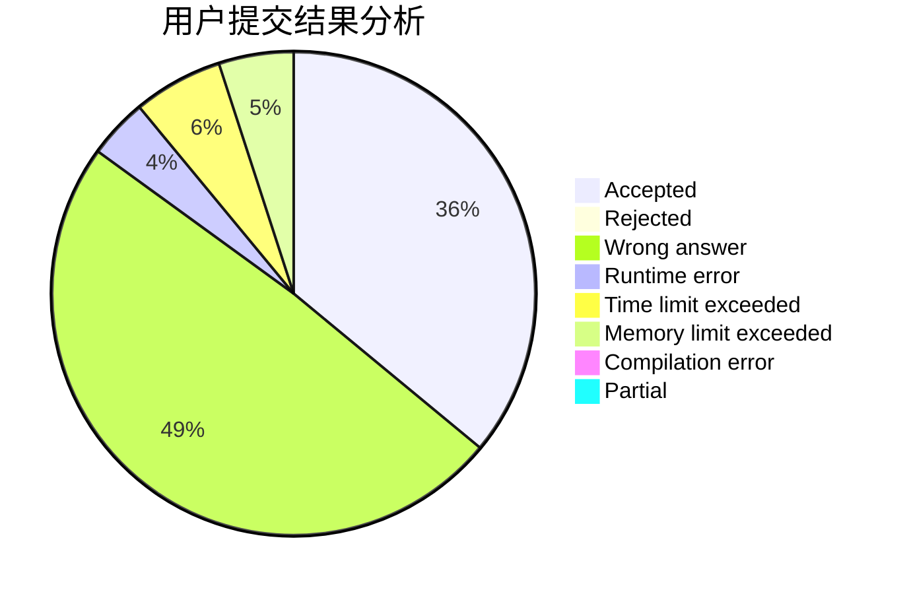
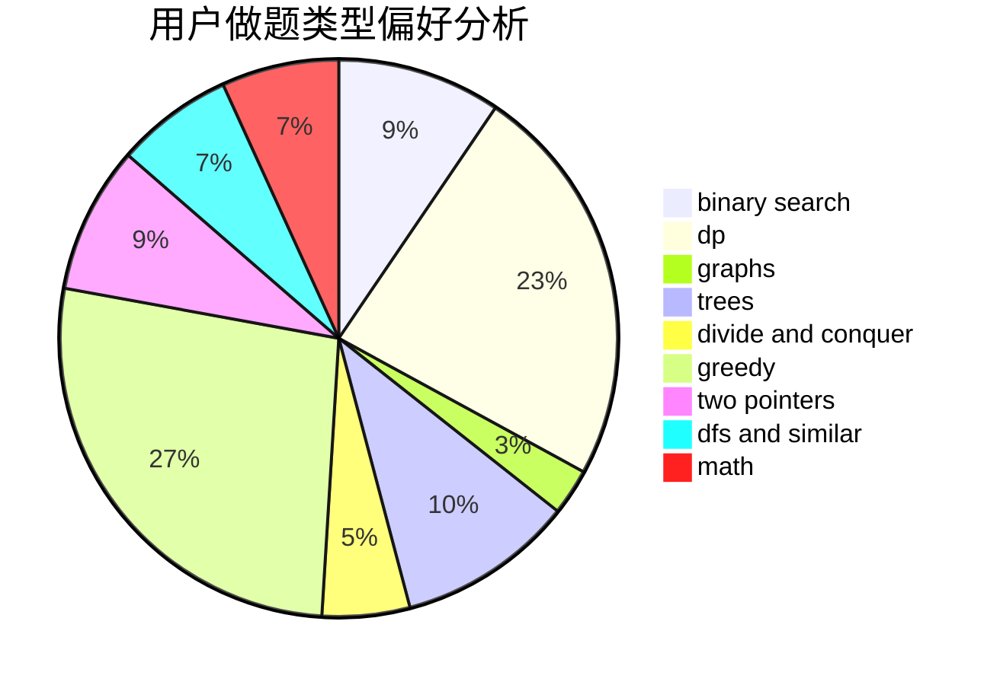

# Gensokyo_Alice

<!-- tabs:start -->

#### **用户提交结果分析**

#### **用户做题类型偏好分析**

<!-- tabs:end -->
# 推荐题目
[1110E](https://codeforces.com/contest/1110/problem/E)
[304D](https://codeforces.com/contest/304/problem/D)
[585F](https://codeforces.com/contest/585/problem/F)
[1423I](https://codeforces.com/contest/1423/problem/I)
[869E](https://codeforces.com/contest/869/problem/E)
[55D](https://codeforces.com/contest/55/problem/D)
[346E](https://codeforces.com/contest/346/problem/E)
[224A](https://codeforces.com/contest/224/problem/A)
[287C](https://codeforces.com/contest/287/problem/C)
[710E](https://codeforces.com/contest/710/problem/E)
