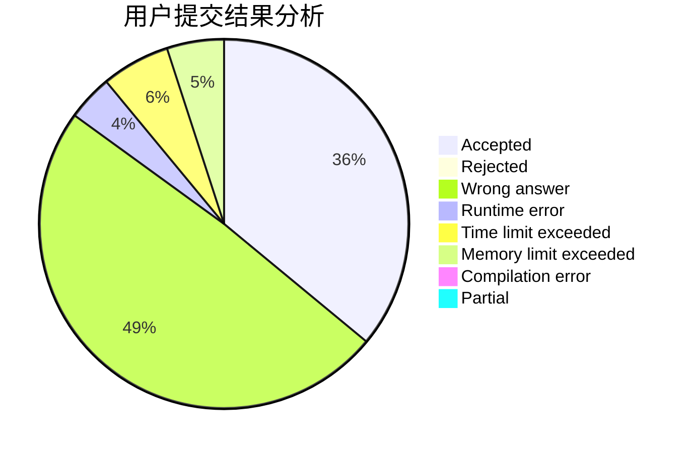
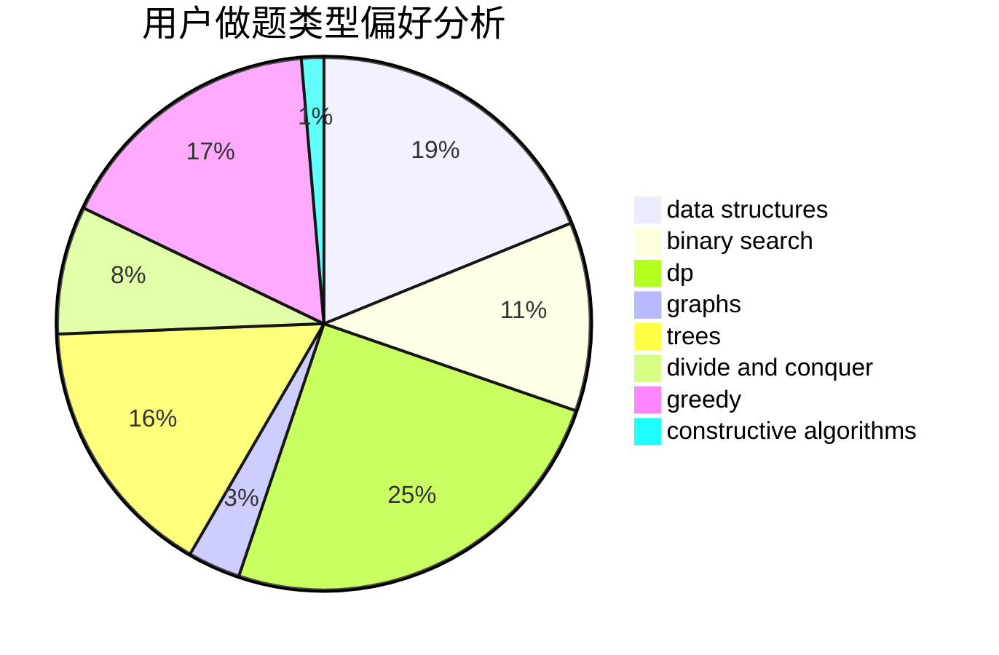
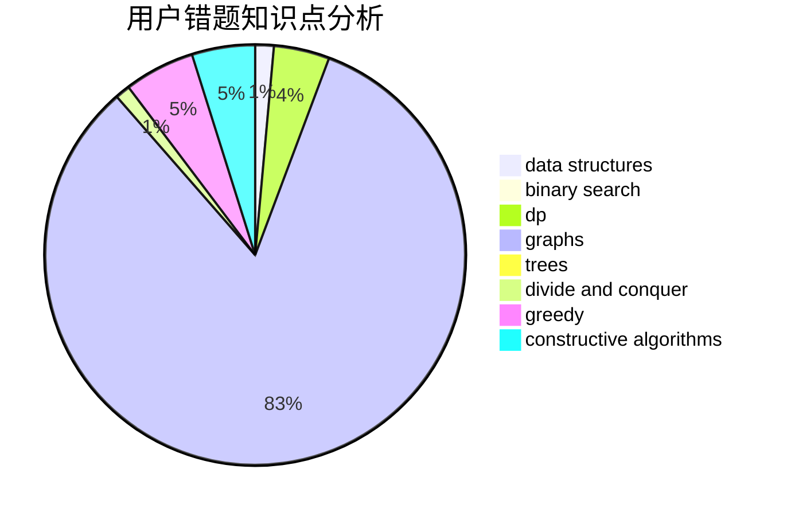

# Gensokyo_Alice

<!-- tabs:start -->

#### **用户提交结果分析**

#### **用户做题类型偏好分析**

#### **用户错题知识点分析**

<!-- tabs:end -->
# 推荐题目
[1110E](https://codeforces.com/contest/1110/problem/E)		constructive algorithms,
                        math,
                        sortings		  
[304D](https://codeforces.com/contest/304/problem/D)		dsu,graphs,sortings,trees		  
[585F](https://codeforces.com/contest/585/problem/F)		dp,
                        implementation,
                        strings		  
[1423I](https://codeforces.com/contest/1423/problem/I)		bitmasks		  
[869E](https://codeforces.com/contest/869/problem/E)		data structures,
                        hashing		  
[55D](https://codeforces.com/contest/55/problem/D)		dp,
                        number theory		  
[346E](https://codeforces.com/contest/346/problem/E)		math,
                        number theory		  
[224A](https://codeforces.com/contest/224/problem/A)		brute force,
                        geometry,
                        math		  
[287C](https://codeforces.com/contest/287/problem/C)		dsu,graphs,sortings,trees		  
[710E](https://codeforces.com/contest/710/problem/E)		dfs and similar,
                        dp		  
