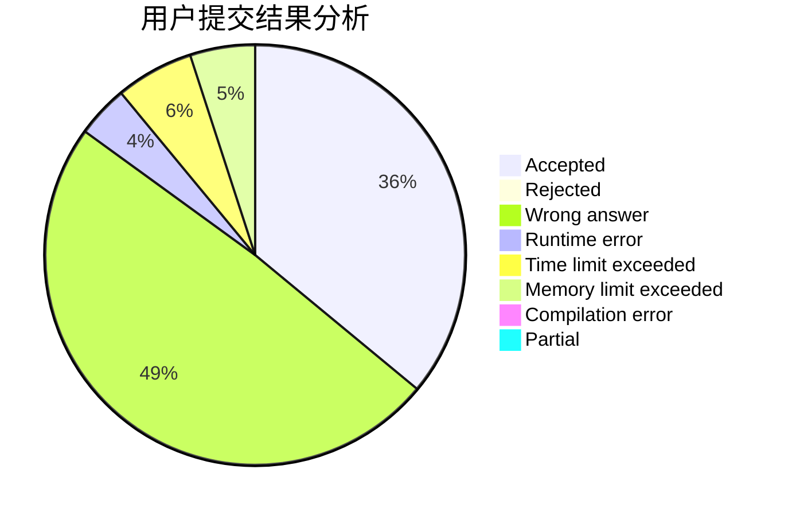
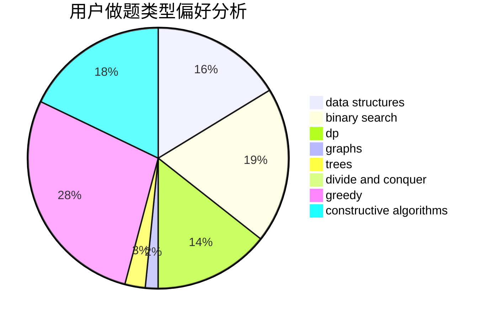
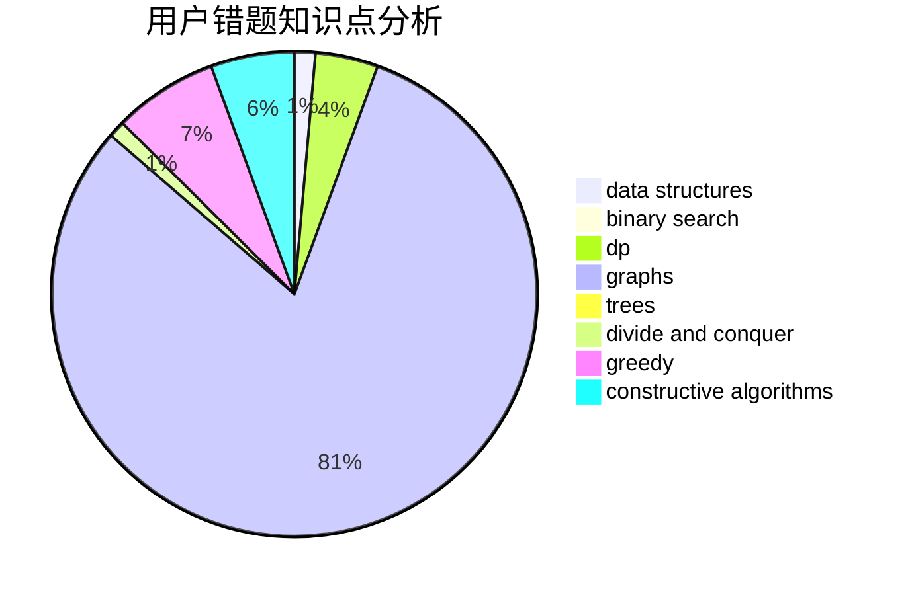

# Gensokyo_Alice

<!-- tabs:start -->

#### **用户提交结果分析**

#### **用户做题类型偏好分析**

#### **用户错题知识点分析**

<!-- tabs:end -->
# 推荐题目
[1110B](https://codeforces.com/contest/1110/problem/B)		greedy,
                        sortings		  
[28D](https://codeforces.com/contest/28/problem/D)		binary search,
                        data structures,
                        dp,
                        hashing		  
[567A](https://codeforces.com/contest/567/problem/A)		greedy,
                        implementation		  
[1415E](https://codeforces.com/contest/1415/problem/E)		constructive algorithms,
                        greedy,
                        math		  
[850F](https://codeforces.com/contest/850/problem/F)		math		  
[53A](https://codeforces.com/contest/53/problem/A)		implementation		  
[317C](https://codeforces.com/contest/317/problem/C)		constructive algorithms,
                        dfs and similar,
                        graphs,
                        trees		  
[1B](https://codeforces.com/contest/1/problem/B)		implementation,
                        math		  
[271A](https://codeforces.com/contest/271/problem/A)		brute force		  
[691A](https://codeforces.com/contest/691/problem/A)		implementation		  
