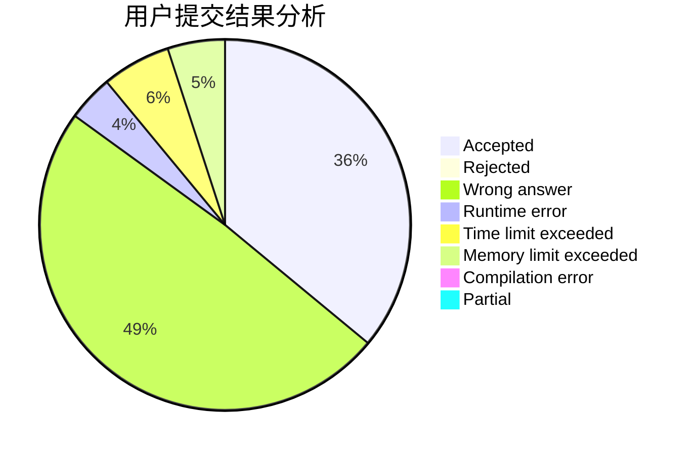
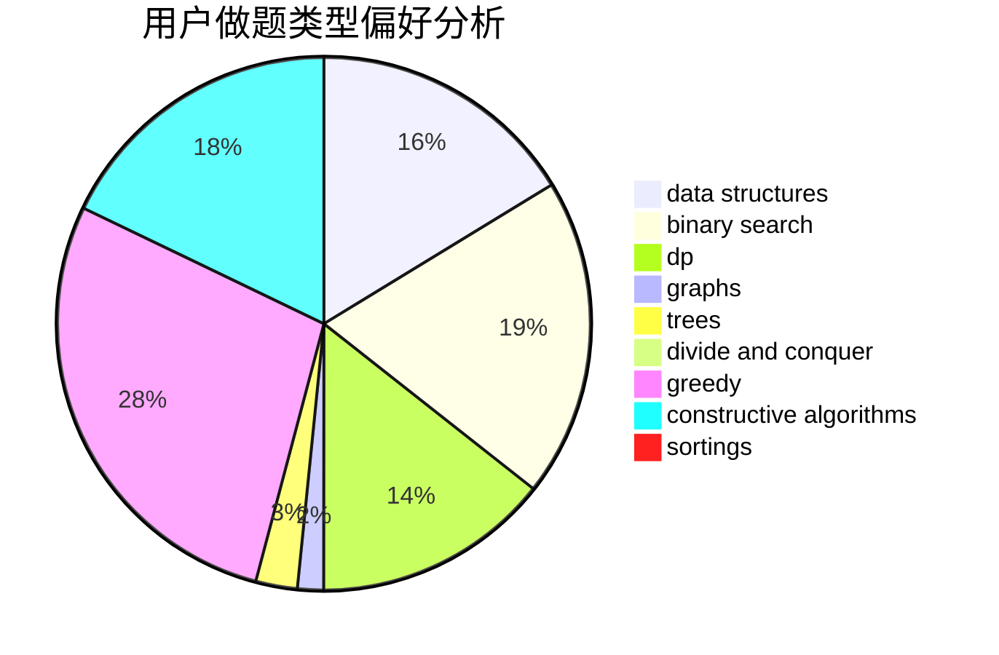
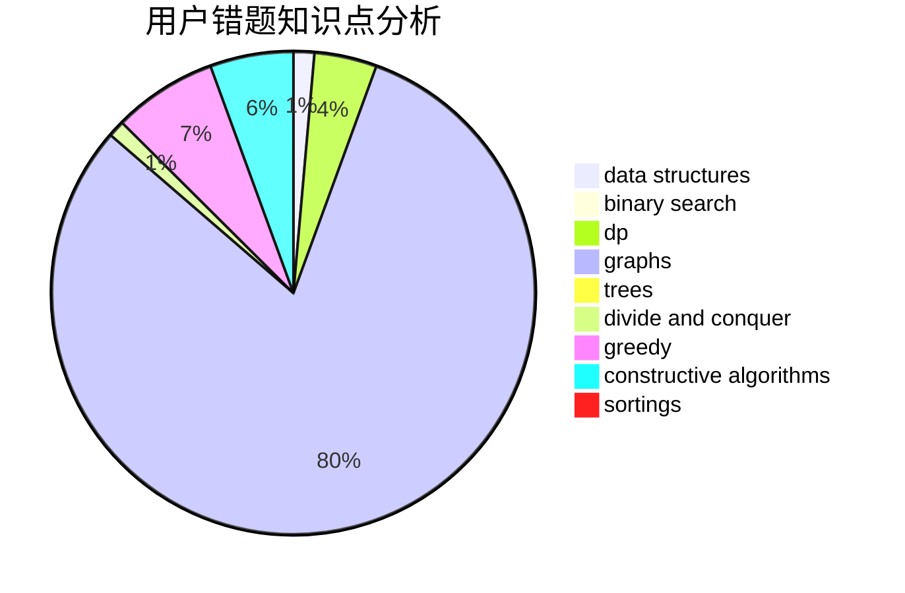

# Gensokyo_Alice
<!-- tabs:start -->
#### **用户提交结果分析**

#### **用户做题类型偏好分析**

#### **用户错题知识点分析**

<!-- tabs:end -->
# 推荐题目
[567A](http://codeforces.com/problemset/problem/567/A)		greedy,
                        implementation		  
[28D](http://codeforces.com/problemset/problem/28/D)		binary search,
                        data structures,
                        dp,
                        hashing		  
[317C](http://codeforces.com/problemset/problem/317/C)		constructive algorithms,
                        dfs and similar,
                        graphs,
                        trees		  
[850F](http://codeforces.com/problemset/problem/850/F)		math		  
[1415E](http://codeforces.com/problemset/problem/1415/E)		constructive algorithms,
                        greedy,
                        math		  
[53A](http://codeforces.com/problemset/problem/53/A)		implementation		  
[691A](http://codeforces.com/problemset/problem/691/A)		implementation		  
[588A](http://codeforces.com/problemset/problem/588/A)		greedy		  
[402E](http://codeforces.com/problemset/problem/402/E)		graphs,
                        math		  
[1B](http://codeforces.com/problemset/problem/1/B)		implementation,
                        math		  
<!-- tabs:start -->
#### **data structures**
[28D](http://codeforces.com/problemset/problem/28/D)		binary search,
                        data structures,
                        dp,
                        hashing		  
[821C](http://codeforces.com/problemset/problem/821/C)		data structures,
                        greedy,
                        trees		  
[818E](http://codeforces.com/problemset/problem/818/E)		binary search,
                        data structures,
                        number theory,
                        two pointers		  
[1442D](http://codeforces.com/problemset/problem/1442/D)		data structures,
                        divide and conquer,
                        dp,
                        greedy		  
[1492C](http://codeforces.com/problemset/problem/1492/C)		binary search,
                        data structures,
                        dp,
                        greedy,
                        two pointers		  
[1490G](http://codeforces.com/problemset/problem/1490/G)		binary search,
                        data structures,
                        math		  
[1479D](http://codeforces.com/problemset/problem/1479/D)		binary search,
                        bitmasks,
                        brute force,
                        data structures,
                        probabilities,
                        trees		  
[1497A](http://codeforces.com/problemset/problem/1497/A)		brute force,
                        data structures,
                        greedy,
                        sortings		  
[1491C](http://codeforces.com/problemset/problem/1491/C)		brute force,
                        data structures,
                        dp,
                        greedy,
                        implementation		  
[1492B](http://codeforces.com/problemset/problem/1492/B)		data structures,
                        greedy,
                        math		  
#### **binary search**
[28D](http://codeforces.com/problemset/problem/28/D)		binary search,
                        data structures,
                        dp,
                        hashing		  
[1285F](http://codeforces.com/problemset/problem/1285/F)		binary search,
                        combinatorics,
                        number theory		  
[727F](http://codeforces.com/problemset/problem/727/F)		binary search,
                        dp,
                        greedy		  
[818E](http://codeforces.com/problemset/problem/818/E)		binary search,
                        data structures,
                        number theory,
                        two pointers		  
[837E](http://codeforces.com/problemset/problem/837/E)		binary search,
                        implementation,
                        math		  
[1492C](http://codeforces.com/problemset/problem/1492/C)		binary search,
                        data structures,
                        dp,
                        greedy,
                        two pointers		  
[1463D](http://codeforces.com/problemset/problem/1463/D)		binary search,
                        constructive algorithms,
                        greedy,
                        two pointers		  
[1490G](http://codeforces.com/problemset/problem/1490/G)		binary search,
                        data structures,
                        math		  
[1479D](http://codeforces.com/problemset/problem/1479/D)		binary search,
                        bitmasks,
                        brute force,
                        data structures,
                        probabilities,
                        trees		  
[1436E](http://codeforces.com/problemset/problem/1436/E)		binary search,
                        data structures,
                        two pointers		  
#### **dp**
[28D](http://codeforces.com/problemset/problem/28/D)		binary search,
                        data structures,
                        dp,
                        hashing		  
[1349F2](http://codeforces.com/problemset/problem/1349/F2)		dp,
                        fft,
                        math		  
[727F](http://codeforces.com/problemset/problem/727/F)		binary search,
                        dp,
                        greedy		  
[1228E](http://codeforces.com/problemset/problem/1228/E)		combinatorics,
                        dp,
                        math		  
[81E](http://codeforces.com/problemset/problem/81/E)		dfs and similar,
                        dp,
                        dsu,
                        graphs,
                        implementation,
                        trees		  
[1442D](http://codeforces.com/problemset/problem/1442/D)		data structures,
                        divide and conquer,
                        dp,
                        greedy		  
[1492C](http://codeforces.com/problemset/problem/1492/C)		binary search,
                        data structures,
                        dp,
                        greedy,
                        two pointers		  
[1457C](https://codeforces.com/contest/1457/problem/C)		brute force,
                        dp,
                        implementation		  
[1491C](http://codeforces.com/problemset/problem/1491/C)		brute force,
                        data structures,
                        dp,
                        greedy,
                        implementation		  
[1437C](http://codeforces.com/problemset/problem/1437/C)		dp,
                        flows,
                        graph matchings,
                        greedy,
                        math,
                        sortings		  
#### **graph**
[317C](http://codeforces.com/problemset/problem/317/C)		constructive algorithms,
                        dfs and similar,
                        graphs,
                        trees		  
[402E](http://codeforces.com/problemset/problem/402/E)		graphs,
                        math		  
[441D](http://codeforces.com/problemset/problem/441/D)		constructive algorithms,
                        dsu,
                        graphs,
                        implementation,
                        math,
                        string suffix structures		  
[1333D](http://codeforces.com/problemset/problem/1333/D)		brute force,
                        constructive algorithms,
                        games,
                        graphs,
                        greedy,
                        implementation,
                        sortings		  
[81E](http://codeforces.com/problemset/problem/81/E)		dfs and similar,
                        dp,
                        dsu,
                        graphs,
                        implementation,
                        trees		  
[1422D](http://codeforces.com/problemset/problem/1422/D)		graphs,
                        shortest paths,
                        sortings		  
[1487C](http://codeforces.com/problemset/problem/1487/C)		brute force,
                        constructive algorithms,
                        dfs and similar,
                        graphs,
                        greedy,
                        implementation,
                        math		  
[1437C](http://codeforces.com/problemset/problem/1437/C)		dp,
                        flows,
                        graph matchings,
                        greedy,
                        math,
                        sortings		  
[1470D](http://codeforces.com/problemset/problem/1470/D)		constructive algorithms,
                        dfs and similar,
                        graph matchings,
                        graphs,
                        greedy		  
[1476C](http://codeforces.com/problemset/problem/1476/C)		dp,
                        graphs,
                        greedy		  
#### **trees**
[317C](http://codeforces.com/problemset/problem/317/C)		constructive algorithms,
                        dfs and similar,
                        graphs,
                        trees		  
[821C](http://codeforces.com/problemset/problem/821/C)		data structures,
                        greedy,
                        trees		  
[81E](http://codeforces.com/problemset/problem/81/E)		dfs and similar,
                        dp,
                        dsu,
                        graphs,
                        implementation,
                        trees		  
[1479D](http://codeforces.com/problemset/problem/1479/D)		binary search,
                        bitmasks,
                        brute force,
                        data structures,
                        probabilities,
                        trees		  
[1511C](http://codeforces.com/problemset/problem/1511/C)		brute force,
                        data structures,
                        implementation,
                        trees		  
[1499F](http://codeforces.com/problemset/problem/1499/F)		combinatorics,
                        dfs and similar,
                        dp,
                        trees		  
[1491E](http://codeforces.com/problemset/problem/1491/E)		brute force,
                        dfs and similar,
                        divide and conquer,
                        number theory,
                        trees		  
[1466D](http://codeforces.com/problemset/problem/1466/D)		data structures,
                        greedy,
                        sortings,
                        trees		  
[1495D](http://codeforces.com/problemset/problem/1495/D)		combinatorics,
                        dfs and similar,
                        graphs,
                        math,
                        shortest paths,
                        trees		  
[1303G](http://codeforces.com/problemset/problem/1303/G)		data structures,
                        divide and conquer,
                        geometry,
                        trees		  
#### **divide and conquer**
[1442D](http://codeforces.com/problemset/problem/1442/D)		data structures,
                        divide and conquer,
                        dp,
                        greedy		  
[1461D](http://codeforces.com/problemset/problem/1461/D)		binary search,
                        brute force,
                        data structures,
                        divide and conquer,
                        implementation,
                        sortings		  
[1466G](http://codeforces.com/problemset/problem/1466/G)		combinatorics,
                        divide and conquer,
                        hashing,
                        math,
                        string suffix structures,
                        strings		  
[1490D](http://codeforces.com/problemset/problem/1490/D)		dfs and similar,
                        divide and conquer,
                        implementation		  
[1483C](https://codeforces.com/contest/1483/problem/C)		data structures,
                        divide and conquer,
                        dp		  
[1491E](http://codeforces.com/problemset/problem/1491/E)		brute force,
                        dfs and similar,
                        divide and conquer,
                        number theory,
                        trees		  
[1303G](http://codeforces.com/problemset/problem/1303/G)		data structures,
                        divide and conquer,
                        geometry,
                        trees		  
[1494D](http://codeforces.com/problemset/problem/1494/D)		constructive algorithms,
                        data structures,
                        dfs and similar,
                        divide and conquer,
                        dsu,
                        greedy,
                        sortings,
                        trees		  
[1482E](http://codeforces.com/problemset/problem/1482/E)		data structures,
                        divide and conquer,
                        dp		  
[566C](http://codeforces.com/problemset/problem/566/C)		dfs and similar,
                        divide and conquer,
                        trees		  
#### **greedy**
[567A](http://codeforces.com/problemset/problem/567/A)		greedy,
                        implementation		  
[1415E](http://codeforces.com/problemset/problem/1415/E)		constructive algorithms,
                        greedy,
                        math		  
[588A](http://codeforces.com/problemset/problem/588/A)		greedy		  
[1360G](http://codeforces.com/problemset/problem/1360/G)		constructive algorithms,
                        greedy,
                        math		  
[1333D](http://codeforces.com/problemset/problem/1333/D)		brute force,
                        constructive algorithms,
                        games,
                        graphs,
                        greedy,
                        implementation,
                        sortings		  
[727F](http://codeforces.com/problemset/problem/727/F)		binary search,
                        dp,
                        greedy		  
[1083B](http://codeforces.com/problemset/problem/1083/B)		greedy,
                        strings		  
[1419B](http://codeforces.com/problemset/problem/1419/B)		brute force,
                        constructive algorithms,
                        greedy,
                        implementation,
                        math		  
[821C](http://codeforces.com/problemset/problem/821/C)		data structures,
                        greedy,
                        trees		  
[1110B](http://codeforces.com/problemset/problem/1110/B)		greedy,
                        sortings		  
#### **constructive algorithms**
[317C](http://codeforces.com/problemset/problem/317/C)		constructive algorithms,
                        dfs and similar,
                        graphs,
                        trees		  
[1415E](http://codeforces.com/problemset/problem/1415/E)		constructive algorithms,
                        greedy,
                        math		  
[441D](http://codeforces.com/problemset/problem/441/D)		constructive algorithms,
                        dsu,
                        graphs,
                        implementation,
                        math,
                        string suffix structures		  
[1360G](http://codeforces.com/problemset/problem/1360/G)		constructive algorithms,
                        greedy,
                        math		  
[1333D](http://codeforces.com/problemset/problem/1333/D)		brute force,
                        constructive algorithms,
                        games,
                        graphs,
                        greedy,
                        implementation,
                        sortings		  
[1419B](http://codeforces.com/problemset/problem/1419/B)		brute force,
                        constructive algorithms,
                        greedy,
                        implementation,
                        math		  
[883K](http://codeforces.com/problemset/problem/883/K)		constructive algorithms,
                        greedy,
                        implementation		  
[1237C1](http://codeforces.com/problemset/problem/1237/C1)		constructive algorithms,
                        geometry,
                        greedy		  
[1493A](http://codeforces.com/problemset/problem/1493/A)		constructive algorithms,
                        greedy		  
[1463D](http://codeforces.com/problemset/problem/1463/D)		binary search,
                        constructive algorithms,
                        greedy,
                        two pointers		  
#### **sortings**
[1333D](http://codeforces.com/problemset/problem/1333/D)		brute force,
                        constructive algorithms,
                        games,
                        graphs,
                        greedy,
                        implementation,
                        sortings		  
[1110B](http://codeforces.com/problemset/problem/1110/B)		greedy,
                        sortings		  
[1165E](http://codeforces.com/problemset/problem/1165/E)		greedy,
                        math,
                        sortings		  
[1422D](http://codeforces.com/problemset/problem/1422/D)		graphs,
                        shortest paths,
                        sortings		  
[1496C](https://codeforces.com/contest/1496/problem/C)		geometry,
                        greedy,
                        math,
                        sortings		  
[1495A](http://codeforces.com/problemset/problem/1495/A)		geometry,
                        greedy,
                        math,
                        sortings		  
[1497A](http://codeforces.com/problemset/problem/1497/A)		brute force,
                        data structures,
                        greedy,
                        sortings		  
[1427A](http://codeforces.com/problemset/problem/1427/A)		math,
                        sortings		  
[1461D](http://codeforces.com/problemset/problem/1461/D)		binary search,
                        brute force,
                        data structures,
                        divide and conquer,
                        implementation,
                        sortings		  
[1437C](http://codeforces.com/problemset/problem/1437/C)		dp,
                        flows,
                        graph matchings,
                        greedy,
                        math,
                        sortings		  
<!-- tabs:end -->
