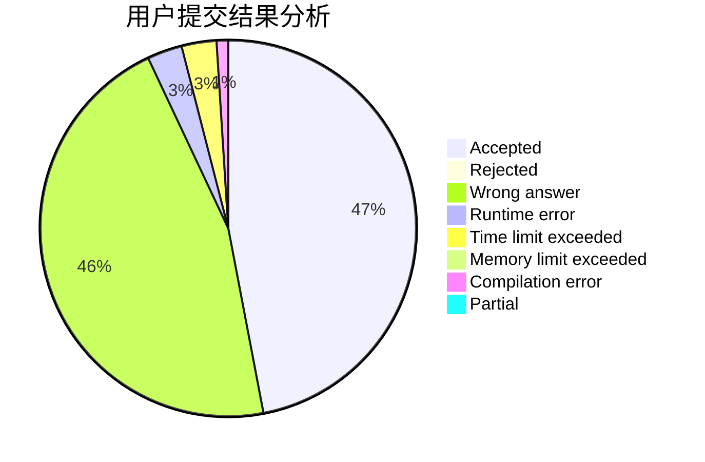
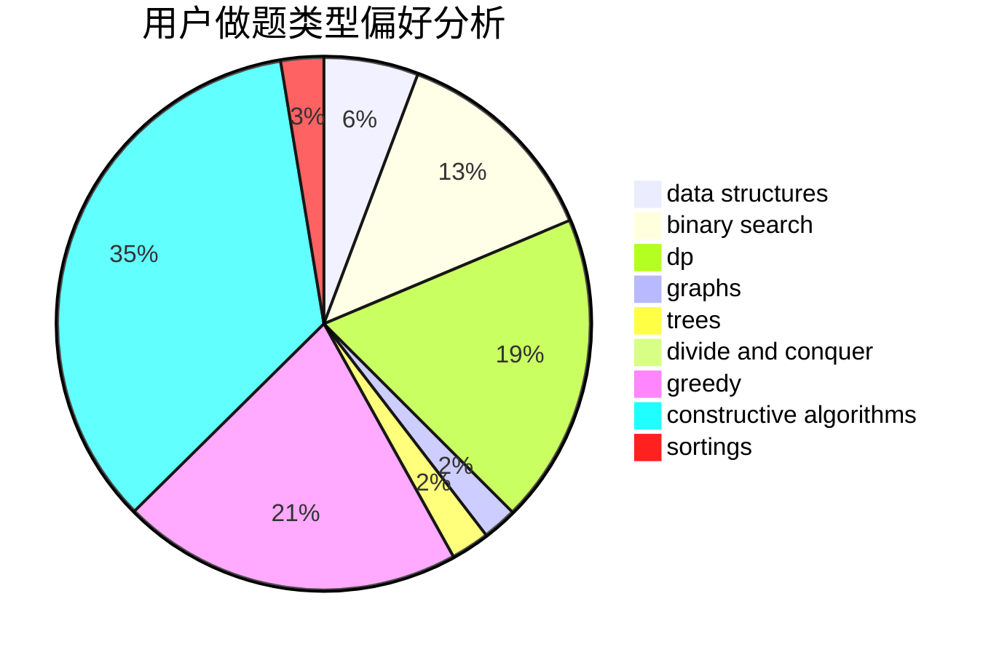
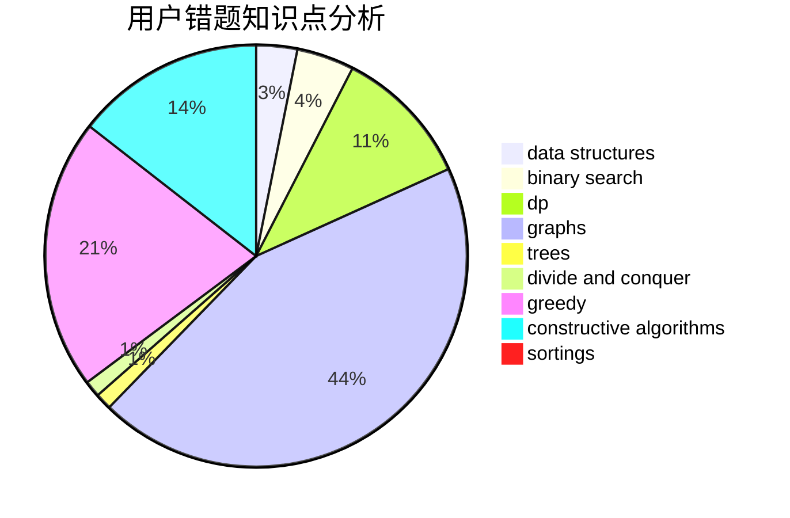

# GeoCalibur
<!-- tabs:start -->
#### **用户提交结果分析**

#### **用户做题类型偏好分析**

#### **用户错题知识点分析**

<!-- tabs:end -->
# 推荐题目
[1428D](http://codeforces.com/problemset/problem/1428/D)		constructive algorithms,
                        greedy,
                        implementation		  
[1478F](https://codeforces.com/contest/1478/problem/F)		constructive algorithms,
                        geometry,
                        greedy,
                        math,
                        sortings		  
[279B](http://codeforces.com/problemset/problem/279/B)		binary search,
                        brute force,
                        implementation,
                        two pointers		  
[842B](http://codeforces.com/problemset/problem/842/B)		geometry		  
[665F](http://codeforces.com/problemset/problem/665/F)		data structures,
                        dp,
                        math,
                        number theory,
                        sortings,
                        two pointers		  
[543B](http://codeforces.com/problemset/problem/543/B)		constructive algorithms,
                        graphs,
                        shortest paths		  
[1033B](http://codeforces.com/problemset/problem/1033/B)		math,
                        number theory		  
[559D](http://codeforces.com/problemset/problem/559/D)		combinatorics,
                        geometry,
                        probabilities		  
[78C](http://codeforces.com/problemset/problem/78/C)		dp,
                        games,
                        number theory		  
[641F](http://codeforces.com/problemset/problem/641/F)		nan		  
<!-- tabs:start -->
#### **data structures**
[665F](http://codeforces.com/problemset/problem/665/F)		data structures,
                        dp,
                        math,
                        number theory,
                        sortings,
                        two pointers		  
[1167E](http://codeforces.com/problemset/problem/1167/E)		binary search,
                        combinatorics,
                        data structures,
                        two pointers		  
[1137F](http://codeforces.com/problemset/problem/1137/F)		data structures,
                        trees		  
[1402A](http://codeforces.com/problemset/problem/1402/A)		*special problem,
                        data structures,
                        dsu,
                        implementation,
                        math,
                        sortings		  
[1320A](http://codeforces.com/problemset/problem/1320/A)		data structures,
                        dp,
                        greedy,
                        math,
                        sortings		  
[1209G2](http://codeforces.com/problemset/problem/1209/G2)		data structures		  
[1381A2](http://codeforces.com/problemset/problem/1381/A2)		constructive algorithms,
                        data structures,
                        implementation,
                        strings,
                        two pointers		  
[1284D](http://codeforces.com/problemset/problem/1284/D)		binary search,
                        data structures,
                        hashing,
                        sortings		  
[1492C](http://codeforces.com/problemset/problem/1492/C)		binary search,
                        data structures,
                        dp,
                        greedy,
                        two pointers		  
[1490G](http://codeforces.com/problemset/problem/1490/G)		binary search,
                        data structures,
                        math		  
#### **binary search**
[279B](http://codeforces.com/problemset/problem/279/B)		binary search,
                        brute force,
                        implementation,
                        two pointers		  
[551C](http://codeforces.com/problemset/problem/551/C)		binary search,
                        greedy		  
[1279F](http://codeforces.com/problemset/problem/1279/F)		binary search,
                        dp		  
[1167E](http://codeforces.com/problemset/problem/1167/E)		binary search,
                        combinatorics,
                        data structures,
                        two pointers		  
[1345B](http://codeforces.com/problemset/problem/1345/B)		binary search,
                        brute force,
                        dp,
                        math		  
[1100E](http://codeforces.com/problemset/problem/1100/E)		binary search,
                        dfs and similar,
                        graphs		  
[1284D](http://codeforces.com/problemset/problem/1284/D)		binary search,
                        data structures,
                        hashing,
                        sortings		  
[804D](http://codeforces.com/problemset/problem/804/D)		binary search,
                        brute force,
                        dfs and similar,
                        dp,
                        sortings,
                        trees		  
[1492C](http://codeforces.com/problemset/problem/1492/C)		binary search,
                        data structures,
                        dp,
                        greedy,
                        two pointers		  
[1463D](http://codeforces.com/problemset/problem/1463/D)		binary search,
                        constructive algorithms,
                        greedy,
                        two pointers		  
#### **dp**
[665F](http://codeforces.com/problemset/problem/665/F)		data structures,
                        dp,
                        math,
                        number theory,
                        sortings,
                        two pointers		  
[78C](http://codeforces.com/problemset/problem/78/C)		dp,
                        games,
                        number theory		  
[544E](https://codeforces.com/contest/544/problem/E)		bitmasks,
                        dp		  
[1279F](http://codeforces.com/problemset/problem/1279/F)		binary search,
                        dp		  
[731E](http://codeforces.com/problemset/problem/731/E)		dp,
                        games		  
[1345B](http://codeforces.com/problemset/problem/1345/B)		binary search,
                        brute force,
                        dp,
                        math		  
[1248C](https://codeforces.com/contest/1248/problem/C)		combinatorics,
                        dp,
                        math		  
[1320A](http://codeforces.com/problemset/problem/1320/A)		data structures,
                        dp,
                        greedy,
                        math,
                        sortings		  
[623B](http://codeforces.com/problemset/problem/623/B)		dp,
                        greedy,
                        number theory		  
[467D](http://codeforces.com/problemset/problem/467/D)		dfs and similar,
                        dp,
                        graphs,
                        hashing,
                        strings		  
#### **graph**
[543B](http://codeforces.com/problemset/problem/543/B)		constructive algorithms,
                        graphs,
                        shortest paths		  
[1064D](https://codeforces.com/contest/1064/problem/D)		graphs,
                        shortest paths		  
[467D](http://codeforces.com/problemset/problem/467/D)		dfs and similar,
                        dp,
                        graphs,
                        hashing,
                        strings		  
[1100E](http://codeforces.com/problemset/problem/1100/E)		binary search,
                        dfs and similar,
                        graphs		  
[1487C](http://codeforces.com/problemset/problem/1487/C)		brute force,
                        constructive algorithms,
                        dfs and similar,
                        graphs,
                        greedy,
                        implementation,
                        math		  
[1437C](http://codeforces.com/problemset/problem/1437/C)		dp,
                        flows,
                        graph matchings,
                        greedy,
                        math,
                        sortings		  
[1470D](http://codeforces.com/problemset/problem/1470/D)		constructive algorithms,
                        dfs and similar,
                        graph matchings,
                        graphs,
                        greedy		  
[1476C](http://codeforces.com/problemset/problem/1476/C)		dp,
                        graphs,
                        greedy		  
[1304D](http://codeforces.com/problemset/problem/1304/D)		constructive algorithms,
                        graphs,
                        greedy,
                        two pointers		  
[1475C](http://codeforces.com/problemset/problem/1475/C)		combinatorics,
                        graphs,
                        math		  
#### **trees**
[1137F](http://codeforces.com/problemset/problem/1137/F)		data structures,
                        trees		  
[1252F](http://codeforces.com/problemset/problem/1252/F)		hashing,
                        trees		  
[804D](http://codeforces.com/problemset/problem/804/D)		binary search,
                        brute force,
                        dfs and similar,
                        dp,
                        sortings,
                        trees		  
[1479D](http://codeforces.com/problemset/problem/1479/D)		binary search,
                        bitmasks,
                        brute force,
                        data structures,
                        probabilities,
                        trees		  
[1511C](http://codeforces.com/problemset/problem/1511/C)		brute force,
                        data structures,
                        implementation,
                        trees		  
[1499F](http://codeforces.com/problemset/problem/1499/F)		combinatorics,
                        dfs and similar,
                        dp,
                        trees		  
[1491E](http://codeforces.com/problemset/problem/1491/E)		brute force,
                        dfs and similar,
                        divide and conquer,
                        number theory,
                        trees		  
[1466D](http://codeforces.com/problemset/problem/1466/D)		data structures,
                        greedy,
                        sortings,
                        trees		  
[1495D](http://codeforces.com/problemset/problem/1495/D)		combinatorics,
                        dfs and similar,
                        graphs,
                        math,
                        shortest paths,
                        trees		  
[1303G](http://codeforces.com/problemset/problem/1303/G)		data structures,
                        divide and conquer,
                        geometry,
                        trees		  
#### **divide and conquer**
[513B2](http://codeforces.com/problemset/problem/513/B2)		bitmasks,
                        divide and conquer,
                        math		  
[1461D](http://codeforces.com/problemset/problem/1461/D)		binary search,
                        brute force,
                        data structures,
                        divide and conquer,
                        implementation,
                        sortings		  
[1466G](http://codeforces.com/problemset/problem/1466/G)		combinatorics,
                        divide and conquer,
                        hashing,
                        math,
                        string suffix structures,
                        strings		  
[1490D](http://codeforces.com/problemset/problem/1490/D)		dfs and similar,
                        divide and conquer,
                        implementation		  
[1483C](https://codeforces.com/contest/1483/problem/C)		data structures,
                        divide and conquer,
                        dp		  
[1491E](http://codeforces.com/problemset/problem/1491/E)		brute force,
                        dfs and similar,
                        divide and conquer,
                        number theory,
                        trees		  
[1303G](http://codeforces.com/problemset/problem/1303/G)		data structures,
                        divide and conquer,
                        geometry,
                        trees		  
[1494D](http://codeforces.com/problemset/problem/1494/D)		constructive algorithms,
                        data structures,
                        dfs and similar,
                        divide and conquer,
                        dsu,
                        greedy,
                        sortings,
                        trees		  
[1482E](http://codeforces.com/problemset/problem/1482/E)		data structures,
                        divide and conquer,
                        dp		  
[566C](http://codeforces.com/problemset/problem/566/C)		dfs and similar,
                        divide and conquer,
                        trees		  
#### **greedy**
[1428D](http://codeforces.com/problemset/problem/1428/D)		constructive algorithms,
                        greedy,
                        implementation		  
[1478F](https://codeforces.com/contest/1478/problem/F)		constructive algorithms,
                        geometry,
                        greedy,
                        math,
                        sortings		  
[551C](http://codeforces.com/problemset/problem/551/C)		binary search,
                        greedy		  
[1320A](http://codeforces.com/problemset/problem/1320/A)		data structures,
                        dp,
                        greedy,
                        math,
                        sortings		  
[623B](http://codeforces.com/problemset/problem/623/B)		dp,
                        greedy,
                        number theory		  
[883M](http://codeforces.com/problemset/problem/883/M)		greedy,
                        math		  
[1250G](http://codeforces.com/problemset/problem/1250/G)		dp,
                        greedy,
                        two pointers		  
[1443B](http://codeforces.com/problemset/problem/1443/B)		dp,
                        greedy,
                        math,
                        sortings		  
[1492C](http://codeforces.com/problemset/problem/1492/C)		binary search,
                        data structures,
                        dp,
                        greedy,
                        two pointers		  
[1496C](https://codeforces.com/contest/1496/problem/C)		geometry,
                        greedy,
                        math,
                        sortings		  
#### **constructive algorithms**
[1428D](http://codeforces.com/problemset/problem/1428/D)		constructive algorithms,
                        greedy,
                        implementation		  
[1478F](https://codeforces.com/contest/1478/problem/F)		constructive algorithms,
                        geometry,
                        greedy,
                        math,
                        sortings		  
[543B](http://codeforces.com/problemset/problem/543/B)		constructive algorithms,
                        graphs,
                        shortest paths		  
[417E](http://codeforces.com/problemset/problem/417/E)		constructive algorithms,
                        math,
                        probabilities		  
[1381A2](http://codeforces.com/problemset/problem/1381/A2)		constructive algorithms,
                        data structures,
                        implementation,
                        strings,
                        two pointers		  
[1493A](http://codeforces.com/problemset/problem/1493/A)		constructive algorithms,
                        greedy		  
[1463D](http://codeforces.com/problemset/problem/1463/D)		binary search,
                        constructive algorithms,
                        greedy,
                        two pointers		  
[1456B](https://codeforces.com/contest/1456/problem/B)		bitmasks,
                        brute force,
                        constructive algorithms		  
[1492D](http://codeforces.com/problemset/problem/1492/D)		bitmasks,
                        constructive algorithms,
                        greedy,
                        math		  
[1504D](https://codeforces.com/contest/1504/problem/D)		constructive algorithms,
                        games,
                        interactive		  
#### **sortings**
[1478F](https://codeforces.com/contest/1478/problem/F)		constructive algorithms,
                        geometry,
                        greedy,
                        math,
                        sortings		  
[665F](http://codeforces.com/problemset/problem/665/F)		data structures,
                        dp,
                        math,
                        number theory,
                        sortings,
                        two pointers		  
[1005E1](http://codeforces.com/problemset/problem/1005/E1)		sortings		  
[1402A](http://codeforces.com/problemset/problem/1402/A)		*special problem,
                        data structures,
                        dsu,
                        implementation,
                        math,
                        sortings		  
[1320A](http://codeforces.com/problemset/problem/1320/A)		data structures,
                        dp,
                        greedy,
                        math,
                        sortings		  
[792A](http://codeforces.com/problemset/problem/792/A)		implementation,
                        sortings		  
[1284D](http://codeforces.com/problemset/problem/1284/D)		binary search,
                        data structures,
                        hashing,
                        sortings		  
[804D](http://codeforces.com/problemset/problem/804/D)		binary search,
                        brute force,
                        dfs and similar,
                        dp,
                        sortings,
                        trees		  
[1443B](http://codeforces.com/problemset/problem/1443/B)		dp,
                        greedy,
                        math,
                        sortings		  
[1496C](https://codeforces.com/contest/1496/problem/C)		geometry,
                        greedy,
                        math,
                        sortings		  
<!-- tabs:end -->
