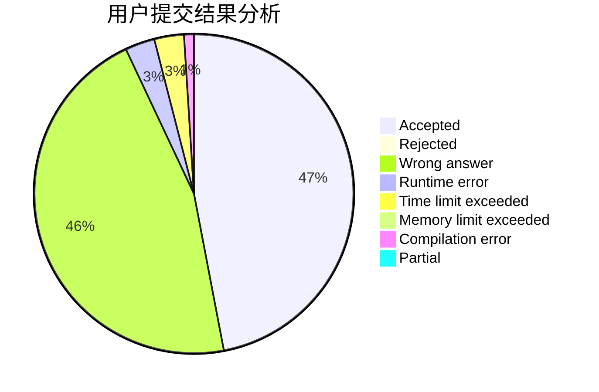
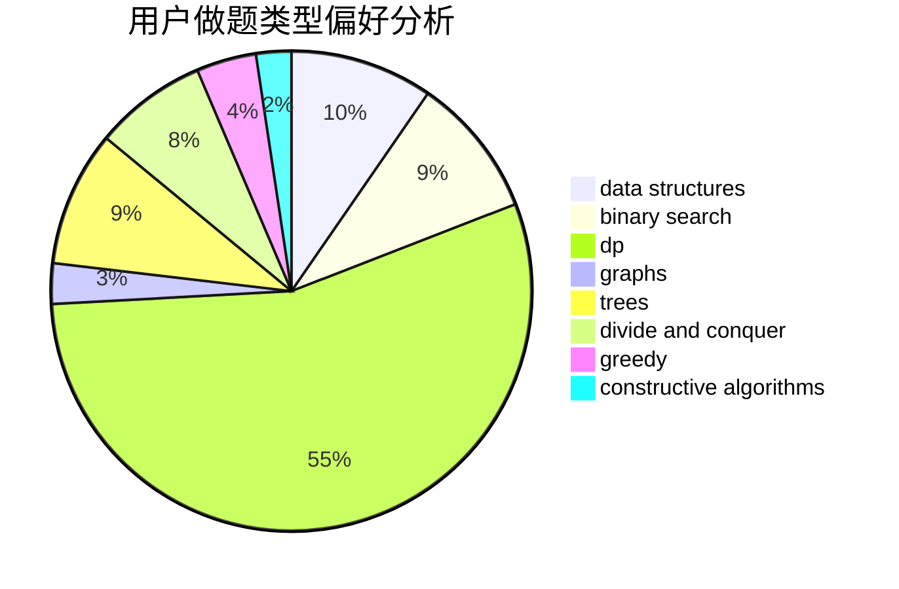

# GeoCalibur

<!-- tabs:start -->

#### **用户提交结果分析**

#### **用户做题类型偏好分析**

#### **用户错题知识点分析**

<!-- tabs:end -->
# 推荐题目
[1487D](https://codeforces.com/contest/1487/problem/D)		binary search,
                        brute force,
                        math,
                        number theory		  
[686D](https://codeforces.com/contest/686/problem/D)		dsu,graphs,sortings,trees		  
[1033E](https://codeforces.com/contest/1033/problem/E)		binary search,
                        constructive algorithms,
                        dfs and similar,
                        graphs,
                        interactive		  
[861A](https://codeforces.com/contest/861/problem/A)		dsu,graphs,sortings,trees		  
[559B](https://codeforces.com/contest/559/problem/B)		divide and conquer,
                        hashing,
                        sortings,
                        strings		  
[567D](https://codeforces.com/contest/567/problem/D)		binary search,
                        data structures,
                        greedy,
                        sortings		  
[886C](https://codeforces.com/contest/886/problem/C)		dsu,
                        greedy,
                        implementation,
                        trees		  
[1327A](https://codeforces.com/contest/1327/problem/A)		math		  
[74A](https://codeforces.com/contest/74/problem/A)		implementation		  
[113B](https://codeforces.com/contest/113/problem/B)		brute force,
                        data structures,
                        hashing,
                        strings		  
