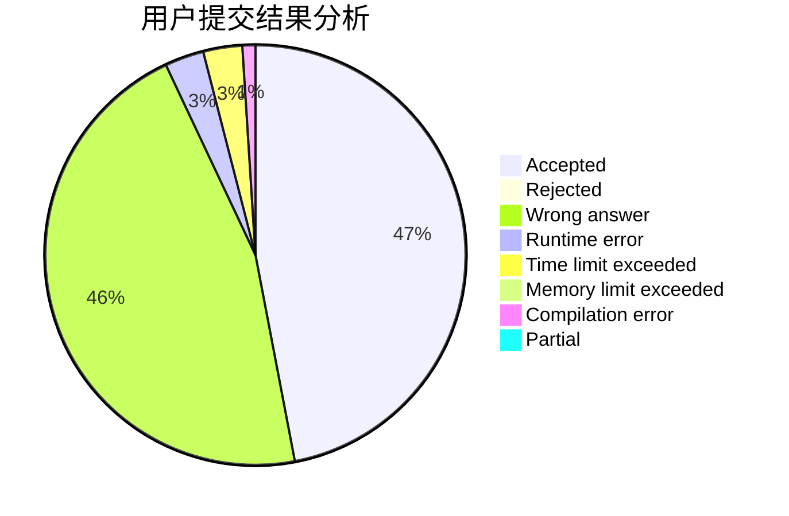
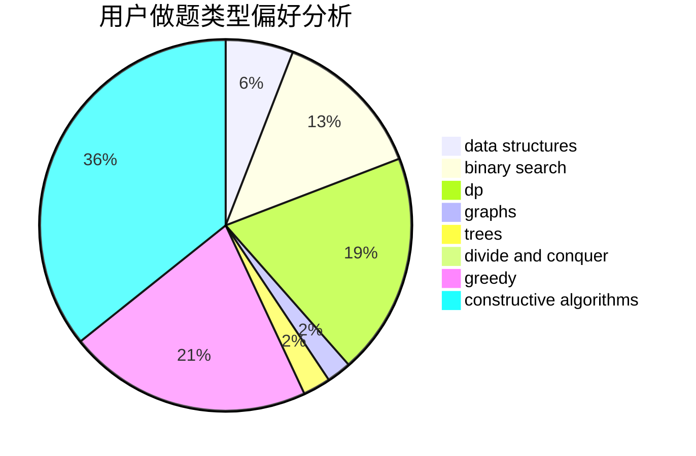
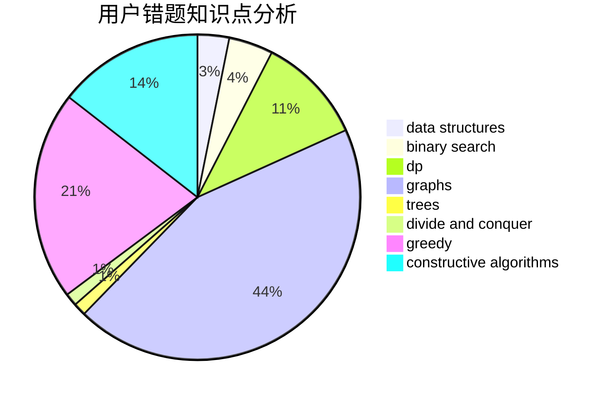

# GeoCalibur

<!-- tabs:start -->

#### **用户提交结果分析**

#### **用户做题类型偏好分析**

#### **用户错题知识点分析**

<!-- tabs:end -->
# 推荐题目
[1478F](https://codeforces.com/contest/1478/problem/F)		dsu,graphs,sortings,trees		  
[665F](https://codeforces.com/contest/665/problem/F)		data structures,
                        dp,
                        math,
                        number theory,
                        sortings,
                        two pointers		  
[1033B](https://codeforces.com/contest/1033/problem/B)		math,
                        number theory		  
[842B](https://codeforces.com/contest/842/problem/B)		geometry		  
[538A](https://codeforces.com/contest/538/problem/A)		brute force,
                        implementation		  
[543B](https://codeforces.com/contest/543/problem/B)		constructive algorithms,
                        graphs,
                        shortest paths		  
[865G](https://codeforces.com/contest/865/problem/G)		combinatorics,
                        math,
                        matrices		  
[1320A](https://codeforces.com/contest/1320/problem/A)		data structures,
                        dp,
                        greedy,
                        math,
                        sortings		  
[731E](https://codeforces.com/contest/731/problem/E)		dp,
                        games		  
[1137F](https://codeforces.com/contest/1137/problem/F)		data structures,
                        trees		  
