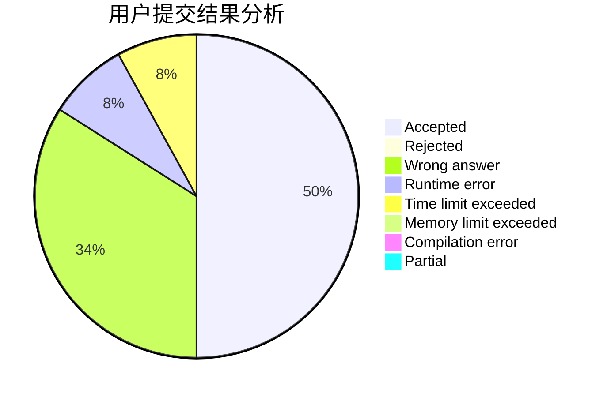
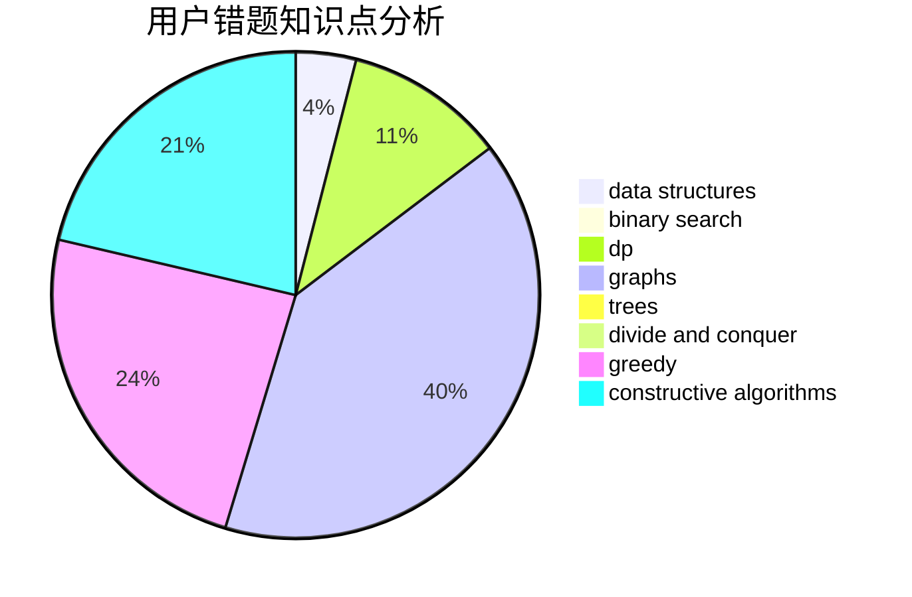

# 2020hduyz

<!-- tabs:start -->

#### **用户提交结果分析**

#### **用户做题类型偏好分析**

#### **用户错题知识点分析**

<!-- tabs:end -->
# 推荐题目
[1285A](https://codeforces.com/contest/1285/problem/A)		math		  
[1285B](https://codeforces.com/contest/1285/problem/B)		dp,
                        greedy,
                        implementation		  
[1283F](https://codeforces.com/contest/1283/problem/F)		constructive algorithms,
                        greedy,
                        trees		  
[113B](https://codeforces.com/contest/113/problem/B)		brute force,
                        data structures,
                        hashing,
                        strings		  
[1137B](https://codeforces.com/contest/1137/problem/B)		greedy,
                        hashing,
                        strings		  
[1282E](https://codeforces.com/contest/1282/problem/E)		constructive algorithms,
                        data structures,
                        dfs and similar,
                        graphs		  
[1283B](https://codeforces.com/contest/1283/problem/B)		math		  
[1283A](https://codeforces.com/contest/1283/problem/A)		math		  
[1283D](https://codeforces.com/contest/1283/problem/D)		graphs,
                        greedy,
                        shortest paths		  
[1118E](https://codeforces.com/contest/1118/problem/E)		constructive algorithms,
                        implementation		  
