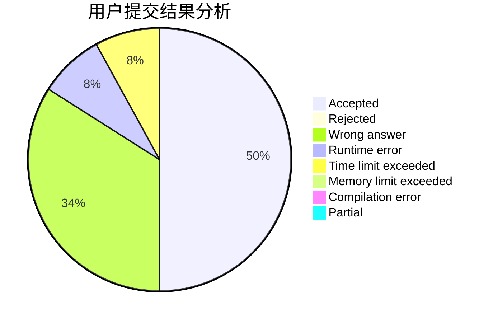
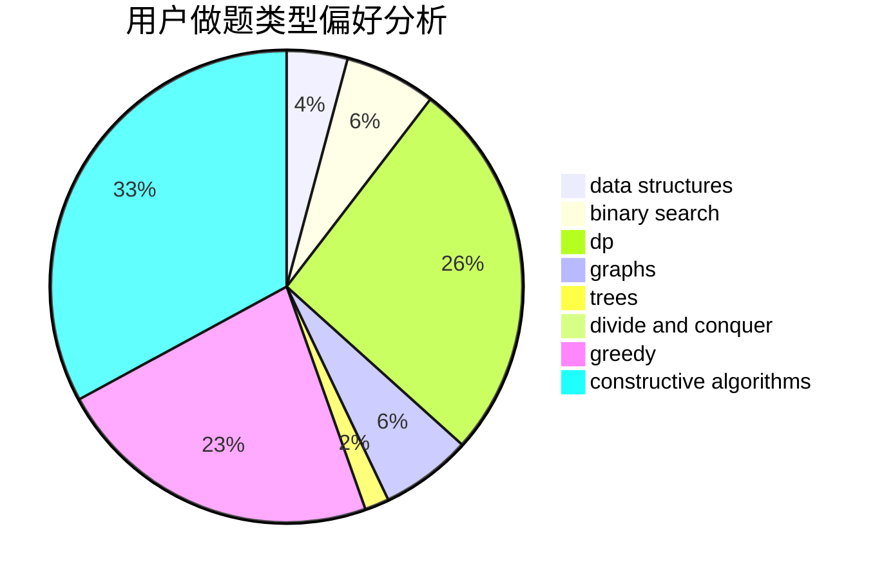
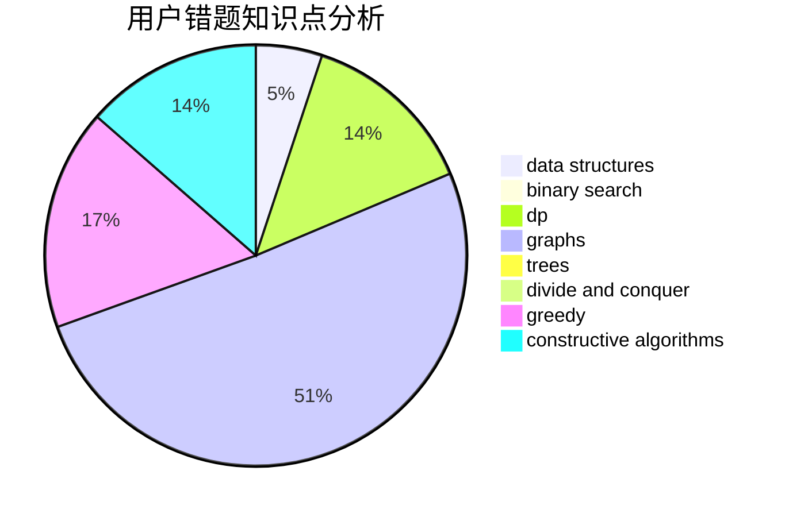

# 2020hduyz

<!-- tabs:start -->

#### **用户提交结果分析**

#### **用户做题类型偏好分析**

#### **用户错题知识点分析**

<!-- tabs:end -->
# 推荐题目
[1292B](https://codeforces.com/contest/1292/problem/B)		brute force,
                        constructive algorithms,
                        geometry,
                        greedy,
                        implementation		  
[1292C](https://codeforces.com/contest/1292/problem/C)		combinatorics,
                        dfs and similar,
                        dp,
                        greedy,
                        trees		  
[1290F](https://codeforces.com/contest/1290/problem/F)		dp		  
[1141B](https://codeforces.com/contest/1141/problem/B)		implementation		  
[1139C](https://codeforces.com/contest/1139/problem/C)		dfs and similar,
                        dsu,
                        graphs,
                        math,
                        trees		  
[128C](https://codeforces.com/contest/128/problem/C)		combinatorics,
                        dp		  
[1290B](https://codeforces.com/contest/1290/problem/B)		binary search,
                        constructive algorithms,
                        data structures,
                        strings,
                        two pointers		  
[1290A](https://codeforces.com/contest/1290/problem/A)		brute force,
                        data structures,
                        implementation		  
[1290D](https://codeforces.com/contest/1290/problem/D)		constructive algorithms,
                        graphs,
                        interactive		  
[1120C](https://codeforces.com/contest/1120/problem/C)		dp,
                        strings		  
