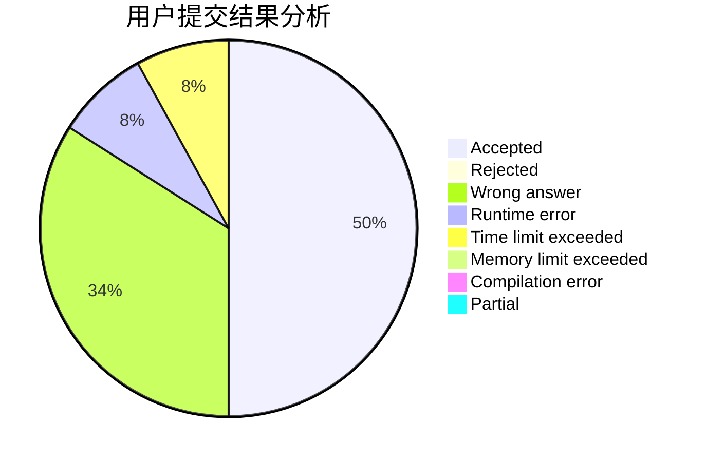
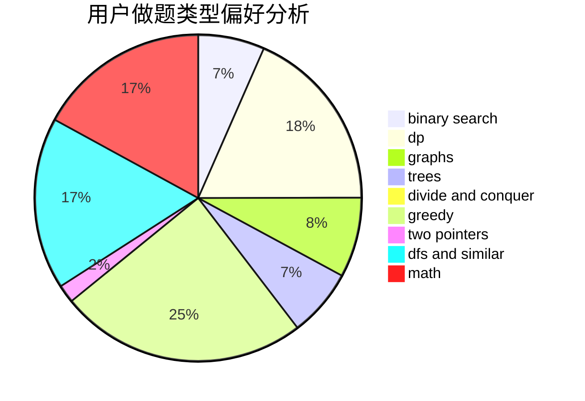

# 2020hduyz

<!-- tabs:start -->

#### **用户提交结果分析**

#### **用户做题类型偏好分析**

<!-- tabs:end -->
# 推荐题目
[1292B](https://codeforces.com/contest/1292/problem/B)
[1292C](https://codeforces.com/contest/1292/problem/C)
[1290F](https://codeforces.com/contest/1290/problem/F)
[1141B](https://codeforces.com/contest/1141/problem/B)
[1139C](https://codeforces.com/contest/1139/problem/C)
[128C](https://codeforces.com/contest/128/problem/C)
[1290B](https://codeforces.com/contest/1290/problem/B)
[1290A](https://codeforces.com/contest/1290/problem/A)
[1290D](https://codeforces.com/contest/1290/problem/D)
[1120C](https://codeforces.com/contest/1120/problem/C)
