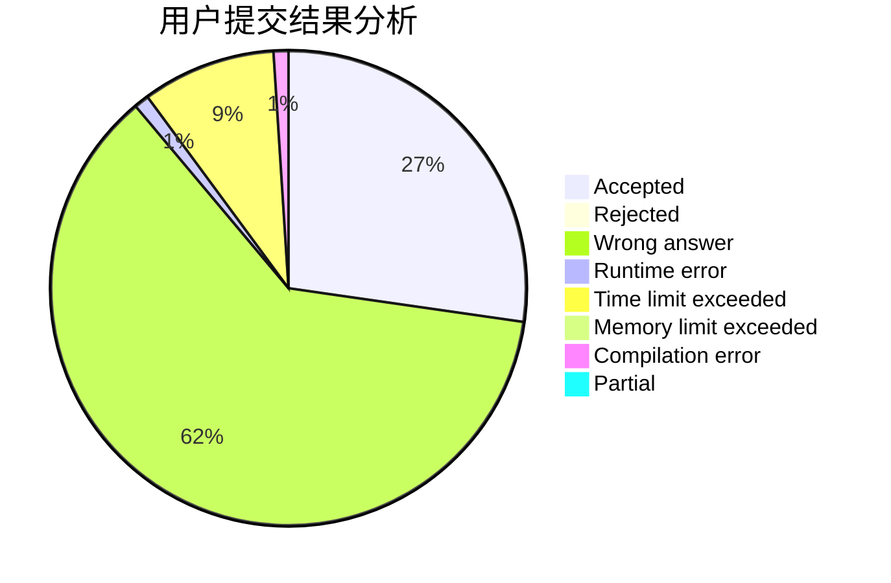
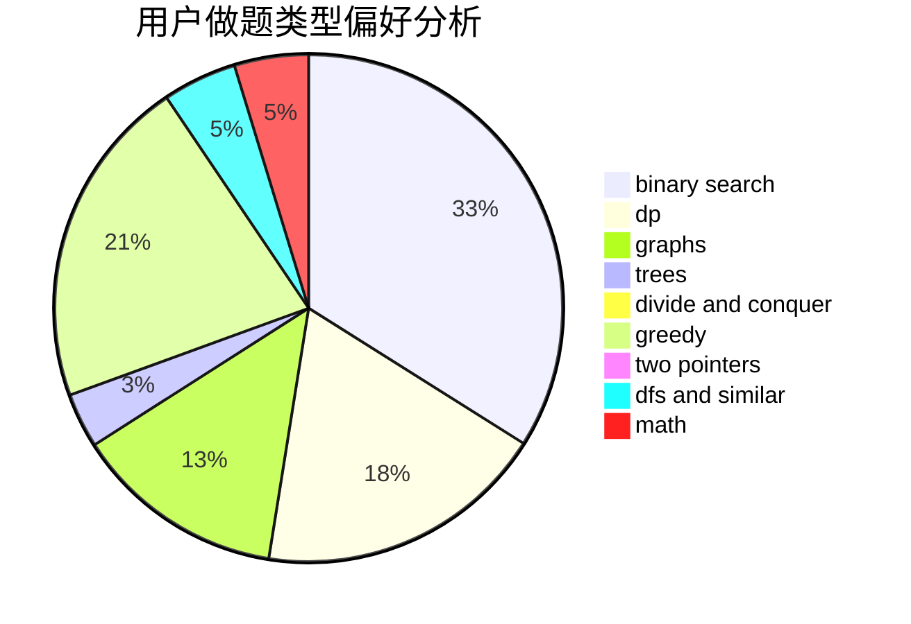

# GhostCai

<!-- tabs:start -->

#### **用户提交结果分析**

#### **用户做题类型偏好分析**

<!-- tabs:end -->
# 推荐题目
[1485C](https://codeforces.com/contest/1485/problem/C)
[1491G](https://codeforces.com/contest/1491/problem/G)
[569A](https://codeforces.com/contest/569/problem/A)
[1423I](https://codeforces.com/contest/1423/problem/I)
[830E](https://codeforces.com/contest/830/problem/E)
[1366F](https://codeforces.com/contest/1366/problem/F)
[902D](https://codeforces.com/contest/902/problem/D)
[468C](https://codeforces.com/contest/468/problem/C)
[903A](https://codeforces.com/contest/903/problem/A)
[1415C](https://codeforces.com/contest/1415/problem/C)
