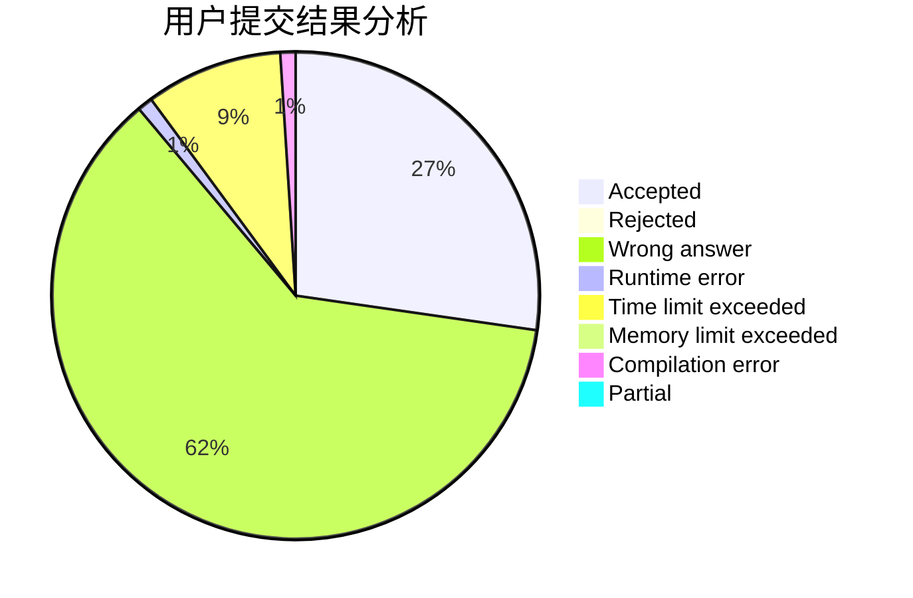
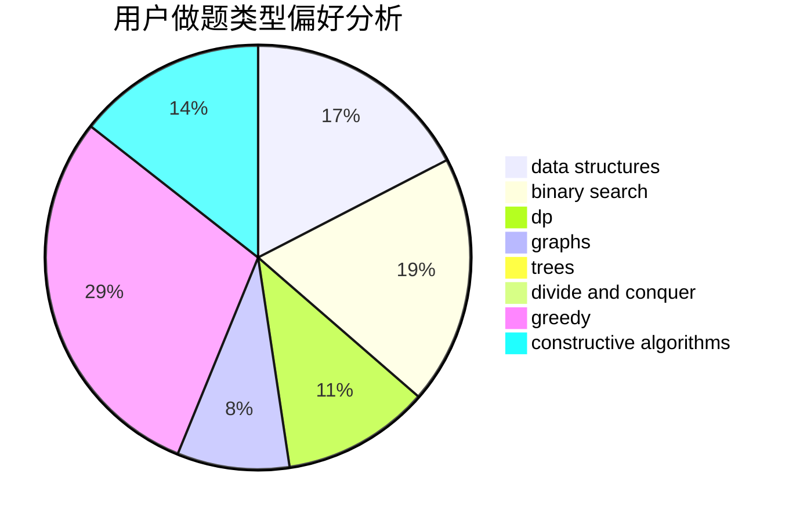
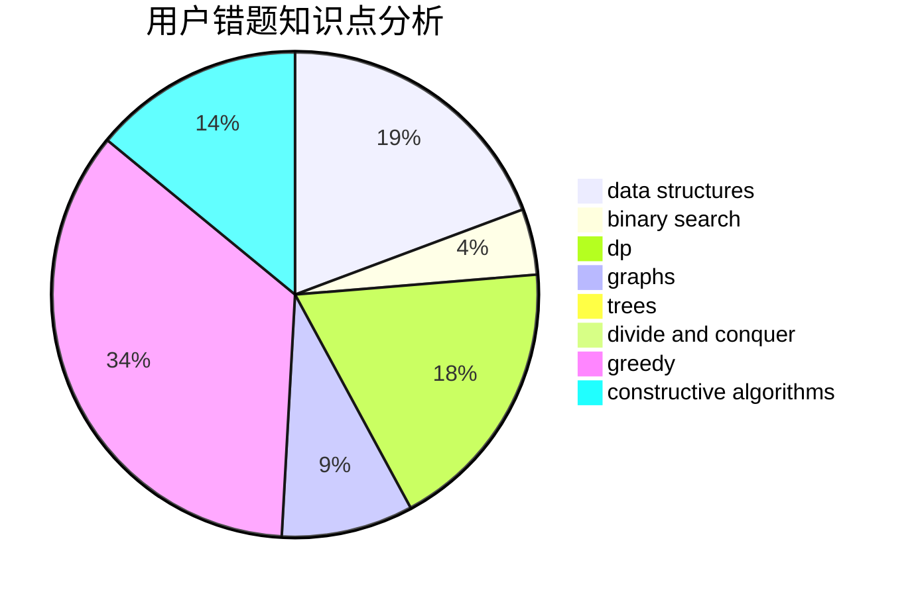

# GhostCai

<!-- tabs:start -->

#### **用户提交结果分析**

#### **用户做题类型偏好分析**

#### **用户错题知识点分析**

<!-- tabs:end -->
# 推荐题目
[1476E](https://codeforces.com/contest/1476/problem/E)		bitmasks,
                        data structures,
                        dfs and similar,
                        graphs,
                        hashing,
                        sortings,
                        strings		  
[1484C](https://codeforces.com/contest/1484/problem/C)		dsu,graphs,sortings,trees		  
[544D](https://codeforces.com/contest/544/problem/D)		dsu,graphs,sortings,trees		  
[1415E](https://codeforces.com/contest/1415/problem/E)		constructive algorithms,
                        greedy,
                        math		  
[812B](https://codeforces.com/contest/812/problem/B)		bitmasks,
                        brute force,
                        dp		  
[1358D](https://codeforces.com/contest/1358/problem/D)		binary search,
                        brute force,
                        greedy,
                        implementation,
                        two pointers		  
[884C](https://codeforces.com/contest/884/problem/C)		dfs and similar,
                        greedy,
                        math		  
[448C](https://codeforces.com/contest/448/problem/C)		divide and conquer,
                        dp,
                        greedy		  
[884D](https://codeforces.com/contest/884/problem/D)		data structures,
                        greedy		  
[1404A](https://codeforces.com/contest/1404/problem/A)		implementation,
                        strings		  
