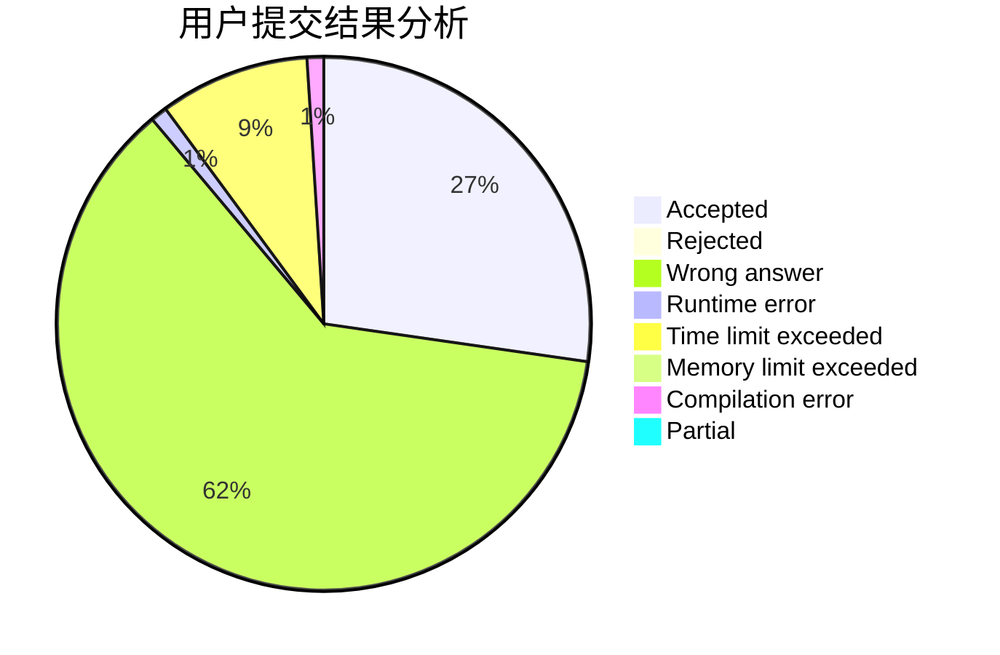
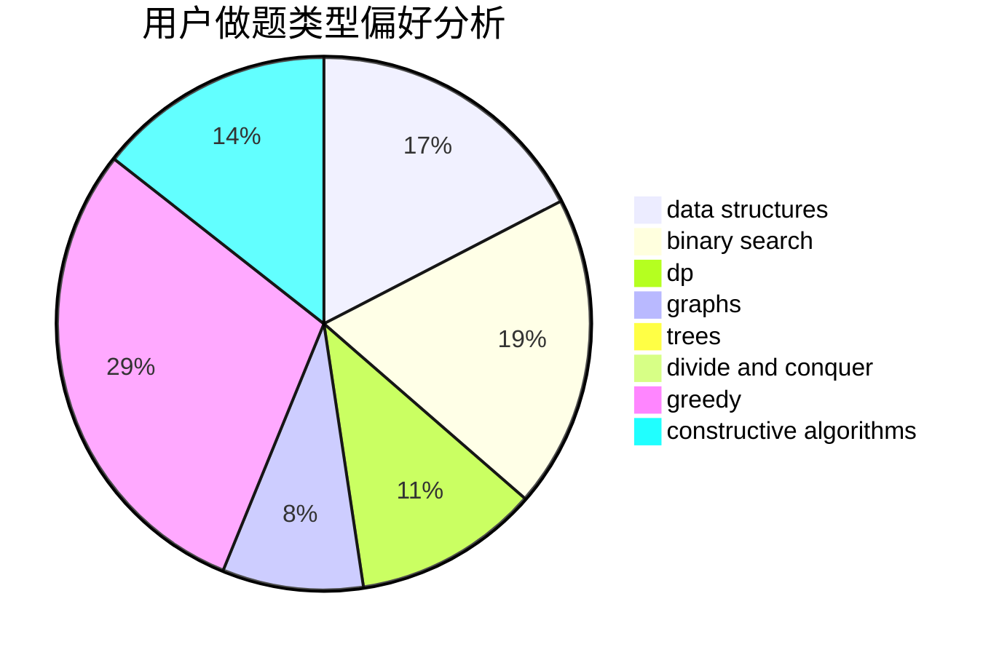
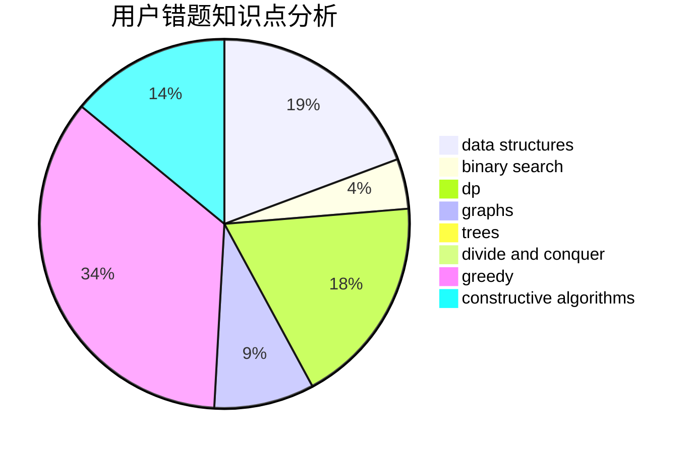

# GhostCai
<!-- tabs:start -->
#### **用户提交结果分析**

#### **用户做题类型偏好分析**

#### **用户错题知识点分析**

<!-- tabs:end -->
# 推荐题目
[Basic Diplomacy](https://codeforces.com/contest/1484/problem/C)		brute force,
                        constructive algorithms,
                        greedy,
                        implementation		  
[WeirdSort](http://codeforces.com/problemset/problem/1311/B)		dfs and similar,
                        sortings		  
[Berry Jam](http://codeforces.com/problemset/problem/1278/C)		data structures,
                        dp,
                        greedy,
                        implementation		  
[Destroying Roads](https://codeforces.com/contest/544/problem/D)		constructive algorithms,
                        graphs,
                        shortest paths		  
[Karen and Game](https://codeforces.com/contest/816/problem/C)		brute force,
                        greedy,
                        implementation		  
[Boxes And Balls](http://codeforces.com/problemset/problem/884/D)		data structures,
                        greedy		  
[The Best Vacation](http://codeforces.com/problemset/problem/1358/D)		binary search,
                        brute force,
                        greedy,
                        implementation,
                        two pointers		  
[Balance](http://codeforces.com/problemset/problem/317/C)		constructive algorithms,
                        dfs and similar,
                        graphs,
                        trees		  
[Triple Flips](https://codeforces.com/contest/1071/problem/C)		constructive algorithms		  
[Find Divisible](http://codeforces.com/problemset/problem/1096/A)		greedy,
                        implementation,
                        math		  
<!-- tabs:start -->
#### **data structures**
[Basic Diplomacy](http://codeforces.com/problemset/problem/1278/C)		data structures,
                        dp,
                        greedy,
                        implementation		  
[WeirdSort](http://codeforces.com/problemset/problem/884/D)		data structures,
                        greedy		  
[Berry Jam](http://codeforces.com/problemset/problem/568/E)		data structures,
                        dp		  
[Destroying Roads](http://codeforces.com/problemset/problem/547/E)		data structures,
                        string suffix structures,
                        strings,
                        trees		  
[Karen and Game](http://codeforces.com/problemset/problem/1476/E)		bitmasks,
                        data structures,
                        dfs and similar,
                        graphs,
                        hashing,
                        sortings,
                        strings		  
[Boxes And Balls](http://codeforces.com/problemset/problem/702/B)		brute force,
                        data structures,
                        implementation,
                        math		  
[The Best Vacation](http://codeforces.com/problemset/problem/1492/C)		binary search,
                        data structures,
                        dp,
                        greedy,
                        two pointers		  
[Balance](http://codeforces.com/problemset/problem/1490/G)		binary search,
                        data structures,
                        math		  
[Triple Flips](http://codeforces.com/problemset/problem/1479/D)		binary search,
                        bitmasks,
                        brute force,
                        data structures,
                        probabilities,
                        trees		  
[Find Divisible](http://codeforces.com/problemset/problem/1497/A)		brute force,
                        data structures,
                        greedy,
                        sortings		  
#### **binary search**
[Basic Diplomacy](http://codeforces.com/problemset/problem/1358/D)		binary search,
                        brute force,
                        greedy,
                        implementation,
                        two pointers		  
[WeirdSort](http://codeforces.com/problemset/problem/830/A)		binary search,
                        brute force,
                        dp,
                        greedy,
                        sortings		  
[Berry Jam](http://codeforces.com/problemset/problem/1492/C)		binary search,
                        data structures,
                        dp,
                        greedy,
                        two pointers		  
[Destroying Roads](http://codeforces.com/problemset/problem/1463/D)		binary search,
                        constructive algorithms,
                        greedy,
                        two pointers		  
[Karen and Game](http://codeforces.com/problemset/problem/1490/G)		binary search,
                        data structures,
                        math		  
[Boxes And Balls](http://codeforces.com/problemset/problem/1479/D)		binary search,
                        bitmasks,
                        brute force,
                        data structures,
                        probabilities,
                        trees		  
[The Best Vacation](http://codeforces.com/problemset/problem/1436/E)		binary search,
                        data structures,
                        two pointers		  
[Balance](http://codeforces.com/problemset/problem/1461/D)		binary search,
                        brute force,
                        data structures,
                        divide and conquer,
                        implementation,
                        sortings		  
[Triple Flips](http://codeforces.com/problemset/problem/1493/C)		binary search,
                        brute force,
                        constructive algorithms,
                        greedy,
                        strings		  
[Find Divisible](http://codeforces.com/problemset/problem/1487/D)		binary search,
                        brute force,
                        math,
                        number theory		  
#### **dp**
[Basic Diplomacy](http://codeforces.com/problemset/problem/1278/C)		data structures,
                        dp,
                        greedy,
                        implementation		  
[WeirdSort](http://codeforces.com/problemset/problem/830/A)		binary search,
                        brute force,
                        dp,
                        greedy,
                        sortings		  
[Berry Jam](http://codeforces.com/problemset/problem/731/E)		dp,
                        games		  
[Destroying Roads](http://codeforces.com/problemset/problem/812/B)		bitmasks,
                        brute force,
                        dp		  
[Karen and Game](http://codeforces.com/problemset/problem/568/E)		data structures,
                        dp		  
[Boxes And Balls](http://codeforces.com/problemset/problem/1120/D)		dfs and similar,
                        dp,
                        dsu,
                        graphs,
                        greedy,
                        trees		  
[The Best Vacation](http://codeforces.com/problemset/problem/448/C)		divide and conquer,
                        dp,
                        greedy		  
[Balance](http://codeforces.com/problemset/problem/142/C)		brute force,
                        dp		  
[Triple Flips](http://codeforces.com/problemset/problem/1303/E)		dp,
                        strings		  
[Find Divisible](http://codeforces.com/problemset/problem/1459/B)		dp,
                        math		  
#### **graph**
[Basic Diplomacy](https://codeforces.com/contest/544/problem/D)		constructive algorithms,
                        graphs,
                        shortest paths		  
[WeirdSort](http://codeforces.com/problemset/problem/317/C)		constructive algorithms,
                        dfs and similar,
                        graphs,
                        trees		  
[Berry Jam](http://codeforces.com/problemset/problem/884/F)		flows,
                        graphs,
                        greedy		  
[Destroying Roads](http://codeforces.com/problemset/problem/1120/D)		dfs and similar,
                        dp,
                        dsu,
                        graphs,
                        greedy,
                        trees		  
[Karen and Game](http://codeforces.com/problemset/problem/1476/E)		bitmasks,
                        data structures,
                        dfs and similar,
                        graphs,
                        hashing,
                        sortings,
                        strings		  
[Boxes And Balls](http://codeforces.com/problemset/problem/1383/F)		flows,
                        graphs		  
[The Best Vacation](http://codeforces.com/problemset/problem/1487/C)		brute force,
                        constructive algorithms,
                        dfs and similar,
                        graphs,
                        greedy,
                        implementation,
                        math		  
[Balance](http://codeforces.com/problemset/problem/1437/C)		dp,
                        flows,
                        graph matchings,
                        greedy,
                        math,
                        sortings		  
[Triple Flips](http://codeforces.com/problemset/problem/1470/D)		constructive algorithms,
                        dfs and similar,
                        graph matchings,
                        graphs,
                        greedy		  
[Find Divisible](http://codeforces.com/problemset/problem/1476/C)		dp,
                        graphs,
                        greedy		  
#### **trees**
[Basic Diplomacy](http://codeforces.com/problemset/problem/317/C)		constructive algorithms,
                        dfs and similar,
                        graphs,
                        trees		  
[WeirdSort](http://codeforces.com/problemset/problem/1120/D)		dfs and similar,
                        dp,
                        dsu,
                        graphs,
                        greedy,
                        trees		  
[Berry Jam](http://codeforces.com/problemset/problem/547/E)		data structures,
                        string suffix structures,
                        strings,
                        trees		  
[Destroying Roads](http://codeforces.com/problemset/problem/1479/D)		binary search,
                        bitmasks,
                        brute force,
                        data structures,
                        probabilities,
                        trees		  
[Karen and Game](http://codeforces.com/problemset/problem/1511/C)		brute force,
                        data structures,
                        implementation,
                        trees		  
[Boxes And Balls](http://codeforces.com/problemset/problem/1499/F)		combinatorics,
                        dfs and similar,
                        dp,
                        trees		  
[The Best Vacation](http://codeforces.com/problemset/problem/1491/E)		brute force,
                        dfs and similar,
                        divide and conquer,
                        number theory,
                        trees		  
[Balance](http://codeforces.com/problemset/problem/1466/D)		data structures,
                        greedy,
                        sortings,
                        trees		  
[Triple Flips](http://codeforces.com/problemset/problem/1495/D)		combinatorics,
                        dfs and similar,
                        graphs,
                        math,
                        shortest paths,
                        trees		  
[Find Divisible](http://codeforces.com/problemset/problem/1303/G)		data structures,
                        divide and conquer,
                        geometry,
                        trees		  
#### **divide and conquer**
[Basic Diplomacy](http://codeforces.com/problemset/problem/448/C)		divide and conquer,
                        dp,
                        greedy		  
[WeirdSort](http://codeforces.com/problemset/problem/1461/D)		binary search,
                        brute force,
                        data structures,
                        divide and conquer,
                        implementation,
                        sortings		  
[Berry Jam](http://codeforces.com/problemset/problem/1466/G)		combinatorics,
                        divide and conquer,
                        hashing,
                        math,
                        string suffix structures,
                        strings		  
[Destroying Roads](http://codeforces.com/problemset/problem/1490/D)		dfs and similar,
                        divide and conquer,
                        implementation		  
[Karen and Game](https://codeforces.com/contest/1483/problem/C)		data structures,
                        divide and conquer,
                        dp		  
[Boxes And Balls](http://codeforces.com/problemset/problem/1491/E)		brute force,
                        dfs and similar,
                        divide and conquer,
                        number theory,
                        trees		  
[The Best Vacation](http://codeforces.com/problemset/problem/1303/G)		data structures,
                        divide and conquer,
                        geometry,
                        trees		  
[Balance](http://codeforces.com/problemset/problem/1494/D)		constructive algorithms,
                        data structures,
                        dfs and similar,
                        divide and conquer,
                        dsu,
                        greedy,
                        sortings,
                        trees		  
[Triple Flips](http://codeforces.com/problemset/problem/1482/E)		data structures,
                        divide and conquer,
                        dp		  
[Find Divisible](http://codeforces.com/problemset/problem/566/C)		dfs and similar,
                        divide and conquer,
                        trees		  
#### **greedy**
[Basic Diplomacy](https://codeforces.com/contest/1484/problem/C)		brute force,
                        constructive algorithms,
                        greedy,
                        implementation		  
[WeirdSort](http://codeforces.com/problemset/problem/1278/C)		data structures,
                        dp,
                        greedy,
                        implementation		  
[Berry Jam](https://codeforces.com/contest/816/problem/C)		brute force,
                        greedy,
                        implementation		  
[Destroying Roads](http://codeforces.com/problemset/problem/884/D)		data structures,
                        greedy		  
[Karen and Game](http://codeforces.com/problemset/problem/1358/D)		binary search,
                        brute force,
                        greedy,
                        implementation,
                        two pointers		  
[Boxes And Balls](http://codeforces.com/problemset/problem/1096/A)		greedy,
                        implementation,
                        math		  
[The Best Vacation](http://codeforces.com/problemset/problem/1415/E)		constructive algorithms,
                        greedy,
                        math		  
[Balance](http://codeforces.com/problemset/problem/819/A)		games,
                        greedy		  
[Triple Flips](http://codeforces.com/problemset/problem/830/A)		binary search,
                        brute force,
                        dp,
                        greedy,
                        sortings		  
[Find Divisible](http://codeforces.com/problemset/problem/884/F)		flows,
                        graphs,
                        greedy		  
#### **constructive algorithms**
[Basic Diplomacy](https://codeforces.com/contest/1484/problem/C)		brute force,
                        constructive algorithms,
                        greedy,
                        implementation		  
[WeirdSort](https://codeforces.com/contest/544/problem/D)		constructive algorithms,
                        graphs,
                        shortest paths		  
[Berry Jam](http://codeforces.com/problemset/problem/317/C)		constructive algorithms,
                        dfs and similar,
                        graphs,
                        trees		  
[Destroying Roads](https://codeforces.com/contest/1071/problem/C)		constructive algorithms		  
[Karen and Game](http://codeforces.com/problemset/problem/1415/E)		constructive algorithms,
                        greedy,
                        math		  
[Boxes And Balls](http://codeforces.com/problemset/problem/1372/C)		constructive algorithms,
                        math		  
[The Best Vacation](http://codeforces.com/problemset/problem/1493/A)		constructive algorithms,
                        greedy		  
[Balance](http://codeforces.com/problemset/problem/1463/D)		binary search,
                        constructive algorithms,
                        greedy,
                        two pointers		  
[Triple Flips](https://codeforces.com/contest/1456/problem/B)		bitmasks,
                        brute force,
                        constructive algorithms		  
[Find Divisible](http://codeforces.com/problemset/problem/1492/D)		bitmasks,
                        constructive algorithms,
                        greedy,
                        math		  
#### **sortings**
[Basic Diplomacy](http://codeforces.com/problemset/problem/1311/B)		dfs and similar,
                        sortings		  
[WeirdSort](http://codeforces.com/problemset/problem/830/A)		binary search,
                        brute force,
                        dp,
                        greedy,
                        sortings		  
[Berry Jam](http://codeforces.com/problemset/problem/1476/E)		bitmasks,
                        data structures,
                        dfs and similar,
                        graphs,
                        hashing,
                        sortings,
                        strings		  
[Destroying Roads](http://codeforces.com/problemset/problem/1397/B)		brute force,
                        math,
                        number theory,
                        sortings		  
[Karen and Game](https://codeforces.com/contest/1496/problem/C)		geometry,
                        greedy,
                        math,
                        sortings		  
[Boxes And Balls](http://codeforces.com/problemset/problem/1495/A)		geometry,
                        greedy,
                        math,
                        sortings		  
[The Best Vacation](http://codeforces.com/problemset/problem/1497/A)		brute force,
                        data structures,
                        greedy,
                        sortings		  
[Balance](http://codeforces.com/problemset/problem/1427/A)		math,
                        sortings		  
[Triple Flips](http://codeforces.com/problemset/problem/1461/D)		binary search,
                        brute force,
                        data structures,
                        divide and conquer,
                        implementation,
                        sortings		  
[Find Divisible](http://codeforces.com/problemset/problem/1437/C)		dp,
                        flows,
                        graph matchings,
                        greedy,
                        math,
                        sortings		  
<!-- tabs:end -->
