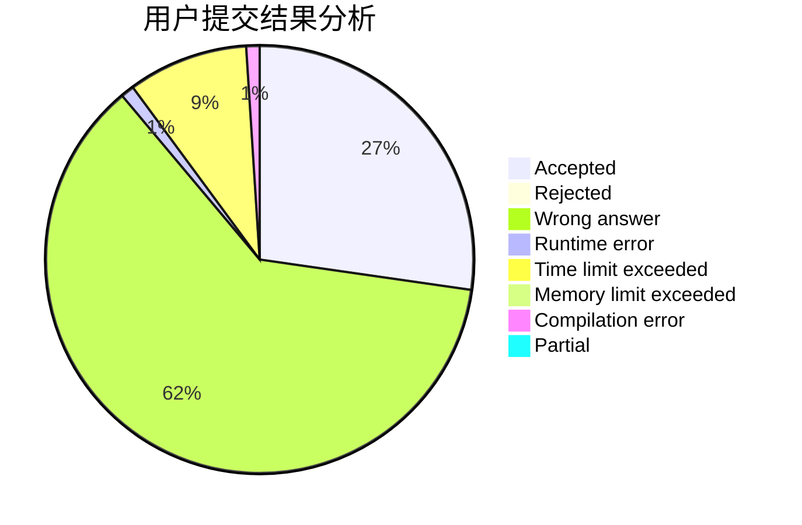
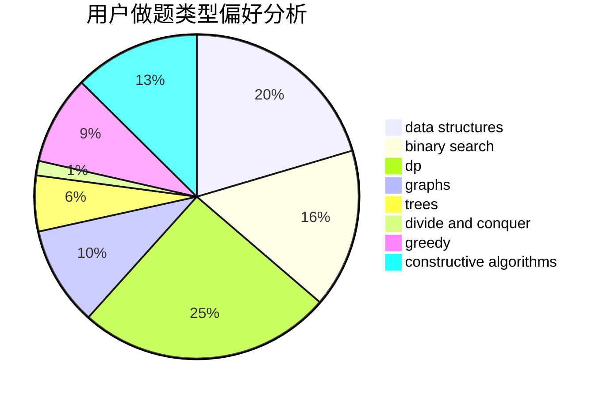
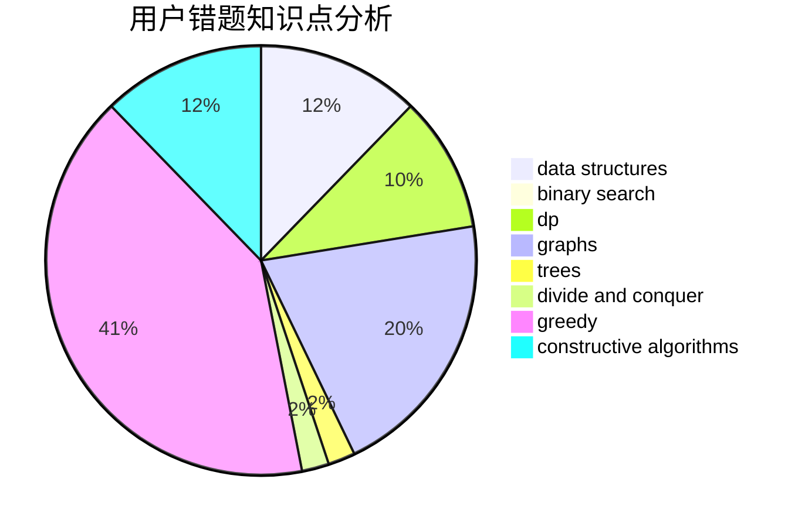

# GhostCai

<!-- tabs:start -->

#### **用户提交结果分析**

#### **用户做题类型偏好分析**

#### **用户错题知识点分析**

<!-- tabs:end -->
# 推荐题目
[1485C](https://codeforces.com/contest/1485/problem/C)		binary search,
                        brute force,
                        math,
                        number theory		  
[1491G](https://codeforces.com/contest/1491/problem/G)		constructive algorithms,
                        graphs,
                        math		  
[569A](https://codeforces.com/contest/569/problem/A)		implementation,
                        math		  
[1423I](https://codeforces.com/contest/1423/problem/I)		bitmasks		  
[830E](https://codeforces.com/contest/830/problem/E)		constructive algorithms,
                        dp,
                        graphs,
                        implementation,
                        math,
                        trees		  
[1366F](https://codeforces.com/contest/1366/problem/F)		binary search,
                        dp,
                        geometry,
                        graphs		  
[902D](https://codeforces.com/contest/902/problem/D)		dsu,graphs,sortings,trees		  
[468C](https://codeforces.com/contest/468/problem/C)		binary search,
                        constructive algorithms,
                        math		  
[903A](https://codeforces.com/contest/903/problem/A)		greedy,
                        implementation		  
[1415C](https://codeforces.com/contest/1415/problem/C)		brute force,
                        dp,
                        implementation		  
