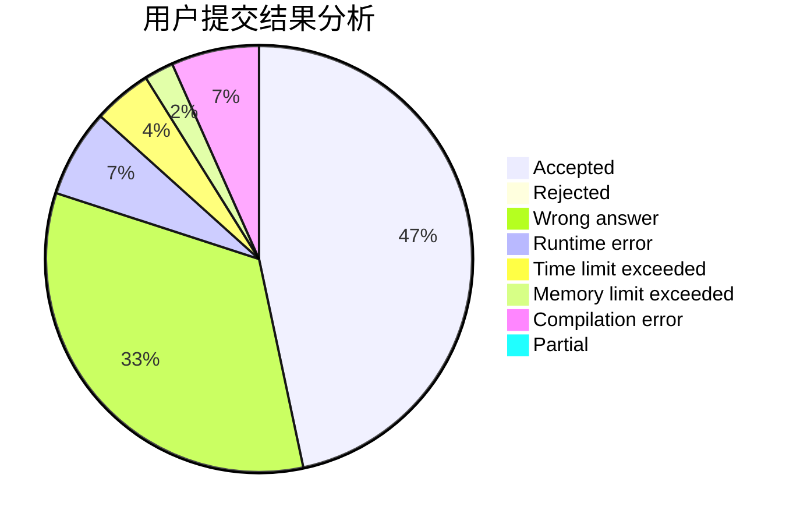
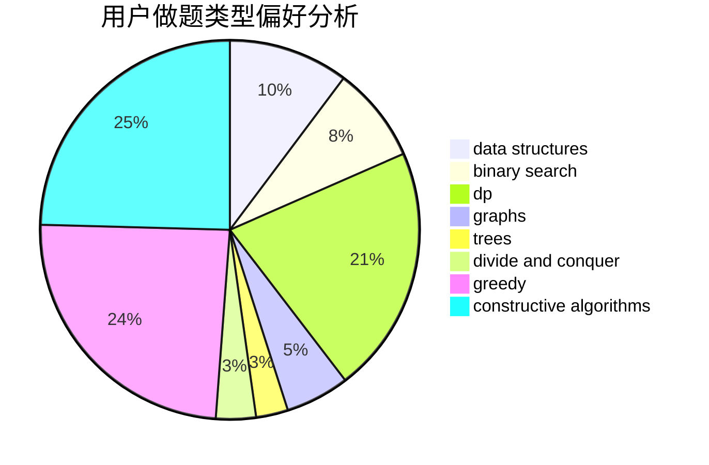
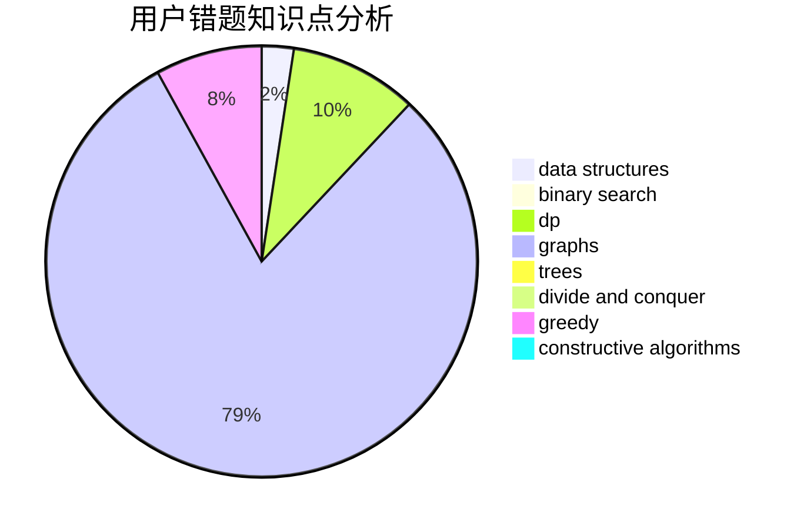

# GhostOfGod

<!-- tabs:start -->

#### **用户提交结果分析**

#### **用户做题类型偏好分析**

#### **用户错题知识点分析**

<!-- tabs:end -->
# 推荐题目
[54A](https://codeforces.com/contest/54/problem/A)		implementation		  
[377E](https://codeforces.com/contest/377/problem/E)		dp,
                        geometry		  
[238A](https://codeforces.com/contest/238/problem/A)		constructive algorithms,
                        math		  
[886F](https://codeforces.com/contest/886/problem/F)		geometry		  
[1080B](https://codeforces.com/contest/1080/problem/B)		math		  
[1167D](https://codeforces.com/contest/1167/problem/D)		constructive algorithms,
                        greedy		  
[515C](https://codeforces.com/contest/515/problem/C)		greedy,
                        math,
                        sortings		  
[220E](https://codeforces.com/contest/220/problem/E)		data structures,
                        two pointers		  
[1118E](https://codeforces.com/contest/1118/problem/E)		constructive algorithms,
                        implementation		  
[1349D](https://codeforces.com/contest/1349/problem/D)		math,
                        probabilities		  
