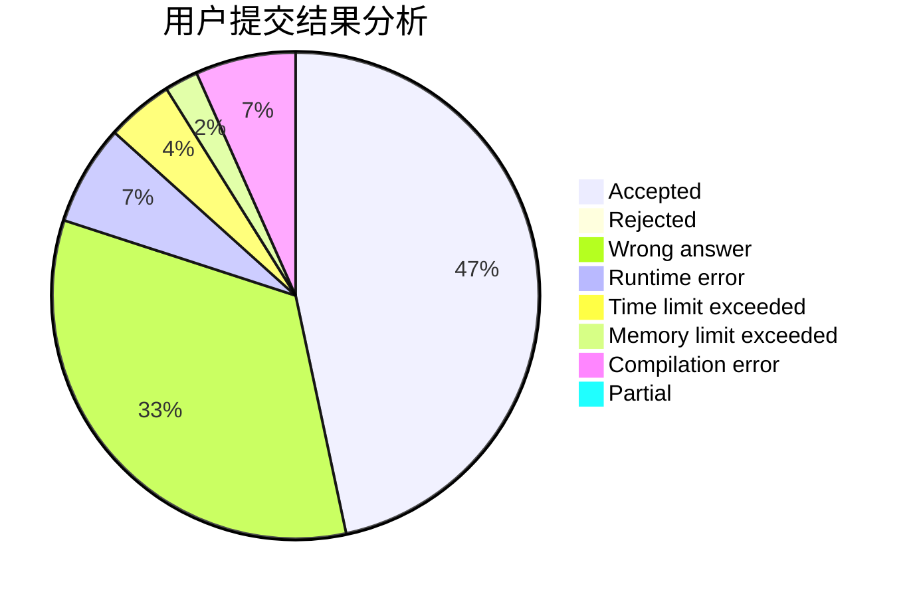
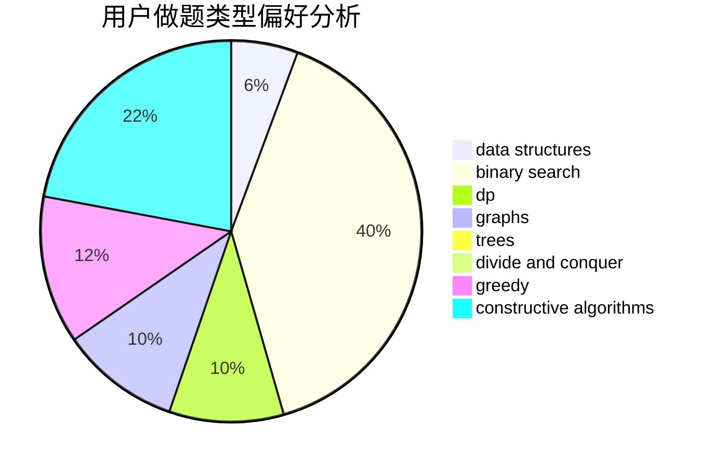

# GhostOfGod

<!-- tabs:start -->

#### **用户提交结果分析**

#### **用户做题类型偏好分析**

#### **用户错题知识点分析**

<!-- tabs:end -->
# 推荐题目
[575A](https://codeforces.com/contest/575/problem/A)		data structures,
                        math,
                        matrices		  
[407B](https://codeforces.com/contest/407/problem/B)		dp,
                        implementation		  
[25D](https://codeforces.com/contest/25/problem/D)		dsu,
                        graphs,
                        trees		  
[906A](https://codeforces.com/contest/906/problem/A)		implementation,
                        strings		  
[1080E](https://codeforces.com/contest/1080/problem/E)		strings		  
[1172A](https://codeforces.com/contest/1172/problem/A)		greedy,
                        implementation		  
[542D](https://codeforces.com/contest/542/problem/D)		dfs and similar,
                        dp,
                        hashing,
                        math,
                        number theory		  
[240E](https://codeforces.com/contest/240/problem/E)		dfs and similar,
                        graphs,
                        greedy		  
[1120C](https://codeforces.com/contest/1120/problem/C)		dp,
                        strings		  
[13562](https://codeforces.com/contest/1356/problem/2)		dsu,graphs,sortings,trees		  
