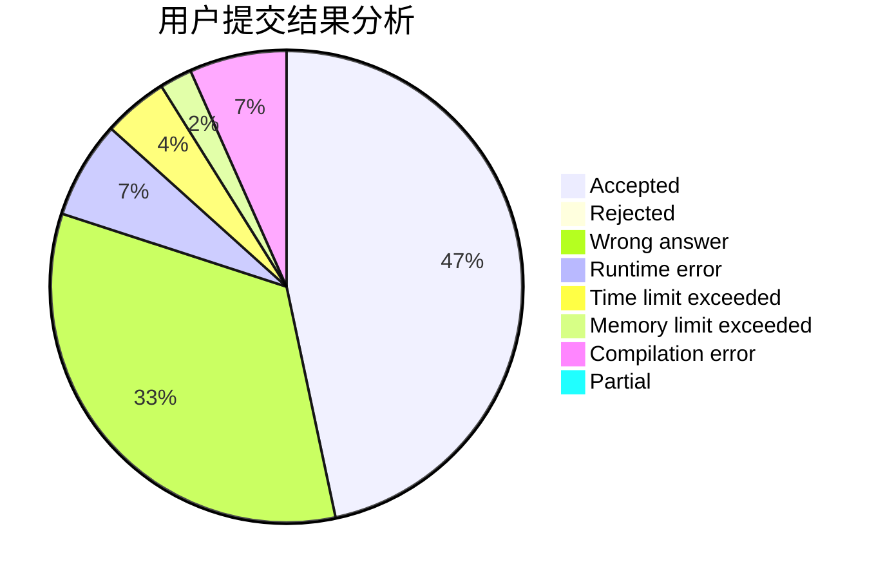
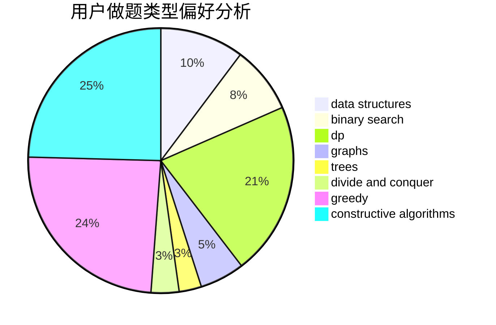
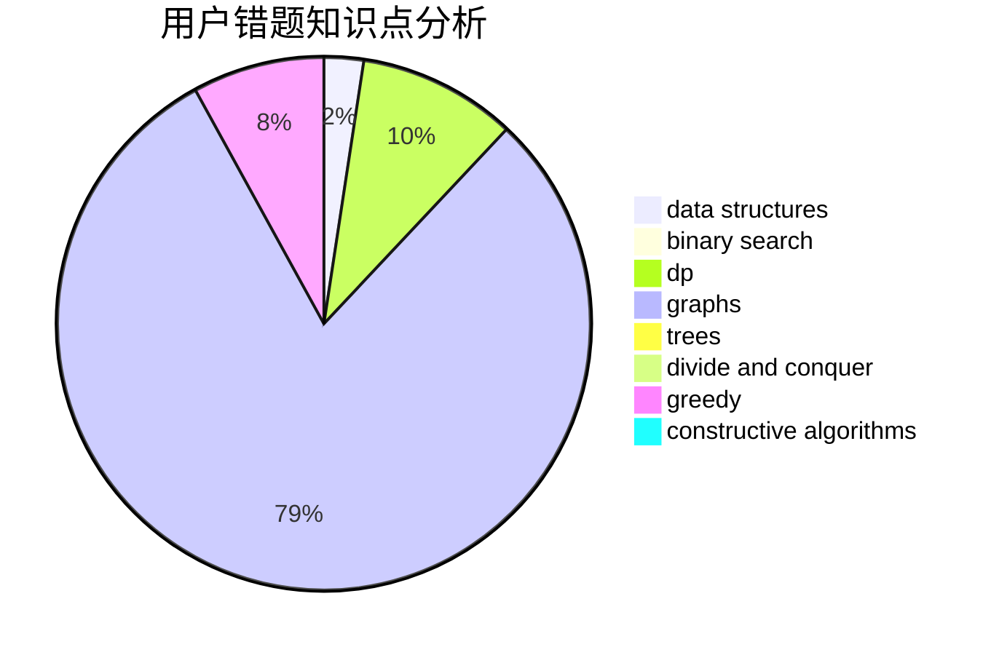

# GhostOfGod
<!-- tabs:start -->
#### **用户提交结果分析**

#### **用户做题类型偏好分析**

#### **用户错题知识点分析**

<!-- tabs:end -->
# 推荐题目
[Presents](http://codeforces.com/problemset/problem/54/A)		implementation		  
[Margarite and the best present](http://codeforces.com/problemset/problem/1080/B)		math		  
[Cookie Clicker](http://codeforces.com/problemset/problem/377/E)		dp,
                        geometry		  
[Not Wool Sequences](http://codeforces.com/problemset/problem/238/A)		constructive algorithms,
                        math		  
[Rooks and Rectangles](http://codeforces.com/problemset/problem/524/E)		data structures,
                        sortings		  
[Bayan Bus](http://codeforces.com/problemset/problem/475/A)		implementation		  
[Yet Another Ball Problem](http://codeforces.com/problemset/problem/1118/E)		constructive algorithms,
                        implementation		  
[Little Elephant and Inversions](http://codeforces.com/problemset/problem/220/E)		data structures,
                        two pointers		  
[Maximum Element](http://codeforces.com/problemset/problem/886/E)		combinatorics,
                        dp,
                        math		  
[Symmetric Projections](http://codeforces.com/problemset/problem/886/F)		geometry		  
<!-- tabs:start -->
#### **data structures**
[Presents](http://codeforces.com/problemset/problem/524/E)		data structures,
                        sortings		  
[Margarite and the best present](http://codeforces.com/problemset/problem/220/E)		data structures,
                        two pointers		  
[Cookie Clicker](http://codeforces.com/problemset/problem/675/E)		data structures,
                        dp,
                        greedy		  
[Not Wool Sequences](http://codeforces.com/problemset/problem/1492/C)		binary search,
                        data structures,
                        dp,
                        greedy,
                        two pointers		  
[Rooks and Rectangles](http://codeforces.com/problemset/problem/1490/G)		binary search,
                        data structures,
                        math		  
[Bayan Bus](http://codeforces.com/problemset/problem/1479/D)		binary search,
                        bitmasks,
                        brute force,
                        data structures,
                        probabilities,
                        trees		  
[Yet Another Ball Problem](http://codeforces.com/problemset/problem/1497/A)		brute force,
                        data structures,
                        greedy,
                        sortings		  
[Little Elephant and Inversions](http://codeforces.com/problemset/problem/1491/C)		brute force,
                        data structures,
                        dp,
                        greedy,
                        implementation		  
[Maximum Element](http://codeforces.com/problemset/problem/1492/B)		data structures,
                        greedy,
                        math		  
[Symmetric Projections](http://codeforces.com/problemset/problem/1436/E)		binary search,
                        data structures,
                        two pointers		  
#### **binary search**
[Presents](http://codeforces.com/problemset/problem/1066/D)		binary search,
                        implementation		  
[Margarite and the best present](http://codeforces.com/problemset/problem/1492/C)		binary search,
                        data structures,
                        dp,
                        greedy,
                        two pointers		  
[Cookie Clicker](http://codeforces.com/problemset/problem/1463/D)		binary search,
                        constructive algorithms,
                        greedy,
                        two pointers		  
[Not Wool Sequences](http://codeforces.com/problemset/problem/1490/G)		binary search,
                        data structures,
                        math		  
[Rooks and Rectangles](http://codeforces.com/problemset/problem/1479/D)		binary search,
                        bitmasks,
                        brute force,
                        data structures,
                        probabilities,
                        trees		  
[Bayan Bus](http://codeforces.com/problemset/problem/1436/E)		binary search,
                        data structures,
                        two pointers		  
[Yet Another Ball Problem](http://codeforces.com/problemset/problem/1461/D)		binary search,
                        brute force,
                        data structures,
                        divide and conquer,
                        implementation,
                        sortings		  
[Little Elephant and Inversions](http://codeforces.com/problemset/problem/1493/C)		binary search,
                        brute force,
                        constructive algorithms,
                        greedy,
                        strings		  
[Maximum Element](http://codeforces.com/problemset/problem/1487/D)		binary search,
                        brute force,
                        math,
                        number theory		  
[Symmetric Projections](http://codeforces.com/problemset/problem/1486/B)		binary search,
                        geometry,
                        shortest paths,
                        sortings		  
#### **dp**
[Presents](http://codeforces.com/problemset/problem/377/E)		dp,
                        geometry		  
[Margarite and the best present](http://codeforces.com/problemset/problem/886/E)		combinatorics,
                        dp,
                        math		  
[Cookie Clicker](http://codeforces.com/problemset/problem/363/B)		brute force,
                        dp		  
[Not Wool Sequences](http://codeforces.com/problemset/problem/494/B)		dp,
                        strings		  
[Rooks and Rectangles](http://codeforces.com/problemset/problem/1153/F)		combinatorics,
                        dp,
                        math,
                        probabilities		  
[Bayan Bus](http://codeforces.com/problemset/problem/675/E)		data structures,
                        dp,
                        greedy		  
[Yet Another Ball Problem](http://codeforces.com/problemset/problem/7/E)		dp,
                        expression parsing,
                        implementation		  
[Little Elephant and Inversions](http://codeforces.com/problemset/problem/1140/D)		dp,
                        greedy,
                        math		  
[Maximum Element](http://codeforces.com/problemset/problem/812/B)		bitmasks,
                        brute force,
                        dp		  
[Symmetric Projections](http://codeforces.com/problemset/problem/1479/E)		dp,
                        fft,
                        math,
                        number theory,
                        probabilities		  
#### **graph**
[Presents](https://codeforces.com/contest/699/problem/D)		constructive algorithms,
                        dfs and similar,
                        dsu,
                        graphs,
                        trees		  
[Margarite and the best present](http://codeforces.com/problemset/problem/367/C)		graphs,
                        greedy,
                        sortings		  
[Cookie Clicker](http://codeforces.com/problemset/problem/1487/C)		brute force,
                        constructive algorithms,
                        dfs and similar,
                        graphs,
                        greedy,
                        implementation,
                        math		  
[Not Wool Sequences](http://codeforces.com/problemset/problem/1437/C)		dp,
                        flows,
                        graph matchings,
                        greedy,
                        math,
                        sortings		  
[Rooks and Rectangles](http://codeforces.com/problemset/problem/1470/D)		constructive algorithms,
                        dfs and similar,
                        graph matchings,
                        graphs,
                        greedy		  
[Bayan Bus](http://codeforces.com/problemset/problem/1476/C)		dp,
                        graphs,
                        greedy		  
[Yet Another Ball Problem](http://codeforces.com/problemset/problem/1304/D)		constructive algorithms,
                        graphs,
                        greedy,
                        two pointers		  
[Little Elephant and Inversions](http://codeforces.com/problemset/problem/1475/C)		combinatorics,
                        graphs,
                        math		  
[Maximum Element](http://codeforces.com/problemset/problem/553/E)		dp,
                        fft,
                        graphs,
                        math,
                        probabilities		  
[Symmetric Projections](http://codeforces.com/problemset/problem/1495/C)		constructive algorithms,
                        graphs		  
#### **trees**
[Presents](http://codeforces.com/problemset/problem/886/C)		dsu,
                        greedy,
                        implementation,
                        trees		  
[Margarite and the best present](https://codeforces.com/contest/699/problem/D)		constructive algorithms,
                        dfs and similar,
                        dsu,
                        graphs,
                        trees		  
[Cookie Clicker](http://codeforces.com/problemset/problem/1479/D)		binary search,
                        bitmasks,
                        brute force,
                        data structures,
                        probabilities,
                        trees		  
[Not Wool Sequences](http://codeforces.com/problemset/problem/1511/C)		brute force,
                        data structures,
                        implementation,
                        trees		  
[Rooks and Rectangles](http://codeforces.com/problemset/problem/1499/F)		combinatorics,
                        dfs and similar,
                        dp,
                        trees		  
[Bayan Bus](http://codeforces.com/problemset/problem/1491/E)		brute force,
                        dfs and similar,
                        divide and conquer,
                        number theory,
                        trees		  
[Yet Another Ball Problem](http://codeforces.com/problemset/problem/1466/D)		data structures,
                        greedy,
                        sortings,
                        trees		  
[Little Elephant and Inversions](http://codeforces.com/problemset/problem/1495/D)		combinatorics,
                        dfs and similar,
                        graphs,
                        math,
                        shortest paths,
                        trees		  
[Maximum Element](http://codeforces.com/problemset/problem/1303/G)		data structures,
                        divide and conquer,
                        geometry,
                        trees		  
[Symmetric Projections](http://codeforces.com/problemset/problem/1454/E)		combinatorics,
                        dfs and similar,
                        graphs,
                        trees		  
#### **divide and conquer**
[Presents](http://codeforces.com/problemset/problem/1461/D)		binary search,
                        brute force,
                        data structures,
                        divide and conquer,
                        implementation,
                        sortings		  
[Margarite and the best present](http://codeforces.com/problemset/problem/1466/G)		combinatorics,
                        divide and conquer,
                        hashing,
                        math,
                        string suffix structures,
                        strings		  
[Cookie Clicker](http://codeforces.com/problemset/problem/1490/D)		dfs and similar,
                        divide and conquer,
                        implementation		  
[Not Wool Sequences](https://codeforces.com/contest/1483/problem/C)		data structures,
                        divide and conquer,
                        dp		  
[Rooks and Rectangles](http://codeforces.com/problemset/problem/1491/E)		brute force,
                        dfs and similar,
                        divide and conquer,
                        number theory,
                        trees		  
[Bayan Bus](http://codeforces.com/problemset/problem/1303/G)		data structures,
                        divide and conquer,
                        geometry,
                        trees		  
[Yet Another Ball Problem](http://codeforces.com/problemset/problem/1494/D)		constructive algorithms,
                        data structures,
                        dfs and similar,
                        divide and conquer,
                        dsu,
                        greedy,
                        sortings,
                        trees		  
[Little Elephant and Inversions](http://codeforces.com/problemset/problem/1482/E)		data structures,
                        divide and conquer,
                        dp		  
[Maximum Element](http://codeforces.com/problemset/problem/566/C)		dfs and similar,
                        divide and conquer,
                        trees		  
[Symmetric Projections](http://codeforces.com/problemset/problem/1428/F)		binary search,
                        data structures,
                        divide and conquer,
                        dp,
                        two pointers		  
#### **greedy**
[Presents](http://codeforces.com/problemset/problem/886/C)		dsu,
                        greedy,
                        implementation,
                        trees		  
[Margarite and the best present](http://codeforces.com/problemset/problem/1167/D)		constructive algorithms,
                        greedy		  
[Cookie Clicker](http://codeforces.com/problemset/problem/675/E)		data structures,
                        dp,
                        greedy		  
[Not Wool Sequences](http://codeforces.com/problemset/problem/1496/A)		brute force,
                        constructive algorithms,
                        greedy,
                        strings		  
[Rooks and Rectangles](http://codeforces.com/problemset/problem/367/C)		graphs,
                        greedy,
                        sortings		  
[Bayan Bus](http://codeforces.com/problemset/problem/1140/D)		dp,
                        greedy,
                        math		  
[Yet Another Ball Problem](http://codeforces.com/problemset/problem/1440/B)		greedy,
                        math		  
[Little Elephant and Inversions](http://codeforces.com/problemset/problem/515/C)		greedy,
                        math,
                        sortings		  
[Maximum Element](https://codeforces.com/contest/1265/problem/C)		greedy,
                        implementation		  
[Symmetric Projections](http://codeforces.com/problemset/problem/1453/C)		greedy,
                        implementation		  
#### **constructive algorithms**
[Presents](http://codeforces.com/problemset/problem/238/A)		constructive algorithms,
                        math		  
[Margarite and the best present](http://codeforces.com/problemset/problem/1118/E)		constructive algorithms,
                        implementation		  
[Cookie Clicker](http://codeforces.com/problemset/problem/1254/C)		constructive algorithms,
                        geometry,
                        interactive,
                        math		  
[Not Wool Sequences](http://codeforces.com/problemset/problem/347/A)		constructive algorithms,
                        implementation,
                        sortings		  
[Rooks and Rectangles](http://codeforces.com/problemset/problem/1167/D)		constructive algorithms,
                        greedy		  
[Bayan Bus](http://codeforces.com/problemset/problem/768/A)		constructive algorithms,
                        sortings		  
[Yet Another Ball Problem](http://codeforces.com/problemset/problem/1496/A)		brute force,
                        constructive algorithms,
                        greedy,
                        strings		  
[Little Elephant and Inversions](https://codeforces.com/contest/699/problem/D)		constructive algorithms,
                        dfs and similar,
                        dsu,
                        graphs,
                        trees		  
[Maximum Element](http://codeforces.com/problemset/problem/271/E)		constructive algorithms,
                        math,
                        number theory		  
[Symmetric Projections](http://codeforces.com/problemset/problem/1286/F)		brute force,
                        constructive algorithms,
                        dp,
                        fft,
                        implementation,
                        math		  
#### **sortings**
[Presents](http://codeforces.com/problemset/problem/524/E)		data structures,
                        sortings		  
[Margarite and the best present](http://codeforces.com/problemset/problem/347/A)		constructive algorithms,
                        implementation,
                        sortings		  
[Cookie Clicker](http://codeforces.com/problemset/problem/768/A)		constructive algorithms,
                        sortings		  
[Not Wool Sequences](http://codeforces.com/problemset/problem/367/C)		graphs,
                        greedy,
                        sortings		  
[Rooks and Rectangles](http://codeforces.com/problemset/problem/515/C)		greedy,
                        math,
                        sortings		  
[Bayan Bus](http://codeforces.com/problemset/problem/792/A)		implementation,
                        sortings		  
[Yet Another Ball Problem](https://codeforces.com/contest/1496/problem/C)		geometry,
                        greedy,
                        math,
                        sortings		  
[Little Elephant and Inversions](http://codeforces.com/problemset/problem/1495/A)		geometry,
                        greedy,
                        math,
                        sortings		  
[Maximum Element](http://codeforces.com/problemset/problem/1497/A)		brute force,
                        data structures,
                        greedy,
                        sortings		  
[Symmetric Projections](http://codeforces.com/problemset/problem/1427/A)		math,
                        sortings		  
<!-- tabs:end -->
