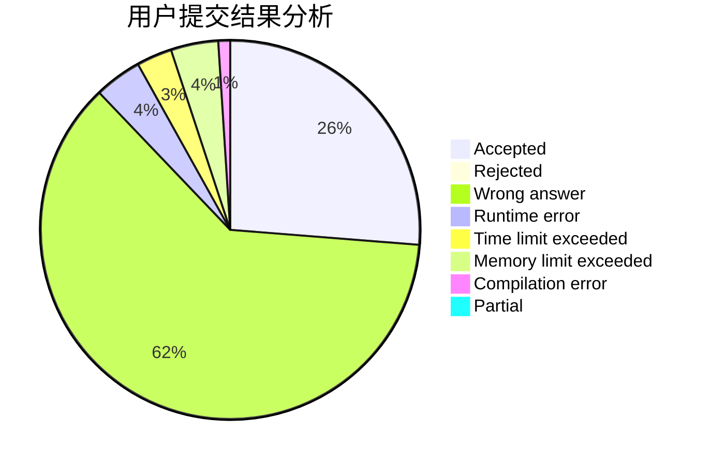
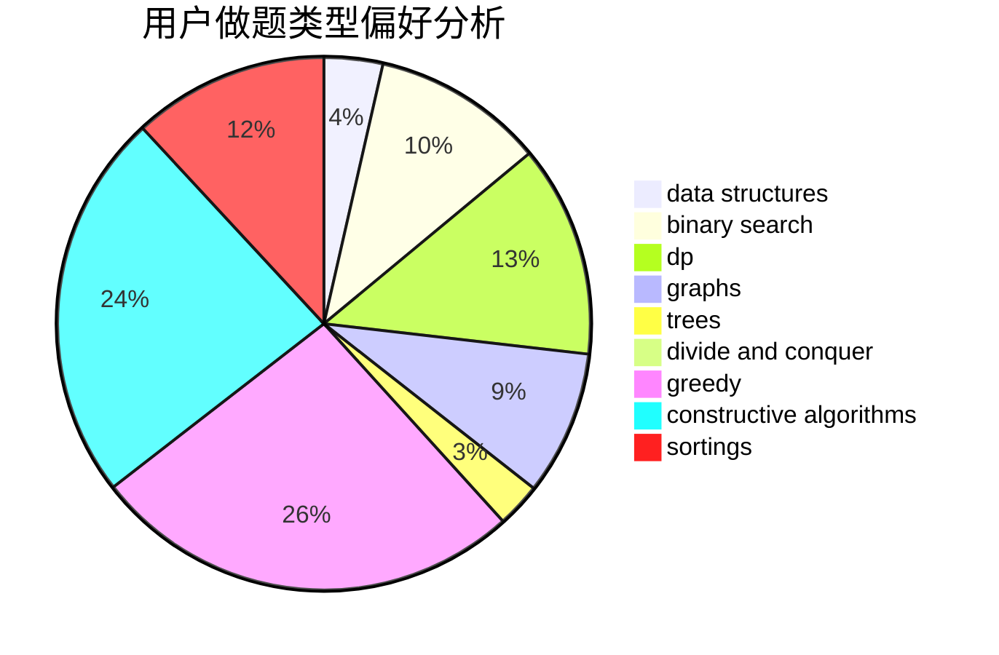

# Ghost_Dragon
<!-- tabs:start -->
#### **用户提交结果分析**

#### **用户做题类型偏好分析**

#### **用户错题知识点分析**

<!-- tabs:end -->
# 推荐题目
[1499F](http://codeforces.com/problemset/problem/1499/F)		combinatorics,
                        dfs and similar,
                        dp,
                        trees		  
[360A](http://codeforces.com/problemset/problem/360/A)		greedy,
                        implementation		  
[887B](http://codeforces.com/problemset/problem/887/B)		brute force,
                        implementation		  
[777A](http://codeforces.com/problemset/problem/777/A)		constructive algorithms,
                        implementation,
                        math		  
[746B](http://codeforces.com/problemset/problem/746/B)		implementation,
                        strings		  
[416C](http://codeforces.com/problemset/problem/416/C)		binary search,
                        dp,
                        greedy,
                        implementation		  
[1225A](http://codeforces.com/problemset/problem/1225/A)		math		  
[887C](http://codeforces.com/problemset/problem/887/C)		brute force,
                        implementation		  
[796A](http://codeforces.com/problemset/problem/796/A)		brute force,
                        implementation		  
[1152D](http://codeforces.com/problemset/problem/1152/D)		dp,
                        greedy,
                        trees		  
<!-- tabs:start -->
#### **data structures**
[887D](http://codeforces.com/problemset/problem/887/D)		data structures,
                        two pointers		  
[47E](http://codeforces.com/problemset/problem/47/E)		data structures,
                        geometry,
                        sortings		  
[722D](http://codeforces.com/problemset/problem/722/D)		binary search,
                        data structures,
                        dfs and similar,
                        greedy,
                        strings,
                        trees		  
[1403A](http://codeforces.com/problemset/problem/1403/A)		*special problem,
                        2-sat,
                        binary search,
                        data structures,
                        graphs,
                        interactive,
                        sortings,
                        two pointers		  
[1214C](http://codeforces.com/problemset/problem/1214/C)		data structures,
                        greedy		  
[19D](http://codeforces.com/problemset/problem/19/D)		data structures		  
[316E1](http://codeforces.com/problemset/problem/316/E1)		brute force,
                        data structures		  
[1462F](http://codeforces.com/problemset/problem/1462/F)		binary search,
                        data structures,
                        greedy		  
[1492C](http://codeforces.com/problemset/problem/1492/C)		binary search,
                        data structures,
                        dp,
                        greedy,
                        two pointers		  
[1490G](http://codeforces.com/problemset/problem/1490/G)		binary search,
                        data structures,
                        math		  
#### **binary search**
[416C](http://codeforces.com/problemset/problem/416/C)		binary search,
                        dp,
                        greedy,
                        implementation		  
[722D](http://codeforces.com/problemset/problem/722/D)		binary search,
                        data structures,
                        dfs and similar,
                        greedy,
                        strings,
                        trees		  
[887E](http://codeforces.com/problemset/problem/887/E)		binary search,
                        geometry,
                        sortings		  
[1403A](http://codeforces.com/problemset/problem/1403/A)		*special problem,
                        2-sat,
                        binary search,
                        data structures,
                        graphs,
                        interactive,
                        sortings,
                        two pointers		  
[1118D2](http://codeforces.com/problemset/problem/1118/D2)		binary search,
                        greedy		  
[1371E1](http://codeforces.com/problemset/problem/1371/E1)		binary search,
                        brute force,
                        combinatorics,
                        math,
                        number theory,
                        sortings		  
[1423B](http://codeforces.com/problemset/problem/1423/B)		binary search,
                        flows,
                        graph matchings,
                        graphs		  
[1462F](http://codeforces.com/problemset/problem/1462/F)		binary search,
                        data structures,
                        greedy		  
[1492C](http://codeforces.com/problemset/problem/1492/C)		binary search,
                        data structures,
                        dp,
                        greedy,
                        two pointers		  
[1463D](http://codeforces.com/problemset/problem/1463/D)		binary search,
                        constructive algorithms,
                        greedy,
                        two pointers		  
#### **dp**
[1499F](http://codeforces.com/problemset/problem/1499/F)		combinatorics,
                        dfs and similar,
                        dp,
                        trees		  
[416C](http://codeforces.com/problemset/problem/416/C)		binary search,
                        dp,
                        greedy,
                        implementation		  
[1152D](http://codeforces.com/problemset/problem/1152/D)		dp,
                        greedy,
                        trees		  
[1146F](http://codeforces.com/problemset/problem/1146/F)		dp,
                        trees		  
[1385D](http://codeforces.com/problemset/problem/1385/D)		bitmasks,
                        brute force,
                        divide and conquer,
                        dp,
                        implementation		  
[1492C](http://codeforces.com/problemset/problem/1492/C)		binary search,
                        data structures,
                        dp,
                        greedy,
                        two pointers		  
[1457C](https://codeforces.com/contest/1457/problem/C)		brute force,
                        dp,
                        implementation		  
[1491C](http://codeforces.com/problemset/problem/1491/C)		brute force,
                        data structures,
                        dp,
                        greedy,
                        implementation		  
[1437C](http://codeforces.com/problemset/problem/1437/C)		dp,
                        flows,
                        graph matchings,
                        greedy,
                        math,
                        sortings		  
[1499B](http://codeforces.com/problemset/problem/1499/B)		brute force,
                        dp,
                        greedy,
                        implementation		  
#### **graph**
[1403A](http://codeforces.com/problemset/problem/1403/A)		*special problem,
                        2-sat,
                        binary search,
                        data structures,
                        graphs,
                        interactive,
                        sortings,
                        two pointers		  
[590E](http://codeforces.com/problemset/problem/590/E)		graph matchings,
                        strings		  
[1423B](http://codeforces.com/problemset/problem/1423/B)		binary search,
                        flows,
                        graph matchings,
                        graphs		  
[1481D](http://codeforces.com/problemset/problem/1481/D)		brute force,
                        constructive algorithms,
                        graphs,
                        greedy,
                        implementation		  
[1487C](http://codeforces.com/problemset/problem/1487/C)		brute force,
                        constructive algorithms,
                        dfs and similar,
                        graphs,
                        greedy,
                        implementation,
                        math		  
[1437C](http://codeforces.com/problemset/problem/1437/C)		dp,
                        flows,
                        graph matchings,
                        greedy,
                        math,
                        sortings		  
[1470D](http://codeforces.com/problemset/problem/1470/D)		constructive algorithms,
                        dfs and similar,
                        graph matchings,
                        graphs,
                        greedy		  
[1476C](http://codeforces.com/problemset/problem/1476/C)		dp,
                        graphs,
                        greedy		  
[1304D](http://codeforces.com/problemset/problem/1304/D)		constructive algorithms,
                        graphs,
                        greedy,
                        two pointers		  
[1475C](http://codeforces.com/problemset/problem/1475/C)		combinatorics,
                        graphs,
                        math		  
#### **trees**
[1499F](http://codeforces.com/problemset/problem/1499/F)		combinatorics,
                        dfs and similar,
                        dp,
                        trees		  
[1152D](http://codeforces.com/problemset/problem/1152/D)		dp,
                        greedy,
                        trees		  
[722D](http://codeforces.com/problemset/problem/722/D)		binary search,
                        data structures,
                        dfs and similar,
                        greedy,
                        strings,
                        trees		  
[1146F](http://codeforces.com/problemset/problem/1146/F)		dp,
                        trees		  
[1479D](http://codeforces.com/problemset/problem/1479/D)		binary search,
                        bitmasks,
                        brute force,
                        data structures,
                        probabilities,
                        trees		  
[1511C](http://codeforces.com/problemset/problem/1511/C)		brute force,
                        data structures,
                        implementation,
                        trees		  
[1499F](http://codeforces.com/problemset/problem/1499/F)		combinatorics,
                        dfs and similar,
                        dp,
                        trees		  
[1491E](http://codeforces.com/problemset/problem/1491/E)		brute force,
                        dfs and similar,
                        divide and conquer,
                        number theory,
                        trees		  
[1466D](http://codeforces.com/problemset/problem/1466/D)		data structures,
                        greedy,
                        sortings,
                        trees		  
[1495D](http://codeforces.com/problemset/problem/1495/D)		combinatorics,
                        dfs and similar,
                        graphs,
                        math,
                        shortest paths,
                        trees		  
#### **divide and conquer**
[1385D](http://codeforces.com/problemset/problem/1385/D)		bitmasks,
                        brute force,
                        divide and conquer,
                        dp,
                        implementation		  
[1461D](http://codeforces.com/problemset/problem/1461/D)		binary search,
                        brute force,
                        data structures,
                        divide and conquer,
                        implementation,
                        sortings		  
[1466G](http://codeforces.com/problemset/problem/1466/G)		combinatorics,
                        divide and conquer,
                        hashing,
                        math,
                        string suffix structures,
                        strings		  
[1490D](http://codeforces.com/problemset/problem/1490/D)		dfs and similar,
                        divide and conquer,
                        implementation		  
[1483C](https://codeforces.com/contest/1483/problem/C)		data structures,
                        divide and conquer,
                        dp		  
[1491E](http://codeforces.com/problemset/problem/1491/E)		brute force,
                        dfs and similar,
                        divide and conquer,
                        number theory,
                        trees		  
[1303G](http://codeforces.com/problemset/problem/1303/G)		data structures,
                        divide and conquer,
                        geometry,
                        trees		  
[1494D](http://codeforces.com/problemset/problem/1494/D)		constructive algorithms,
                        data structures,
                        dfs and similar,
                        divide and conquer,
                        dsu,
                        greedy,
                        sortings,
                        trees		  
[1482E](http://codeforces.com/problemset/problem/1482/E)		data structures,
                        divide and conquer,
                        dp		  
[566C](http://codeforces.com/problemset/problem/566/C)		dfs and similar,
                        divide and conquer,
                        trees		  
#### **greedy**
[360A](http://codeforces.com/problemset/problem/360/A)		greedy,
                        implementation		  
[416C](http://codeforces.com/problemset/problem/416/C)		binary search,
                        dp,
                        greedy,
                        implementation		  
[1152D](http://codeforces.com/problemset/problem/1152/D)		dp,
                        greedy,
                        trees		  
[1108E1](http://codeforces.com/problemset/problem/1108/E1)		brute force,
                        greedy,
                        implementation		  
[722D](http://codeforces.com/problemset/problem/722/D)		binary search,
                        data structures,
                        dfs and similar,
                        greedy,
                        strings,
                        trees		  
[1478A](http://codeforces.com/problemset/problem/1478/A)		brute force,
                        greedy		  
[1118D2](http://codeforces.com/problemset/problem/1118/D2)		binary search,
                        greedy		  
[1214C](http://codeforces.com/problemset/problem/1214/C)		data structures,
                        greedy		  
[1070D](http://codeforces.com/problemset/problem/1070/D)		greedy		  
[1481D](http://codeforces.com/problemset/problem/1481/D)		brute force,
                        constructive algorithms,
                        graphs,
                        greedy,
                        implementation		  
#### **constructive algorithms**
[777A](http://codeforces.com/problemset/problem/777/A)		constructive algorithms,
                        implementation,
                        math		  
[679A](http://codeforces.com/problemset/problem/679/A)		constructive algorithms,
                        interactive,
                        math		  
[1421B](http://codeforces.com/problemset/problem/1421/B)		constructive algorithms,
                        implementation		  
[1481D](http://codeforces.com/problemset/problem/1481/D)		brute force,
                        constructive algorithms,
                        graphs,
                        greedy,
                        implementation		  
[1493A](http://codeforces.com/problemset/problem/1493/A)		constructive algorithms,
                        greedy		  
[1463D](http://codeforces.com/problemset/problem/1463/D)		binary search,
                        constructive algorithms,
                        greedy,
                        two pointers		  
[1456B](https://codeforces.com/contest/1456/problem/B)		bitmasks,
                        brute force,
                        constructive algorithms		  
[1492D](http://codeforces.com/problemset/problem/1492/D)		bitmasks,
                        constructive algorithms,
                        greedy,
                        math		  
[1504D](https://codeforces.com/contest/1504/problem/D)		constructive algorithms,
                        games,
                        interactive		  
[1483A](https://codeforces.com/contest/1483/problem/A)		brute force,
                        constructive algorithms,
                        greedy,
                        implementation		  
#### **sortings**
[47E](http://codeforces.com/problemset/problem/47/E)		data structures,
                        geometry,
                        sortings		  
[887E](http://codeforces.com/problemset/problem/887/E)		binary search,
                        geometry,
                        sortings		  
[1403A](http://codeforces.com/problemset/problem/1403/A)		*special problem,
                        2-sat,
                        binary search,
                        data structures,
                        graphs,
                        interactive,
                        sortings,
                        two pointers		  
[843A](http://codeforces.com/problemset/problem/843/A)		dfs and similar,
                        dsu,
                        implementation,
                        math,
                        sortings		  
[1371E1](http://codeforces.com/problemset/problem/1371/E1)		binary search,
                        brute force,
                        combinatorics,
                        math,
                        number theory,
                        sortings		  
[1496C](https://codeforces.com/contest/1496/problem/C)		geometry,
                        greedy,
                        math,
                        sortings		  
[1495A](http://codeforces.com/problemset/problem/1495/A)		geometry,
                        greedy,
                        math,
                        sortings		  
[1497A](http://codeforces.com/problemset/problem/1497/A)		brute force,
                        data structures,
                        greedy,
                        sortings		  
[1427A](http://codeforces.com/problemset/problem/1427/A)		math,
                        sortings		  
[1461D](http://codeforces.com/problemset/problem/1461/D)		binary search,
                        brute force,
                        data structures,
                        divide and conquer,
                        implementation,
                        sortings		  
<!-- tabs:end -->
