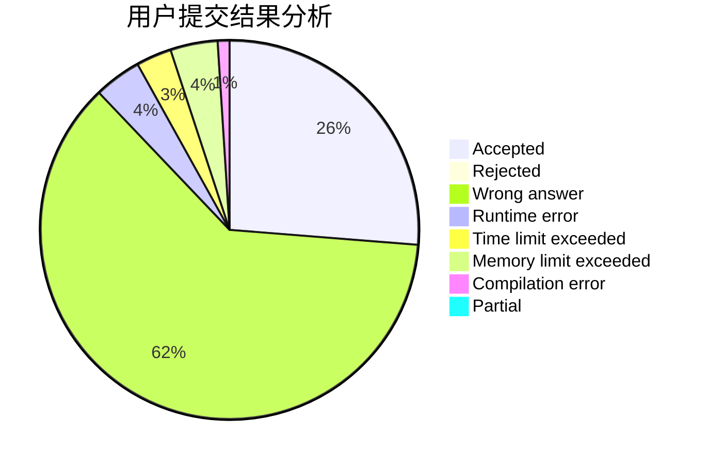
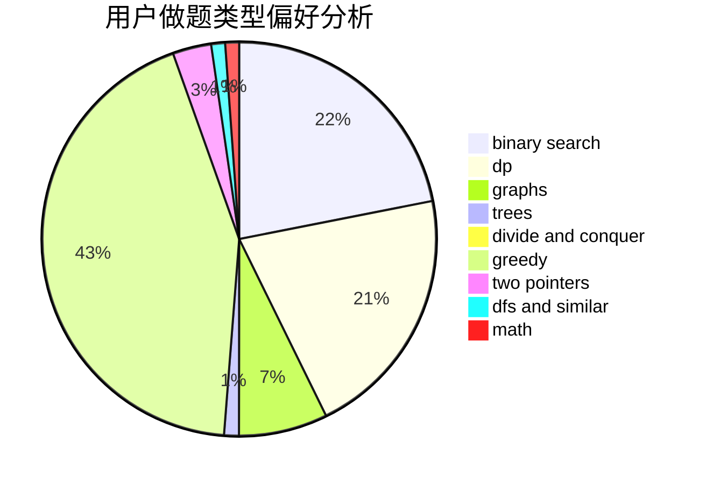

# Ghost_Dragon

<!-- tabs:start -->

#### **用户提交结果分析**

#### **用户做题类型偏好分析**

<!-- tabs:end -->
# 推荐题目
[906C](https://codeforces.com/contest/906/problem/C)
[1509F](https://codeforces.com/contest/1509/problem/F)
[388B](https://codeforces.com/contest/388/problem/B)
[794G](https://codeforces.com/contest/794/problem/G)
[1154D](https://codeforces.com/contest/1154/problem/D)
[1335B](https://codeforces.com/contest/1335/problem/B)
[387D](https://codeforces.com/contest/387/problem/D)
[441C](https://codeforces.com/contest/441/problem/C)
[121D](https://codeforces.com/contest/121/problem/D)
[1109A](https://codeforces.com/contest/1109/problem/A)
