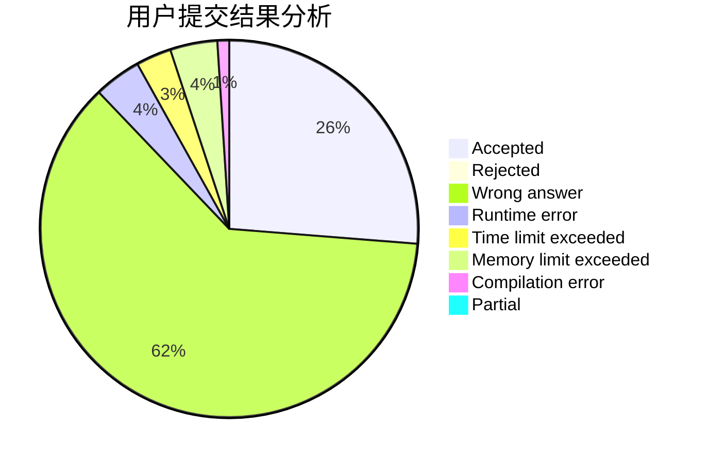
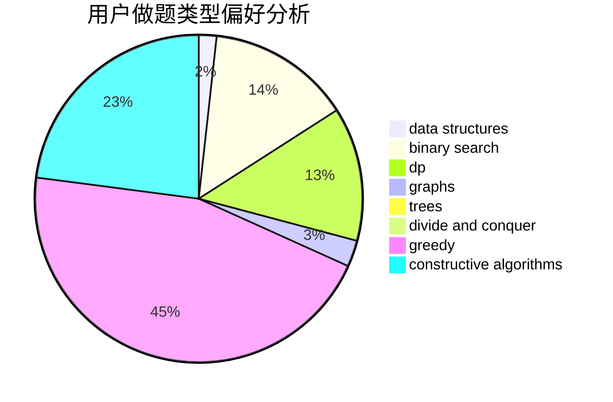

# Ghost_Dragon

<!-- tabs:start -->

#### **用户提交结果分析**

#### **用户做题类型偏好分析**

#### **用户错题知识点分析**

<!-- tabs:end -->
# 推荐题目
[906C](https://codeforces.com/contest/906/problem/C)		bitmasks,
                        brute force,
                        dp,
                        graphs		  
[1509F](https://codeforces.com/contest/1509/problem/F)		dsu,graphs,sortings,trees		  
[388B](https://codeforces.com/contest/388/problem/B)		bitmasks,
                        constructive algorithms,
                        graphs,
                        implementation,
                        math		  
[794G](https://codeforces.com/contest/794/problem/G)		combinatorics,
                        dp,
                        math		  
[1154D](https://codeforces.com/contest/1154/problem/D)		greedy		  
[1335B](https://codeforces.com/contest/1335/problem/B)		constructive algorithms		  
[387D](https://codeforces.com/contest/387/problem/D)		graph matchings		  
[441C](https://codeforces.com/contest/441/problem/C)		constructive algorithms,
                        dfs and similar,
                        implementation		  
[121D](https://codeforces.com/contest/121/problem/D)		binary search,
                        implementation,
                        two pointers		  
[1109A](https://codeforces.com/contest/1109/problem/A)		dp,
                        implementation		  
