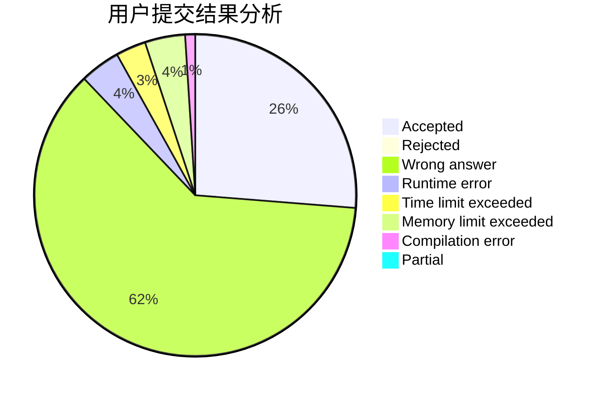
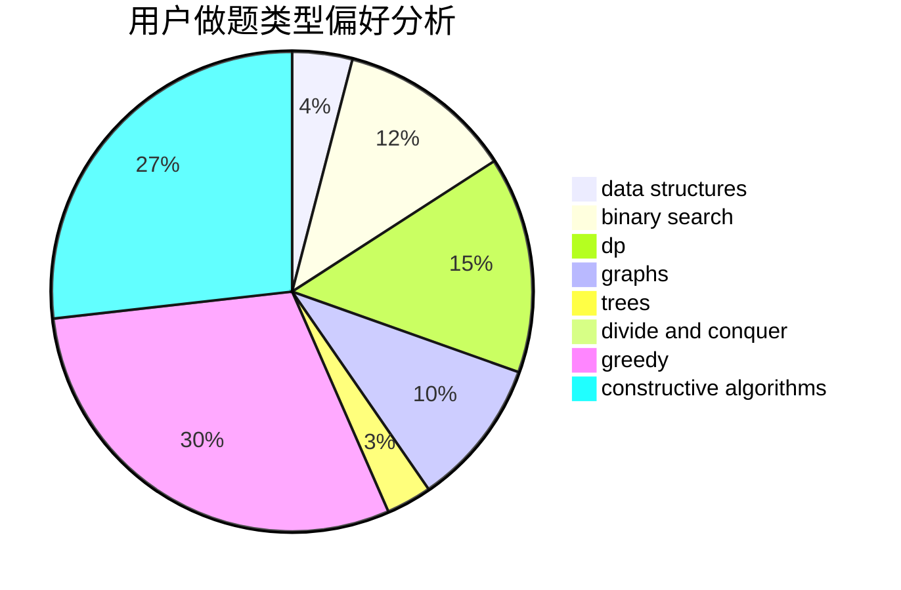

# Ghost_Dragon
<!-- tabs:start -->
#### **用户提交结果分析**

#### **用户做题类型偏好分析**

#### **用户错题知识点分析**

<!-- tabs:end -->
# 推荐题目
[Diameter Cuts](http://codeforces.com/problemset/problem/1499/F)		combinatorics,
                        dfs and similar,
                        dp,
                        trees		  
[Levko and Array Recovery](http://codeforces.com/problemset/problem/360/A)		greedy,
                        implementation		  
[Cubes for Masha](http://codeforces.com/problemset/problem/887/B)		brute force,
                        implementation		  
[Shell Game](http://codeforces.com/problemset/problem/777/A)		constructive algorithms,
                        implementation,
                        math		  
[Decoding](http://codeforces.com/problemset/problem/746/B)		implementation,
                        strings		  
[Booking System](http://codeforces.com/problemset/problem/416/C)		binary search,
                        dp,
                        greedy,
                        implementation		  
[Forgetting Things](http://codeforces.com/problemset/problem/1225/A)		math		  
[Solution for Cube](http://codeforces.com/problemset/problem/887/C)		brute force,
                        implementation		  
[Buying A House](http://codeforces.com/problemset/problem/796/A)		brute force,
                        implementation		  
[Neko and Aki's Prank](http://codeforces.com/problemset/problem/1152/D)		dp,
                        greedy,
                        trees		  
<!-- tabs:start -->
#### **data structures**
[Diameter Cuts](http://codeforces.com/problemset/problem/887/D)		data structures,
                        two pointers		  
[Levko and Array Recovery](http://codeforces.com/problemset/problem/47/E)		data structures,
                        geometry,
                        sortings		  
[Cubes for Masha](http://codeforces.com/problemset/problem/722/D)		binary search,
                        data structures,
                        dfs and similar,
                        greedy,
                        strings,
                        trees		  
[Shell Game](http://codeforces.com/problemset/problem/1403/A)		*special problem,
                        2-sat,
                        binary search,
                        data structures,
                        graphs,
                        interactive,
                        sortings,
                        two pointers		  
[Decoding](http://codeforces.com/problemset/problem/1214/C)		data structures,
                        greedy		  
[Booking System](http://codeforces.com/problemset/problem/19/D)		data structures		  
[Forgetting Things](http://codeforces.com/problemset/problem/316/E1)		brute force,
                        data structures		  
[Solution for Cube](http://codeforces.com/problemset/problem/1462/F)		binary search,
                        data structures,
                        greedy		  
[Buying A House](http://codeforces.com/problemset/problem/1492/C)		binary search,
                        data structures,
                        dp,
                        greedy,
                        two pointers		  
[Neko and Aki's Prank](http://codeforces.com/problemset/problem/1490/G)		binary search,
                        data structures,
                        math		  
#### **binary search**
[Diameter Cuts](http://codeforces.com/problemset/problem/416/C)		binary search,
                        dp,
                        greedy,
                        implementation		  
[Levko and Array Recovery](http://codeforces.com/problemset/problem/722/D)		binary search,
                        data structures,
                        dfs and similar,
                        greedy,
                        strings,
                        trees		  
[Cubes for Masha](http://codeforces.com/problemset/problem/887/E)		binary search,
                        geometry,
                        sortings		  
[Shell Game](http://codeforces.com/problemset/problem/1403/A)		*special problem,
                        2-sat,
                        binary search,
                        data structures,
                        graphs,
                        interactive,
                        sortings,
                        two pointers		  
[Decoding](http://codeforces.com/problemset/problem/1118/D2)		binary search,
                        greedy		  
[Booking System](http://codeforces.com/problemset/problem/1371/E1)		binary search,
                        brute force,
                        combinatorics,
                        math,
                        number theory,
                        sortings		  
[Forgetting Things](http://codeforces.com/problemset/problem/1423/B)		binary search,
                        flows,
                        graph matchings,
                        graphs		  
[Solution for Cube](http://codeforces.com/problemset/problem/1462/F)		binary search,
                        data structures,
                        greedy		  
[Buying A House](http://codeforces.com/problemset/problem/1492/C)		binary search,
                        data structures,
                        dp,
                        greedy,
                        two pointers		  
[Neko and Aki's Prank](http://codeforces.com/problemset/problem/1463/D)		binary search,
                        constructive algorithms,
                        greedy,
                        two pointers		  
#### **dp**
[Diameter Cuts](http://codeforces.com/problemset/problem/1499/F)		combinatorics,
                        dfs and similar,
                        dp,
                        trees		  
[Levko and Array Recovery](http://codeforces.com/problemset/problem/416/C)		binary search,
                        dp,
                        greedy,
                        implementation		  
[Cubes for Masha](http://codeforces.com/problemset/problem/1152/D)		dp,
                        greedy,
                        trees		  
[Shell Game](http://codeforces.com/problemset/problem/1146/F)		dp,
                        trees		  
[Decoding](http://codeforces.com/problemset/problem/1385/D)		bitmasks,
                        brute force,
                        divide and conquer,
                        dp,
                        implementation		  
[Booking System](http://codeforces.com/problemset/problem/1492/C)		binary search,
                        data structures,
                        dp,
                        greedy,
                        two pointers		  
[Forgetting Things](https://codeforces.com/contest/1457/problem/C)		brute force,
                        dp,
                        implementation		  
[Solution for Cube](http://codeforces.com/problemset/problem/1491/C)		brute force,
                        data structures,
                        dp,
                        greedy,
                        implementation		  
[Buying A House](http://codeforces.com/problemset/problem/1437/C)		dp,
                        flows,
                        graph matchings,
                        greedy,
                        math,
                        sortings		  
[Neko and Aki's Prank](http://codeforces.com/problemset/problem/1499/B)		brute force,
                        dp,
                        greedy,
                        implementation		  
#### **graph**
[Diameter Cuts](http://codeforces.com/problemset/problem/1403/A)		*special problem,
                        2-sat,
                        binary search,
                        data structures,
                        graphs,
                        interactive,
                        sortings,
                        two pointers		  
[Levko and Array Recovery](http://codeforces.com/problemset/problem/590/E)		graph matchings,
                        strings		  
[Cubes for Masha](http://codeforces.com/problemset/problem/1423/B)		binary search,
                        flows,
                        graph matchings,
                        graphs		  
[Shell Game](http://codeforces.com/problemset/problem/1481/D)		brute force,
                        constructive algorithms,
                        graphs,
                        greedy,
                        implementation		  
[Decoding](http://codeforces.com/problemset/problem/1487/C)		brute force,
                        constructive algorithms,
                        dfs and similar,
                        graphs,
                        greedy,
                        implementation,
                        math		  
[Booking System](http://codeforces.com/problemset/problem/1437/C)		dp,
                        flows,
                        graph matchings,
                        greedy,
                        math,
                        sortings		  
[Forgetting Things](http://codeforces.com/problemset/problem/1470/D)		constructive algorithms,
                        dfs and similar,
                        graph matchings,
                        graphs,
                        greedy		  
[Solution for Cube](http://codeforces.com/problemset/problem/1476/C)		dp,
                        graphs,
                        greedy		  
[Buying A House](http://codeforces.com/problemset/problem/1304/D)		constructive algorithms,
                        graphs,
                        greedy,
                        two pointers		  
[Neko and Aki's Prank](http://codeforces.com/problemset/problem/1475/C)		combinatorics,
                        graphs,
                        math		  
#### **trees**
[Diameter Cuts](http://codeforces.com/problemset/problem/1499/F)		combinatorics,
                        dfs and similar,
                        dp,
                        trees		  
[Levko and Array Recovery](http://codeforces.com/problemset/problem/1152/D)		dp,
                        greedy,
                        trees		  
[Cubes for Masha](http://codeforces.com/problemset/problem/722/D)		binary search,
                        data structures,
                        dfs and similar,
                        greedy,
                        strings,
                        trees		  
[Shell Game](http://codeforces.com/problemset/problem/1146/F)		dp,
                        trees		  
[Decoding](http://codeforces.com/problemset/problem/1479/D)		binary search,
                        bitmasks,
                        brute force,
                        data structures,
                        probabilities,
                        trees		  
[Booking System](http://codeforces.com/problemset/problem/1511/C)		brute force,
                        data structures,
                        implementation,
                        trees		  
[Forgetting Things](http://codeforces.com/problemset/problem/1499/F)		combinatorics,
                        dfs and similar,
                        dp,
                        trees		  
[Solution for Cube](http://codeforces.com/problemset/problem/1491/E)		brute force,
                        dfs and similar,
                        divide and conquer,
                        number theory,
                        trees		  
[Buying A House](http://codeforces.com/problemset/problem/1466/D)		data structures,
                        greedy,
                        sortings,
                        trees		  
[Neko and Aki's Prank](http://codeforces.com/problemset/problem/1495/D)		combinatorics,
                        dfs and similar,
                        graphs,
                        math,
                        shortest paths,
                        trees		  
#### **divide and conquer**
[Diameter Cuts](http://codeforces.com/problemset/problem/1385/D)		bitmasks,
                        brute force,
                        divide and conquer,
                        dp,
                        implementation		  
[Levko and Array Recovery](http://codeforces.com/problemset/problem/1461/D)		binary search,
                        brute force,
                        data structures,
                        divide and conquer,
                        implementation,
                        sortings		  
[Cubes for Masha](http://codeforces.com/problemset/problem/1466/G)		combinatorics,
                        divide and conquer,
                        hashing,
                        math,
                        string suffix structures,
                        strings		  
[Shell Game](http://codeforces.com/problemset/problem/1490/D)		dfs and similar,
                        divide and conquer,
                        implementation		  
[Decoding](https://codeforces.com/contest/1483/problem/C)		data structures,
                        divide and conquer,
                        dp		  
[Booking System](http://codeforces.com/problemset/problem/1491/E)		brute force,
                        dfs and similar,
                        divide and conquer,
                        number theory,
                        trees		  
[Forgetting Things](http://codeforces.com/problemset/problem/1303/G)		data structures,
                        divide and conquer,
                        geometry,
                        trees		  
[Solution for Cube](http://codeforces.com/problemset/problem/1494/D)		constructive algorithms,
                        data structures,
                        dfs and similar,
                        divide and conquer,
                        dsu,
                        greedy,
                        sortings,
                        trees		  
[Buying A House](http://codeforces.com/problemset/problem/1482/E)		data structures,
                        divide and conquer,
                        dp		  
[Neko and Aki's Prank](http://codeforces.com/problemset/problem/566/C)		dfs and similar,
                        divide and conquer,
                        trees		  
#### **greedy**
[Diameter Cuts](http://codeforces.com/problemset/problem/360/A)		greedy,
                        implementation		  
[Levko and Array Recovery](http://codeforces.com/problemset/problem/416/C)		binary search,
                        dp,
                        greedy,
                        implementation		  
[Cubes for Masha](http://codeforces.com/problemset/problem/1152/D)		dp,
                        greedy,
                        trees		  
[Shell Game](http://codeforces.com/problemset/problem/1108/E1)		brute force,
                        greedy,
                        implementation		  
[Decoding](http://codeforces.com/problemset/problem/722/D)		binary search,
                        data structures,
                        dfs and similar,
                        greedy,
                        strings,
                        trees		  
[Booking System](http://codeforces.com/problemset/problem/1478/A)		brute force,
                        greedy		  
[Forgetting Things](http://codeforces.com/problemset/problem/1118/D2)		binary search,
                        greedy		  
[Solution for Cube](http://codeforces.com/problemset/problem/1214/C)		data structures,
                        greedy		  
[Buying A House](http://codeforces.com/problemset/problem/1070/D)		greedy		  
[Neko and Aki's Prank](http://codeforces.com/problemset/problem/1481/D)		brute force,
                        constructive algorithms,
                        graphs,
                        greedy,
                        implementation		  
#### **constructive algorithms**
[Diameter Cuts](http://codeforces.com/problemset/problem/777/A)		constructive algorithms,
                        implementation,
                        math		  
[Levko and Array Recovery](http://codeforces.com/problemset/problem/679/A)		constructive algorithms,
                        interactive,
                        math		  
[Cubes for Masha](http://codeforces.com/problemset/problem/1421/B)		constructive algorithms,
                        implementation		  
[Shell Game](http://codeforces.com/problemset/problem/1481/D)		brute force,
                        constructive algorithms,
                        graphs,
                        greedy,
                        implementation		  
[Decoding](http://codeforces.com/problemset/problem/1493/A)		constructive algorithms,
                        greedy		  
[Booking System](http://codeforces.com/problemset/problem/1463/D)		binary search,
                        constructive algorithms,
                        greedy,
                        two pointers		  
[Forgetting Things](https://codeforces.com/contest/1456/problem/B)		bitmasks,
                        brute force,
                        constructive algorithms		  
[Solution for Cube](http://codeforces.com/problemset/problem/1492/D)		bitmasks,
                        constructive algorithms,
                        greedy,
                        math		  
[Buying A House](https://codeforces.com/contest/1504/problem/D)		constructive algorithms,
                        games,
                        interactive		  
[Neko and Aki's Prank](https://codeforces.com/contest/1483/problem/A)		brute force,
                        constructive algorithms,
                        greedy,
                        implementation		  
#### **sortings**
[Diameter Cuts](http://codeforces.com/problemset/problem/47/E)		data structures,
                        geometry,
                        sortings		  
[Levko and Array Recovery](http://codeforces.com/problemset/problem/887/E)		binary search,
                        geometry,
                        sortings		  
[Cubes for Masha](http://codeforces.com/problemset/problem/1403/A)		*special problem,
                        2-sat,
                        binary search,
                        data structures,
                        graphs,
                        interactive,
                        sortings,
                        two pointers		  
[Shell Game](http://codeforces.com/problemset/problem/843/A)		dfs and similar,
                        dsu,
                        implementation,
                        math,
                        sortings		  
[Decoding](http://codeforces.com/problemset/problem/1371/E1)		binary search,
                        brute force,
                        combinatorics,
                        math,
                        number theory,
                        sortings		  
[Booking System](https://codeforces.com/contest/1496/problem/C)		geometry,
                        greedy,
                        math,
                        sortings		  
[Forgetting Things](http://codeforces.com/problemset/problem/1495/A)		geometry,
                        greedy,
                        math,
                        sortings		  
[Solution for Cube](http://codeforces.com/problemset/problem/1497/A)		brute force,
                        data structures,
                        greedy,
                        sortings		  
[Buying A House](http://codeforces.com/problemset/problem/1427/A)		math,
                        sortings		  
[Neko and Aki's Prank](http://codeforces.com/problemset/problem/1461/D)		binary search,
                        brute force,
                        data structures,
                        divide and conquer,
                        implementation,
                        sortings		  
<!-- tabs:end -->
