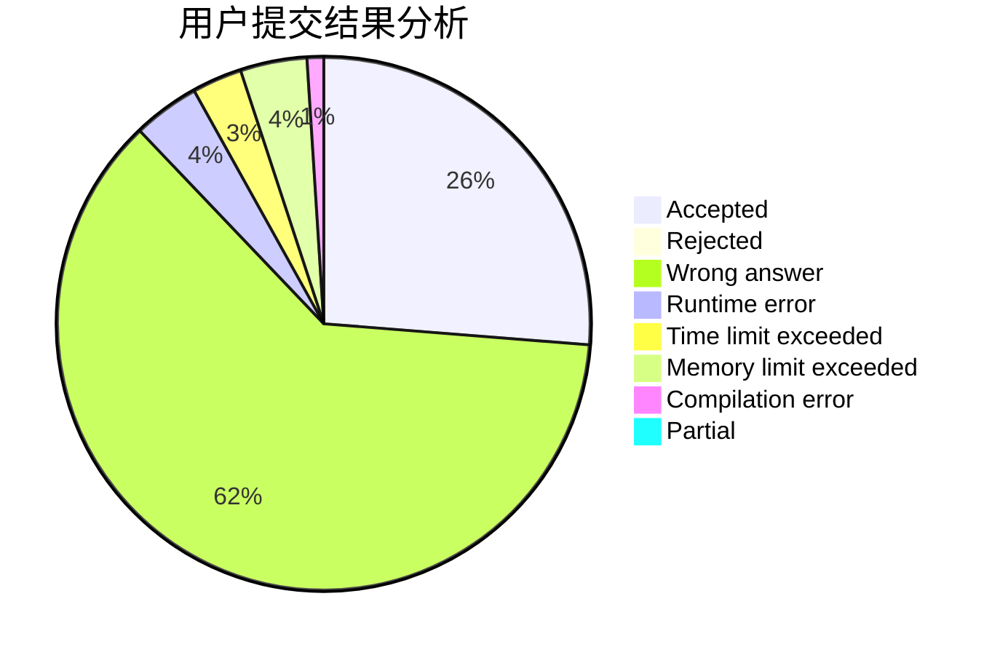
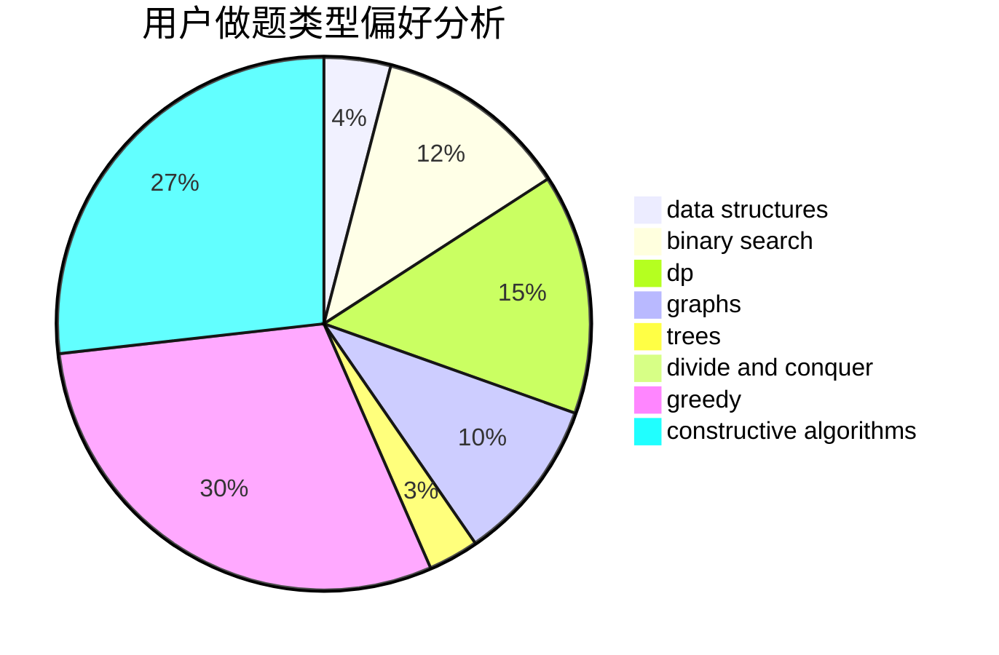

# Ghost_Dragon

<!-- tabs:start -->

#### **用户提交结果分析**

#### **用户做题类型偏好分析**

#### **用户错题知识点分析**

<!-- tabs:end -->
# 推荐题目
[887B](https://codeforces.com/contest/887/problem/B)		brute force,
                        implementation		  
[1499F](https://codeforces.com/contest/1499/problem/F)		combinatorics,
                        dfs and similar,
                        dp,
                        trees		  
[360A](https://codeforces.com/contest/360/problem/A)		greedy,
                        implementation		  
[777A](https://codeforces.com/contest/777/problem/A)		constructive algorithms,
                        implementation,
                        math		  
[1152D](https://codeforces.com/contest/1152/problem/D)		dp,
                        greedy,
                        trees		  
[1329B](https://codeforces.com/contest/1329/problem/B)		bitmasks,
                        combinatorics,
                        math		  
[35A](https://codeforces.com/contest/35/problem/A)		implementation		  
[416C](https://codeforces.com/contest/416/problem/C)		binary search,
                        dp,
                        greedy,
                        implementation		  
[1214C](https://codeforces.com/contest/1214/problem/C)		data structures,
                        greedy		  
[1108E1](https://codeforces.com/contest/1108E/problem/1)		brute force,
                        greedy,
                        implementation		  
