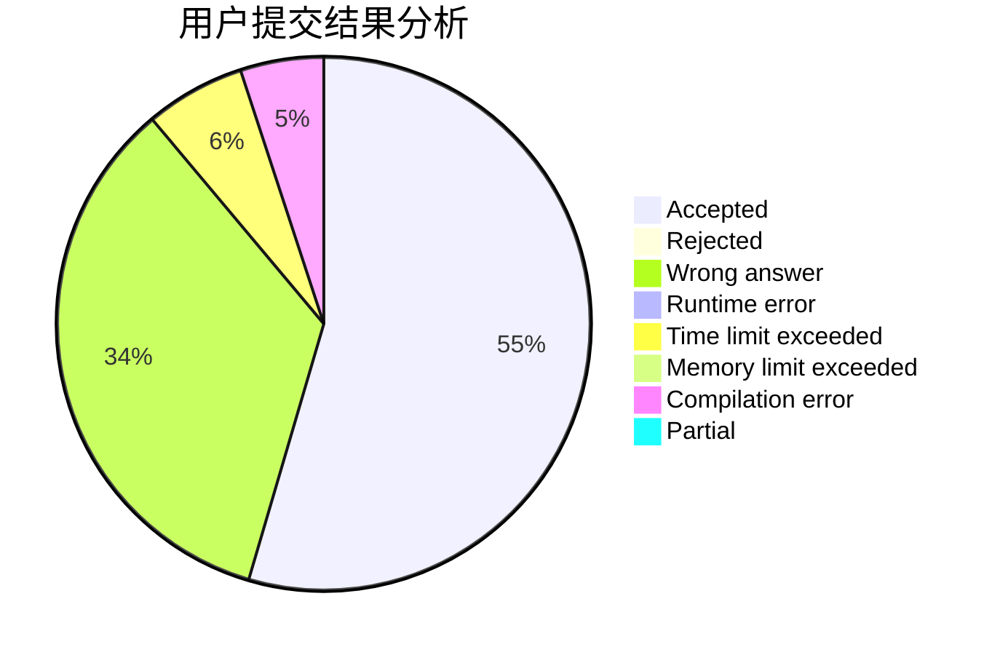
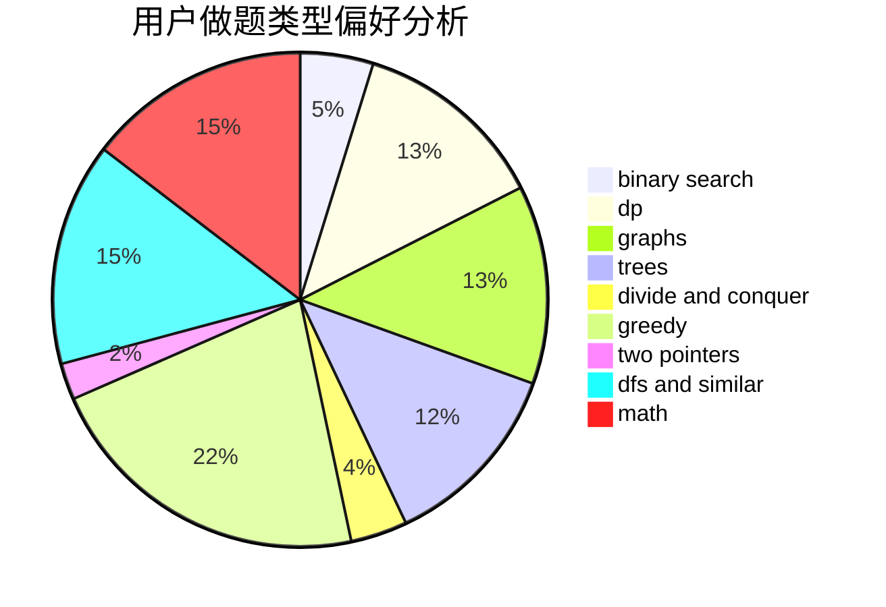

# Gloaming

<!-- tabs:start -->

#### **用户提交结果分析**

#### **用户做题类型偏好分析**

<!-- tabs:end -->
# 推荐题目
[544D](https://codeforces.com/contest/544/problem/D)
[1089D](https://codeforces.com/contest/1089/problem/D)
[907B](https://codeforces.com/contest/907/problem/B)
[1385G](https://codeforces.com/contest/1385/problem/G)
[1179D](https://codeforces.com/contest/1179/problem/D)
[616C](https://codeforces.com/contest/616/problem/C)
[730E](https://codeforces.com/contest/730/problem/E)
[782C](https://codeforces.com/contest/782/problem/C)
[480B](https://codeforces.com/contest/480/problem/B)
[353E](https://codeforces.com/contest/353/problem/E)
