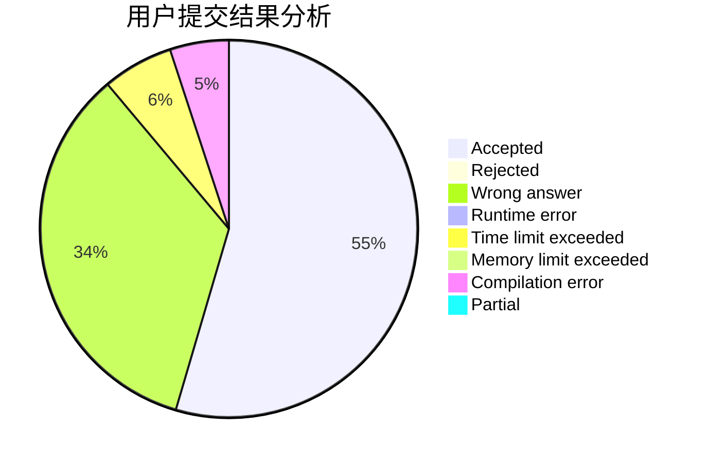
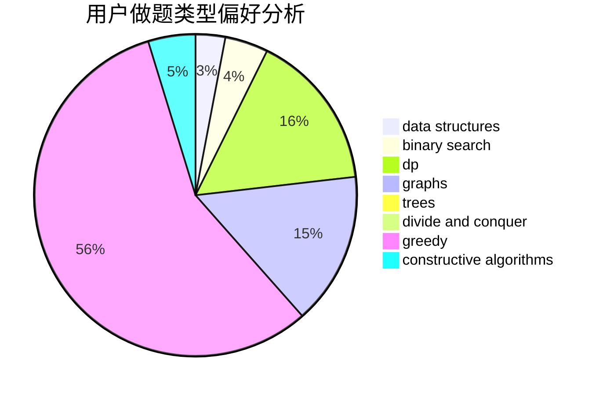
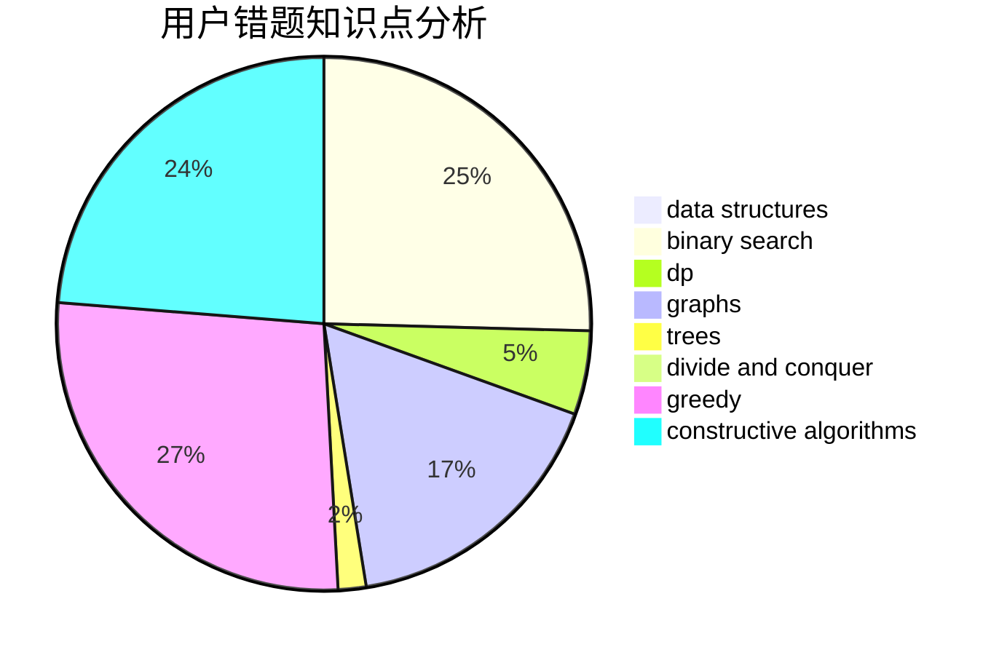

# Gloaming

<!-- tabs:start -->

#### **用户提交结果分析**

#### **用户做题类型偏好分析**

#### **用户错题知识点分析**

<!-- tabs:end -->
# 推荐题目
[519B](https://codeforces.com/contest/519/problem/B)		data structures,
                        implementation,
                        sortings		  
[1088E](https://codeforces.com/contest/1088/problem/E)		dp,
                        greedy,
                        math,
                        trees		  
[887F](https://codeforces.com/contest/887/problem/F)		greedy,
                        sortings		  
[1376B3](https://codeforces.com/contest/1376B/problem/3)		dsu,graphs,sortings,trees		  
[1176C](https://codeforces.com/contest/1176/problem/C)		dp,
                        greedy,
                        implementation		  
[598D](https://codeforces.com/contest/598/problem/D)		dfs and similar,
                        graphs,
                        shortest paths		  
[710B](https://codeforces.com/contest/710/problem/B)		brute force,
                        sortings		  
[763E](https://codeforces.com/contest/763/problem/E)		data structures,
                        divide and conquer,
                        dsu		  
[461B](https://codeforces.com/contest/461/problem/B)		dfs and similar,
                        dp,
                        trees		  
[323B](https://codeforces.com/contest/323/problem/B)		constructive algorithms,
                        graphs		  
