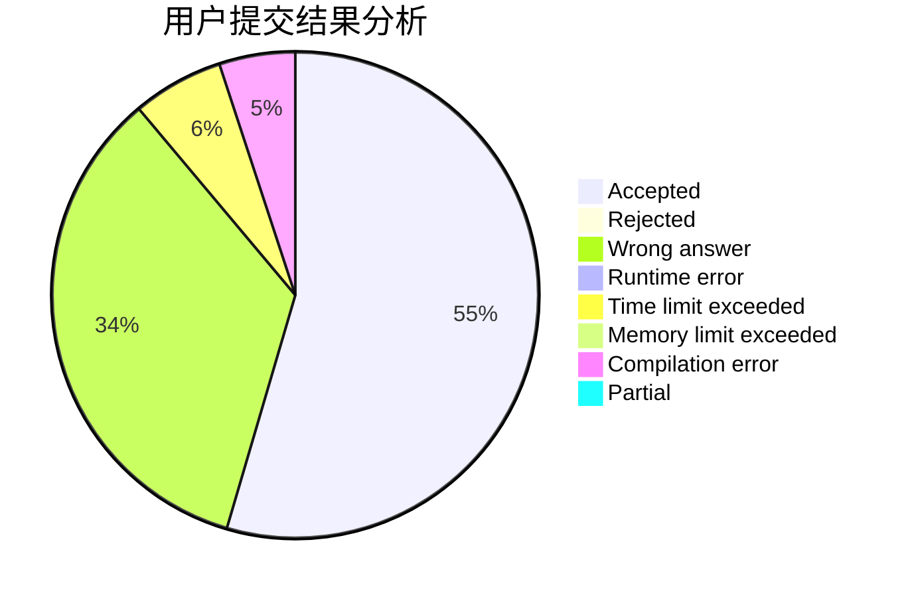
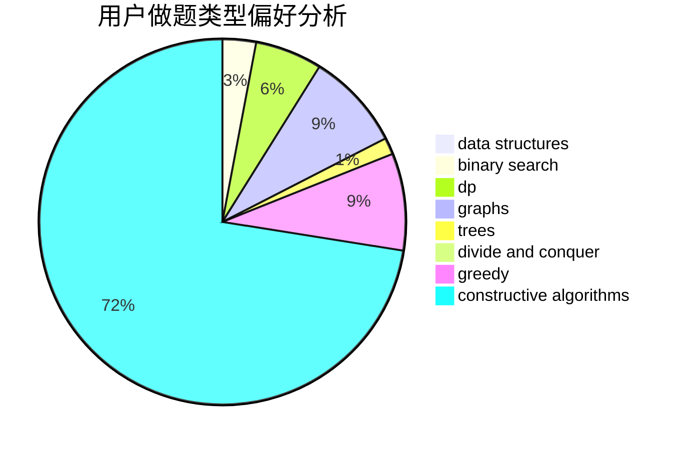
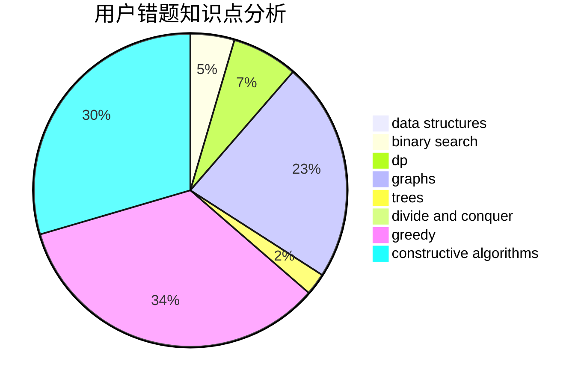

# Gloaming

<!-- tabs:start -->

#### **用户提交结果分析**

#### **用户做题类型偏好分析**

#### **用户错题知识点分析**

<!-- tabs:end -->
# 推荐题目
[544D](https://codeforces.com/contest/544/problem/D)		dsu,graphs,sortings,trees		  
[1089D](https://codeforces.com/contest/1089/problem/D)		graphs		  
[907B](https://codeforces.com/contest/907/problem/B)		implementation		  
[1385G](https://codeforces.com/contest/1385/problem/G)		2-sat,
                        dfs and similar,
                        dsu,
                        graphs,
                        implementation		  
[1179D](https://codeforces.com/contest/1179/problem/D)		data structures,
                        dp,
                        trees		  
[616C](https://codeforces.com/contest/616/problem/C)		dfs and similar		  
[730E](https://codeforces.com/contest/730/problem/E)		greedy,
                        implementation		  
[782C](https://codeforces.com/contest/782/problem/C)		dsu,graphs,sortings,trees		  
[480B](https://codeforces.com/contest/480/problem/B)		dsu,graphs,sortings,trees		  
[353E](https://codeforces.com/contest/353/problem/E)		dp,
                        graph matchings,
                        greedy		  
