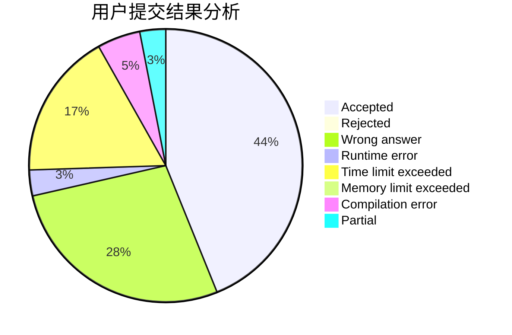
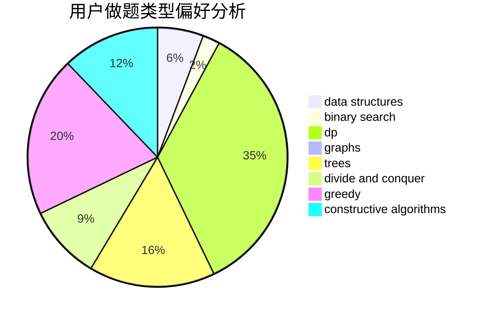
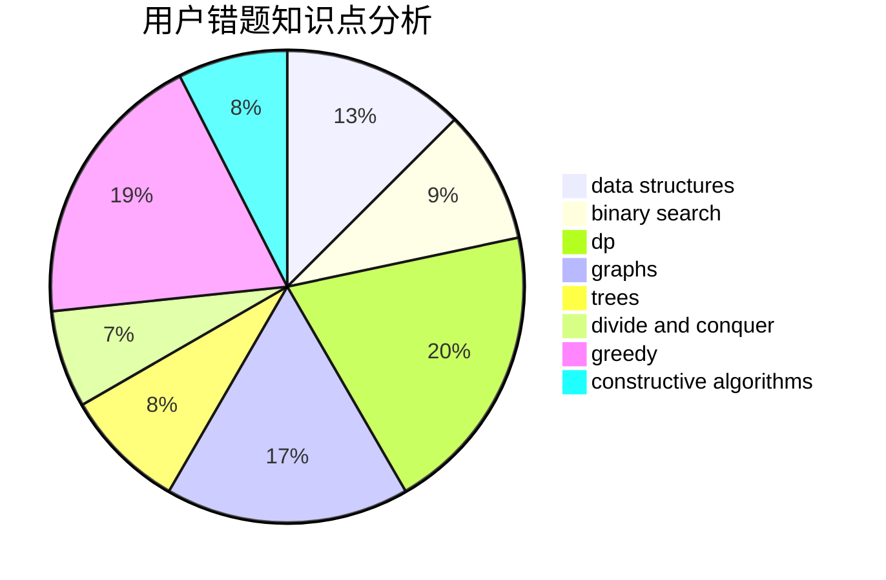

# Gnay_Oahnauhz

<!-- tabs:start -->

#### **用户提交结果分析**

#### **用户做题类型偏好分析**

#### **用户错题知识点分析**

<!-- tabs:end -->
# 推荐题目
[821B](https://codeforces.com/contest/821/problem/B)		brute force,
                        math		  
[852D](https://codeforces.com/contest/852/problem/D)		binary search,
                        flows,
                        graph matchings,
                        shortest paths		  
[216C](https://codeforces.com/contest/216/problem/C)		greedy		  
[75D](https://codeforces.com/contest/75/problem/D)		data structures,
                        dp,
                        greedy,
                        implementation,
                        math,
                        trees		  
[1164H](https://codeforces.com/contest/1164/problem/H)		dsu,graphs,sortings,trees		  
[1250A](https://codeforces.com/contest/1250/problem/A)		implementation		  
[907C](https://codeforces.com/contest/907/problem/C)		dsu,graphs,sortings,trees		  
[568A](https://codeforces.com/contest/568/problem/A)		brute force,
                        implementation,
                        math,
                        number theory		  
[185E](https://codeforces.com/contest/185/problem/E)		binary search,
                        data structures		  
[549B](https://codeforces.com/contest/549/problem/B)		constructive algorithms,
                        dfs and similar,
                        graphs,
                        greedy		  
