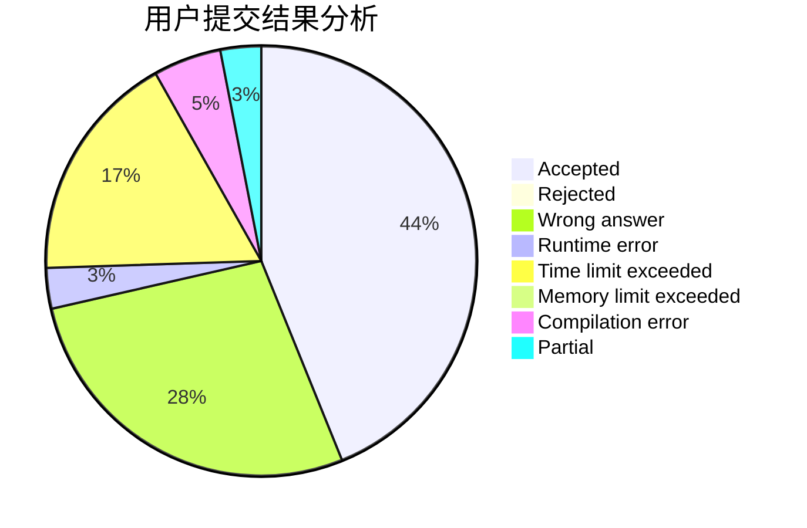
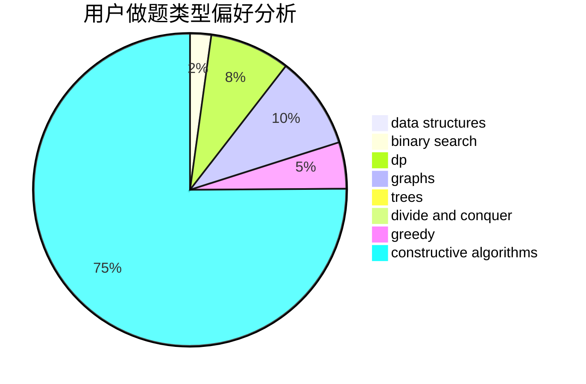
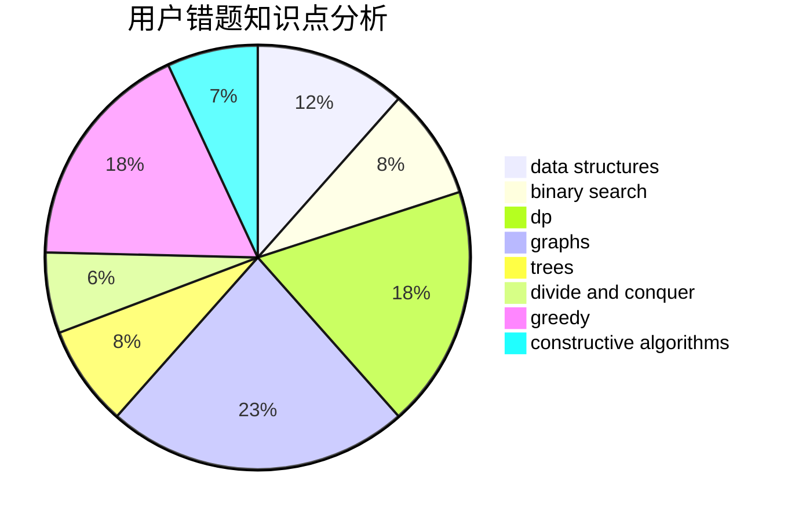

# Gnay_Oahnauhz

<!-- tabs:start -->

#### **用户提交结果分析**

#### **用户做题类型偏好分析**

#### **用户错题知识点分析**

<!-- tabs:end -->
# 推荐题目
[805A](https://codeforces.com/contest/805/problem/A)		greedy,
                        math		  
[834C](https://codeforces.com/contest/834/problem/C)		dsu,graphs,sortings,trees		  
[193B](https://codeforces.com/contest/193/problem/B)		brute force		  
[739D](https://codeforces.com/contest/739/problem/D)		graph matchings		  
[1162A](https://codeforces.com/contest/1162/problem/A)		implementation		  
[1244F](https://codeforces.com/contest/1244/problem/F)		constructive algorithms,
                        implementation		  
[888A](https://codeforces.com/contest/888/problem/A)		brute force,
                        implementation		  
[543E](https://codeforces.com/contest/543/problem/E)		constructive algorithms,
                        data structures		  
[160C](https://codeforces.com/contest/160/problem/C)		implementation,
                        math,
                        sortings		  
[524E](https://codeforces.com/contest/524/problem/E)		data structures,
                        sortings		  
