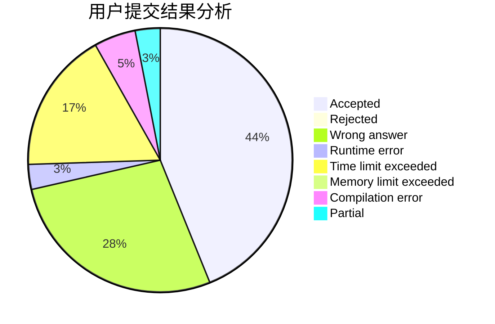
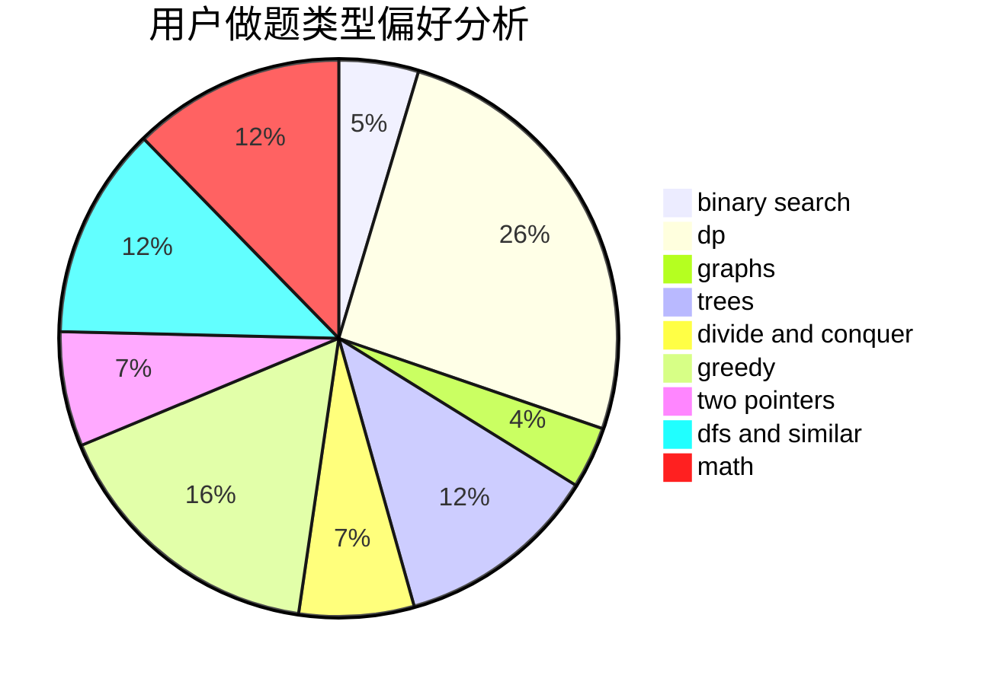

# Gnay_Oahnauhz

<!-- tabs:start -->

#### **用户提交结果分析**

#### **用户做题类型偏好分析**

<!-- tabs:end -->
# 推荐题目
[821B](https://codeforces.com/contest/821/problem/B)
[852D](https://codeforces.com/contest/852/problem/D)
[216C](https://codeforces.com/contest/216/problem/C)
[75D](https://codeforces.com/contest/75/problem/D)
[1164H](https://codeforces.com/contest/1164/problem/H)
[1250A](https://codeforces.com/contest/1250/problem/A)
[907C](https://codeforces.com/contest/907/problem/C)
[568A](https://codeforces.com/contest/568/problem/A)
[185E](https://codeforces.com/contest/185/problem/E)
[549B](https://codeforces.com/contest/549/problem/B)
