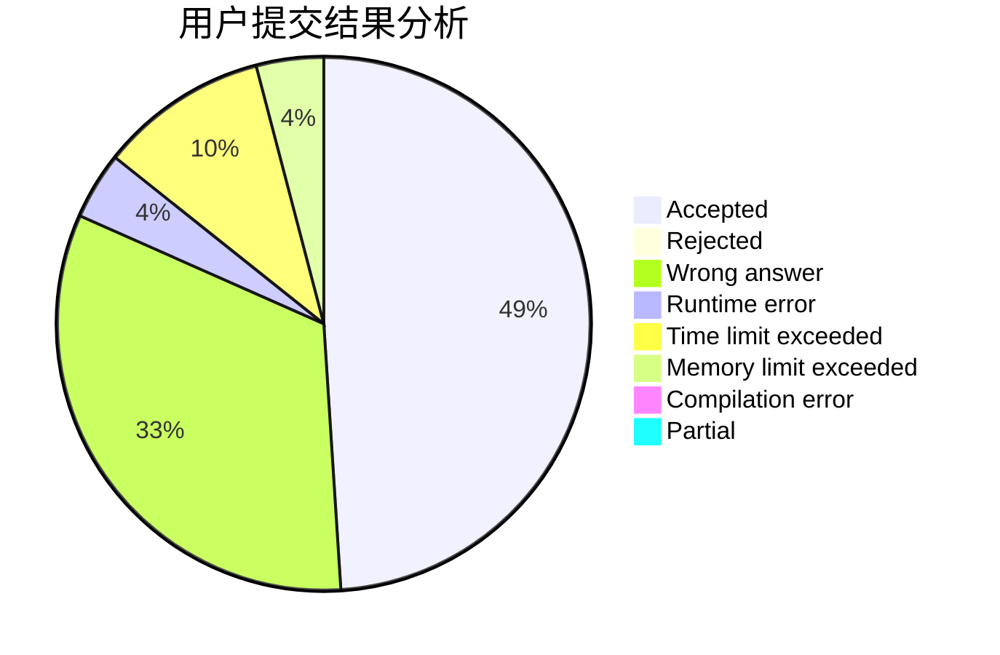
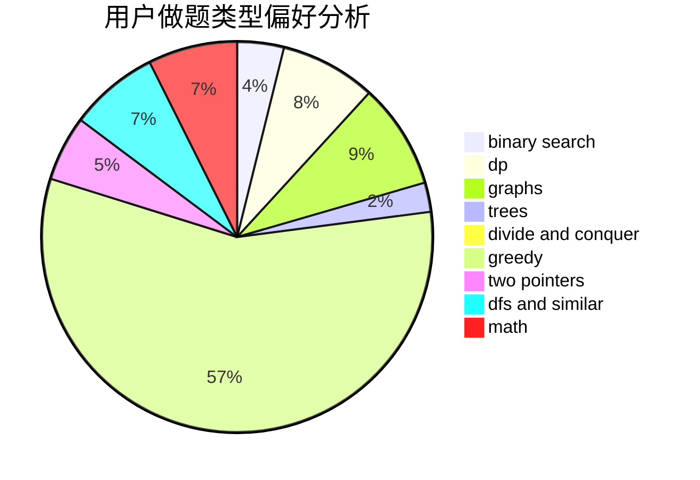

# GoRed

<!-- tabs:start -->

#### **用户提交结果分析**

#### **用户做题类型偏好分析**

<!-- tabs:end -->
# 推荐题目
[219D](https://codeforces.com/contest/219/problem/D)
[896A](https://codeforces.com/contest/896/problem/A)
[1340D](https://codeforces.com/contest/1340/problem/D)
[47B](https://codeforces.com/contest/47/problem/B)
[1142D](https://codeforces.com/contest/1142/problem/D)
[908A](https://codeforces.com/contest/908/problem/A)
[318A](https://codeforces.com/contest/318/problem/A)
[1322A](https://codeforces.com/contest/1322/problem/A)
[784F](https://codeforces.com/contest/784/problem/F)
[907D](https://codeforces.com/contest/907/problem/D)
