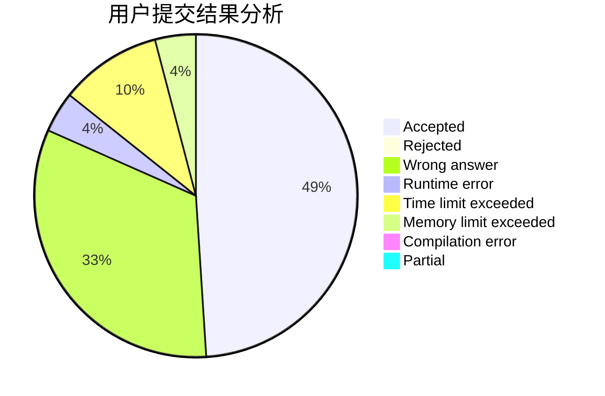
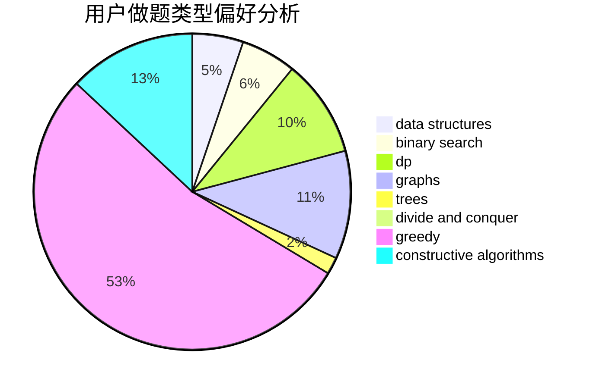
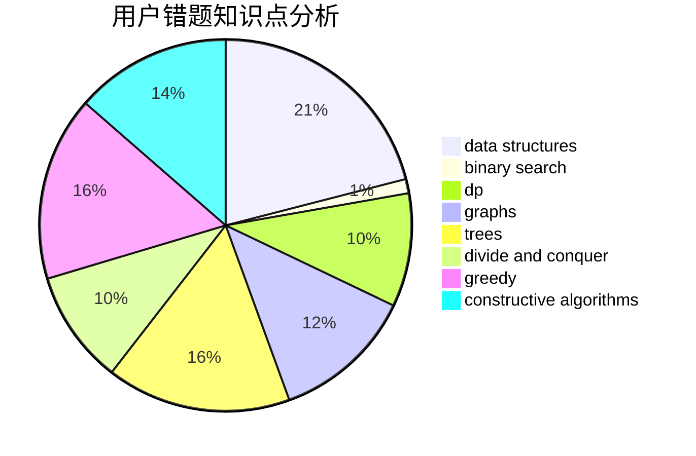

# GoRed

<!-- tabs:start -->

#### **用户提交结果分析**

#### **用户做题类型偏好分析**

#### **用户错题知识点分析**

<!-- tabs:end -->
# 推荐题目
[219D](https://codeforces.com/contest/219/problem/D)		dfs and similar,
                        dp,
                        graphs,
                        trees		  
[896A](https://codeforces.com/contest/896/problem/A)		binary search,
                        dfs and similar		  
[1340D](https://codeforces.com/contest/1340/problem/D)		constructive algorithms,
                        dfs and similar,
                        graphs,
                        trees		  
[47B](https://codeforces.com/contest/47/problem/B)		implementation		  
[1142D](https://codeforces.com/contest/1142/problem/D)		dp		  
[908A](https://codeforces.com/contest/908/problem/A)		brute force,
                        implementation		  
[318A](https://codeforces.com/contest/318/problem/A)		math		  
[1322A](https://codeforces.com/contest/1322/problem/A)		greedy		  
[784F](https://codeforces.com/contest/784/problem/F)		*special problem,
                        implementation		  
[907D](https://codeforces.com/contest/907/problem/D)		dsu,graphs,sortings,trees		  
