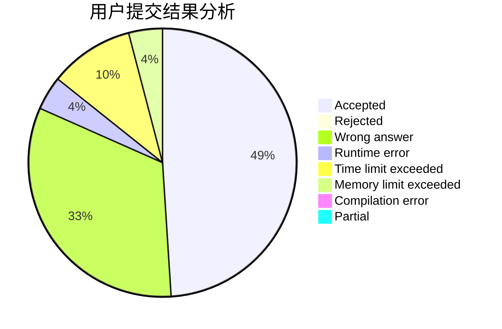
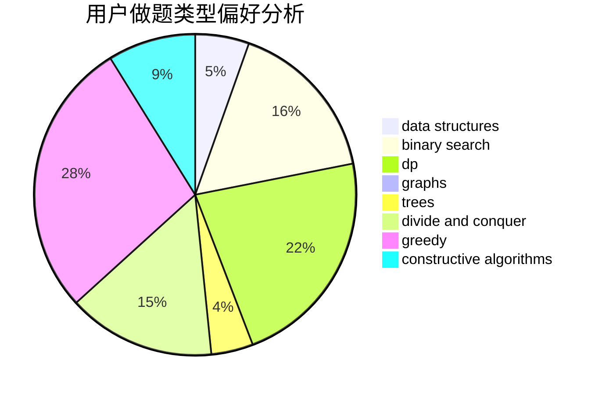
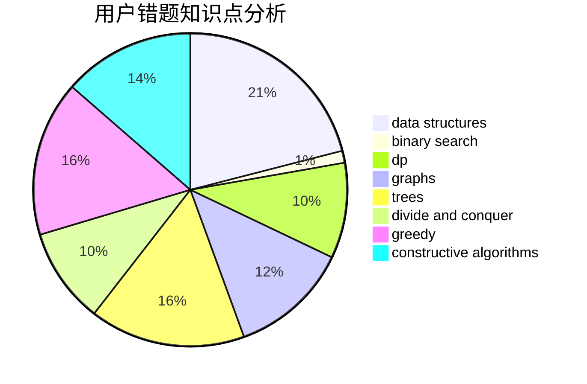

# GoRed

<!-- tabs:start -->

#### **用户提交结果分析**

#### **用户做题类型偏好分析**

#### **用户错题知识点分析**

<!-- tabs:end -->
# 推荐题目
[198B](https://codeforces.com/contest/198/problem/B)		shortest paths		  
[875F](https://codeforces.com/contest/875/problem/F)		dsu,
                        graphs,
                        greedy		  
[1333E](https://codeforces.com/contest/1333/problem/E)		brute force,
                        constructive algorithms		  
[460D](https://codeforces.com/contest/460/problem/D)		brute force,
                        constructive algorithms,
                        math		  
[1140F](https://codeforces.com/contest/1140/problem/F)		data structures,
                        divide and conquer,
                        dsu		  
[888C](https://codeforces.com/contest/888/problem/C)		binary search,
                        implementation,
                        two pointers		  
[2B](https://codeforces.com/contest/2/problem/B)		dp,
                        math		  
[1312E](https://codeforces.com/contest/1312/problem/E)		dp,
                        greedy		  
[765C](https://codeforces.com/contest/765/problem/C)		math		  
[888B](https://codeforces.com/contest/888/problem/B)		greedy		  
