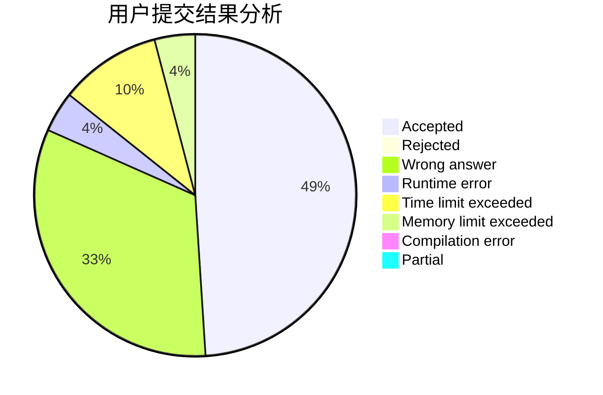
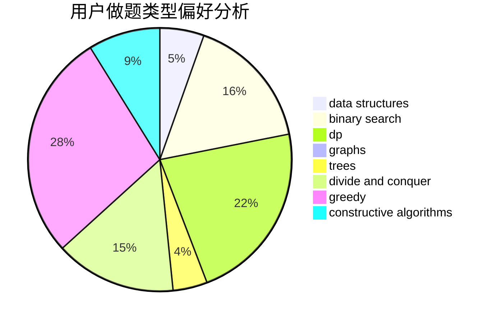
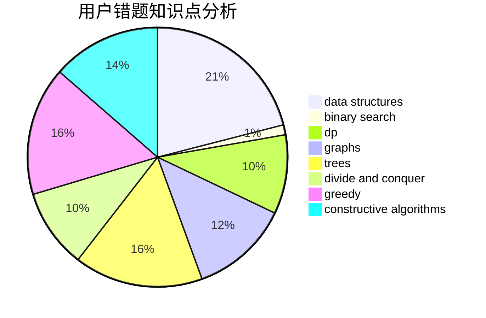

# GoRed
<!-- tabs:start -->
#### **用户提交结果分析**

#### **用户做题类型偏好分析**

#### **用户错题知识点分析**

<!-- tabs:end -->
# 推荐题目
[Jumping on Walls](http://codeforces.com/problemset/problem/198/B)		shortest paths		  
[Little Victor and Set](http://codeforces.com/problemset/problem/460/D)		brute force,
                        constructive algorithms,
                        math		  
[Extending Set of Points](http://codeforces.com/problemset/problem/1140/F)		data structures,
                        divide and conquer,
                        dsu		  
[Royal Questions](http://codeforces.com/problemset/problem/875/F)		dsu,
                        graphs,
                        greedy		  
[Listening to Music](http://codeforces.com/problemset/problem/543/E)		constructive algorithms,
                        data structures		  
[Road to 1600](http://codeforces.com/problemset/problem/1333/E)		brute force,
                        constructive algorithms		  
[Distinguish Y, XZ, -Y and -XZ](http://codeforces.com/problemset/problem/1357/A7)		nan		  
[K-Dominant Character](http://codeforces.com/problemset/problem/888/C)		binary search,
                        implementation,
                        two pointers		  
[Creating the Contest](http://codeforces.com/problemset/problem/1029/B)		dp,
                        greedy,
                        math		  
[Generous Kefa](http://codeforces.com/problemset/problem/841/A)		brute force,
                        implementation		  
<!-- tabs:start -->
#### **data structures**
[Extending Set of Points](http://codeforces.com/problemset/problem/1140/F)		data structures,
                        divide and conquer,
                        dsu		  
[Listening to Music](http://codeforces.com/problemset/problem/543/E)		constructive algorithms,
                        data structures		  
[Clear the Multiset](http://codeforces.com/problemset/problem/1400/E)		data structures,
                        divide and conquer,
                        dp,
                        greedy		  
[Maximum width](http://codeforces.com/problemset/problem/1492/C)		binary search,
                        data structures,
                        dp,
                        greedy,
                        two pointers		  
[Old Floppy Drive](http://codeforces.com/problemset/problem/1490/G)		binary search,
                        data structures,
                        math		  
[Odd Mineral Resource](http://codeforces.com/problemset/problem/1479/D)		binary search,
                        bitmasks,
                        brute force,
                        data structures,
                        probabilities,
                        trees		  
[Meximization](http://codeforces.com/problemset/problem/1497/A)		brute force,
                        data structures,
                        greedy,
                        sortings		  
[Pekora and Trampoline](http://codeforces.com/problemset/problem/1491/C)		brute force,
                        data structures,
                        dp,
                        greedy,
                        implementation		  
[Card Deck](http://codeforces.com/problemset/problem/1492/B)		data structures,
                        greedy,
                        math		  
[Complicated Computations](http://codeforces.com/problemset/problem/1436/E)		binary search,
                        data structures,
                        two pointers		  
#### **binary search**
[K-Dominant Character](http://codeforces.com/problemset/problem/888/C)		binary search,
                        implementation,
                        two pointers		  
[Au Pont Rouge](https://codeforces.com/contest/1315/problem/F)		binary search,
                        dp,
                        strings		  
[Maximum width](http://codeforces.com/problemset/problem/1492/C)		binary search,
                        data structures,
                        dp,
                        greedy,
                        two pointers		  
[Pairs](http://codeforces.com/problemset/problem/1463/D)		binary search,
                        constructive algorithms,
                        greedy,
                        two pointers		  
[Old Floppy Drive](http://codeforces.com/problemset/problem/1490/G)		binary search,
                        data structures,
                        math		  
[Odd Mineral Resource](http://codeforces.com/problemset/problem/1479/D)		binary search,
                        bitmasks,
                        brute force,
                        data structures,
                        probabilities,
                        trees		  
[Complicated Computations](http://codeforces.com/problemset/problem/1436/E)		binary search,
                        data structures,
                        two pointers		  
[Divide and Summarize](http://codeforces.com/problemset/problem/1461/D)		binary search,
                        brute force,
                        data structures,
                        divide and conquer,
                        implementation,
                        sortings		  
[K-beautiful Strings](http://codeforces.com/problemset/problem/1493/C)		binary search,
                        brute force,
                        constructive algorithms,
                        greedy,
                        strings		  
[Pythagorean Triples](http://codeforces.com/problemset/problem/1487/D)		binary search,
                        brute force,
                        math,
                        number theory		  
#### **dp**
[Creating the Contest](http://codeforces.com/problemset/problem/1029/B)		dp,
                        greedy,
                        math		  
[Au Pont Rouge](https://codeforces.com/contest/1315/problem/F)		binary search,
                        dp,
                        strings		  
[The least round way](http://codeforces.com/problemset/problem/2/B)		dp,
                        math		  
[Make It Ascending](http://codeforces.com/problemset/problem/1342/F)		bitmasks,
                        brute force,
                        dp		  
[Pokémon Army (easy version)](http://codeforces.com/problemset/problem/1420/C1)		constructive algorithms,
                        dp,
                        greedy		  
[Array Shrinking](http://codeforces.com/problemset/problem/1312/E)		dp,
                        greedy		  
[Shrinking Tree](http://codeforces.com/problemset/problem/1060/F)		combinatorics,
                        dp		  
[Zero Remainder Sum](http://codeforces.com/problemset/problem/1433/F)		dp		  
[Glass Half Spilled](http://codeforces.com/problemset/problem/1458/B)		dp		  
[Restricted RPS](http://codeforces.com/problemset/problem/1245/B)		constructive algorithms,
                        dp,
                        greedy		  
#### **graph**
[Royal Questions](http://codeforces.com/problemset/problem/875/F)		dsu,
                        graphs,
                        greedy		  
[The Two Routes](https://codeforces.com/contest/602/problem/C)		graphs,
                        shortest paths		  
[1-2-3](http://codeforces.com/problemset/problem/863/C)		graphs,
                        implementation		  
[Mr. Kitayuta's Colorful Graph](http://codeforces.com/problemset/problem/505/B)		dfs and similar,
                        dp,
                        dsu,
                        graphs		  
[Minimum Ties](http://codeforces.com/problemset/problem/1487/C)		brute force,
                        constructive algorithms,
                        dfs and similar,
                        graphs,
                        greedy,
                        implementation,
                        math		  
[Chef Monocarp](http://codeforces.com/problemset/problem/1437/C)		dp,
                        flows,
                        graph matchings,
                        greedy,
                        math,
                        sortings		  
[Strange Housing](http://codeforces.com/problemset/problem/1470/D)		constructive algorithms,
                        dfs and similar,
                        graph matchings,
                        graphs,
                        greedy		  
[Longest Simple Cycle](http://codeforces.com/problemset/problem/1476/C)		dp,
                        graphs,
                        greedy		  
[Shortest and Longest LIS](http://codeforces.com/problemset/problem/1304/D)		constructive algorithms,
                        graphs,
                        greedy,
                        two pointers		  
[Ball in Berland](http://codeforces.com/problemset/problem/1475/C)		combinatorics,
                        graphs,
                        math		  
#### **trees**
[Odd Mineral Resource](http://codeforces.com/problemset/problem/1479/D)		binary search,
                        bitmasks,
                        brute force,
                        data structures,
                        probabilities,
                        trees		  
[Yet Another Card Deck](http://codeforces.com/problemset/problem/1511/C)		brute force,
                        data structures,
                        implementation,
                        trees		  
[Diameter Cuts](http://codeforces.com/problemset/problem/1499/F)		combinatorics,
                        dfs and similar,
                        dp,
                        trees		  
[Fib-tree](http://codeforces.com/problemset/problem/1491/E)		brute force,
                        dfs and similar,
                        divide and conquer,
                        number theory,
                        trees		  
[13th Labour of Heracles](http://codeforces.com/problemset/problem/1466/D)		data structures,
                        greedy,
                        sortings,
                        trees		  
[BFS Trees](http://codeforces.com/problemset/problem/1495/D)		combinatorics,
                        dfs and similar,
                        graphs,
                        math,
                        shortest paths,
                        trees		  
[Sum of Prefix Sums](http://codeforces.com/problemset/problem/1303/G)		data structures,
                        divide and conquer,
                        geometry,
                        trees		  
[Number of Simple Paths](http://codeforces.com/problemset/problem/1454/E)		combinatorics,
                        dfs and similar,
                        graphs,
                        trees		  
[Dogeforces](http://codeforces.com/problemset/problem/1494/D)		constructive algorithms,
                        data structures,
                        dfs and similar,
                        divide and conquer,
                        dsu,
                        greedy,
                        sortings,
                        trees		  
[Xenon's Attack on the Gangs](http://codeforces.com/problemset/problem/1292/C)		combinatorics,
                        dfs and similar,
                        dp,
                        greedy,
                        trees		  
#### **divide and conquer**
[Extending Set of Points](http://codeforces.com/problemset/problem/1140/F)		data structures,
                        divide and conquer,
                        dsu		  
[Clear the Multiset](http://codeforces.com/problemset/problem/1400/E)		data structures,
                        divide and conquer,
                        dp,
                        greedy		  
[Divide and Summarize](http://codeforces.com/problemset/problem/1461/D)		binary search,
                        brute force,
                        data structures,
                        divide and conquer,
                        implementation,
                        sortings		  
[Song of the Sirens](http://codeforces.com/problemset/problem/1466/G)		combinatorics,
                        divide and conquer,
                        hashing,
                        math,
                        string suffix structures,
                        strings		  
[Permutation Transformation](http://codeforces.com/problemset/problem/1490/D)		dfs and similar,
                        divide and conquer,
                        implementation		  
[Skyline Photo](https://codeforces.com/contest/1483/problem/C)		data structures,
                        divide and conquer,
                        dp		  
[Fib-tree](http://codeforces.com/problemset/problem/1491/E)		brute force,
                        dfs and similar,
                        divide and conquer,
                        number theory,
                        trees		  
[Sum of Prefix Sums](http://codeforces.com/problemset/problem/1303/G)		data structures,
                        divide and conquer,
                        geometry,
                        trees		  
[Dogeforces](http://codeforces.com/problemset/problem/1494/D)		constructive algorithms,
                        data structures,
                        dfs and similar,
                        divide and conquer,
                        dsu,
                        greedy,
                        sortings,
                        trees		  
[Skyline Photo](http://codeforces.com/problemset/problem/1482/E)		data structures,
                        divide and conquer,
                        dp		  
#### **greedy**
[Royal Questions](http://codeforces.com/problemset/problem/875/F)		dsu,
                        graphs,
                        greedy		  
[Creating the Contest](http://codeforces.com/problemset/problem/1029/B)		dp,
                        greedy,
                        math		  
[Puzzles](http://codeforces.com/problemset/problem/337/A)		greedy		  
[Pokémon Army (easy version)](http://codeforces.com/problemset/problem/1420/C1)		constructive algorithms,
                        dp,
                        greedy		  
[Array Shrinking](http://codeforces.com/problemset/problem/1312/E)		dp,
                        greedy		  
[Numbers Box](http://codeforces.com/problemset/problem/1447/B)		greedy,
                        math		  
[Buggy Robot](http://codeforces.com/problemset/problem/888/B)		greedy		  
[Restricted RPS](http://codeforces.com/problemset/problem/1245/B)		constructive algorithms,
                        dp,
                        greedy		  
[Clear the Multiset](http://codeforces.com/problemset/problem/1400/E)		data structures,
                        divide and conquer,
                        dp,
                        greedy		  
[Maximum width](http://codeforces.com/problemset/problem/1492/C)		binary search,
                        data structures,
                        dp,
                        greedy,
                        two pointers		  
#### **constructive algorithms**
[Little Victor and Set](http://codeforces.com/problemset/problem/460/D)		brute force,
                        constructive algorithms,
                        math		  
[Listening to Music](http://codeforces.com/problemset/problem/543/E)		constructive algorithms,
                        data structures		  
[Road to 1600](http://codeforces.com/problemset/problem/1333/E)		brute force,
                        constructive algorithms		  
[Present from Lena](http://codeforces.com/problemset/problem/118/B)		constructive algorithms,
                        implementation		  
[Pokémon Army (easy version)](http://codeforces.com/problemset/problem/1420/C1)		constructive algorithms,
                        dp,
                        greedy		  
[Restricted RPS](http://codeforces.com/problemset/problem/1245/B)		constructive algorithms,
                        dp,
                        greedy		  
[Balanced Reversals](http://codeforces.com/problemset/problem/1237/H)		constructive algorithms		  
[Anti-knapsack](http://codeforces.com/problemset/problem/1493/A)		constructive algorithms,
                        greedy		  
[Pairs](http://codeforces.com/problemset/problem/1463/D)		binary search,
                        constructive algorithms,
                        greedy,
                        two pointers		  
[XOR-gun](https://codeforces.com/contest/1456/problem/B)		bitmasks,
                        brute force,
                        constructive algorithms		  
#### **sortings**
[Vladik and Complicated Book](http://codeforces.com/problemset/problem/811/B)		implementation,
                        sortings		  
[Diamond Miner](https://codeforces.com/contest/1496/problem/C)		geometry,
                        greedy,
                        math,
                        sortings		  
[Diamond Miner](http://codeforces.com/problemset/problem/1495/A)		geometry,
                        greedy,
                        math,
                        sortings		  
[Meximization](http://codeforces.com/problemset/problem/1497/A)		brute force,
                        data structures,
                        greedy,
                        sortings		  
[Avoiding Zero](http://codeforces.com/problemset/problem/1427/A)		math,
                        sortings		  
[Divide and Summarize](http://codeforces.com/problemset/problem/1461/D)		binary search,
                        brute force,
                        data structures,
                        divide and conquer,
                        implementation,
                        sortings		  
[Chef Monocarp](http://codeforces.com/problemset/problem/1437/C)		dp,
                        flows,
                        graph matchings,
                        greedy,
                        math,
                        sortings		  
[Replacing Elements](http://codeforces.com/problemset/problem/1473/A)		greedy,
                        implementation,
                        math,
                        sortings		  
[Eastern Exhibition](http://codeforces.com/problemset/problem/1486/B)		binary search,
                        geometry,
                        shortest paths,
                        sortings		  
[The Great Hero](http://codeforces.com/problemset/problem/1480/B)		greedy,
                        implementation,
                        sortings		  
<!-- tabs:end -->
