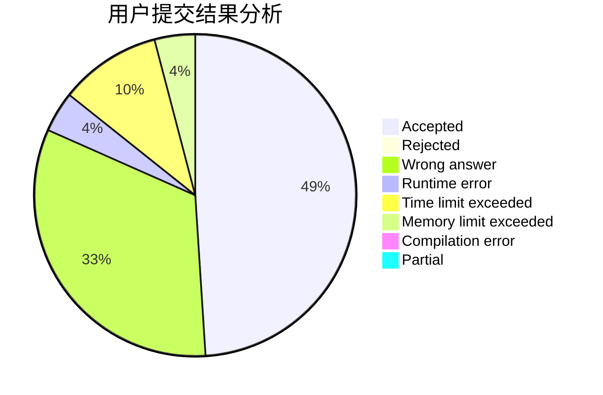
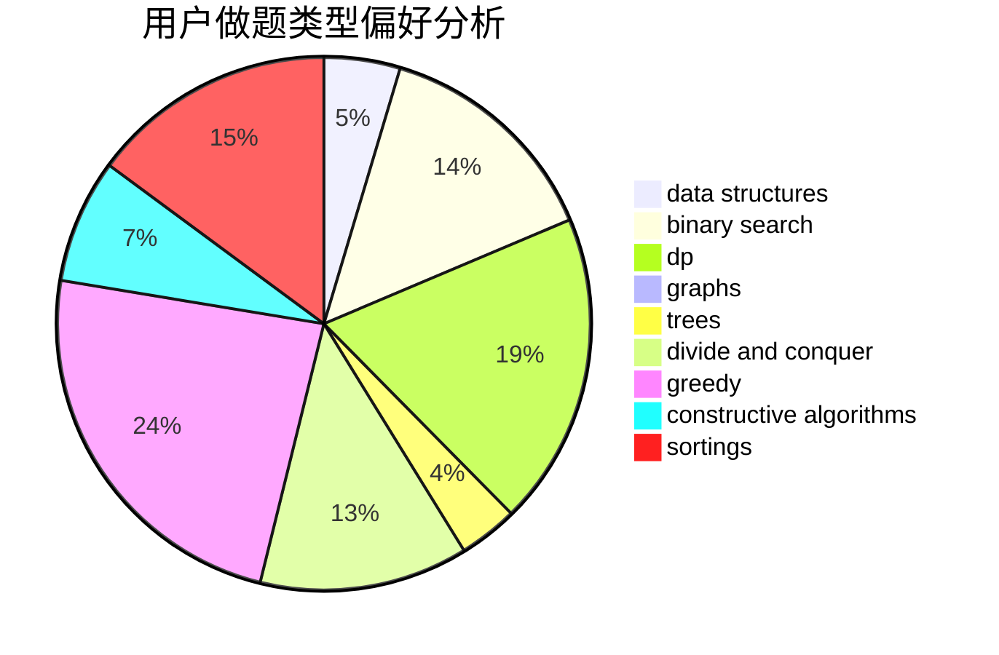
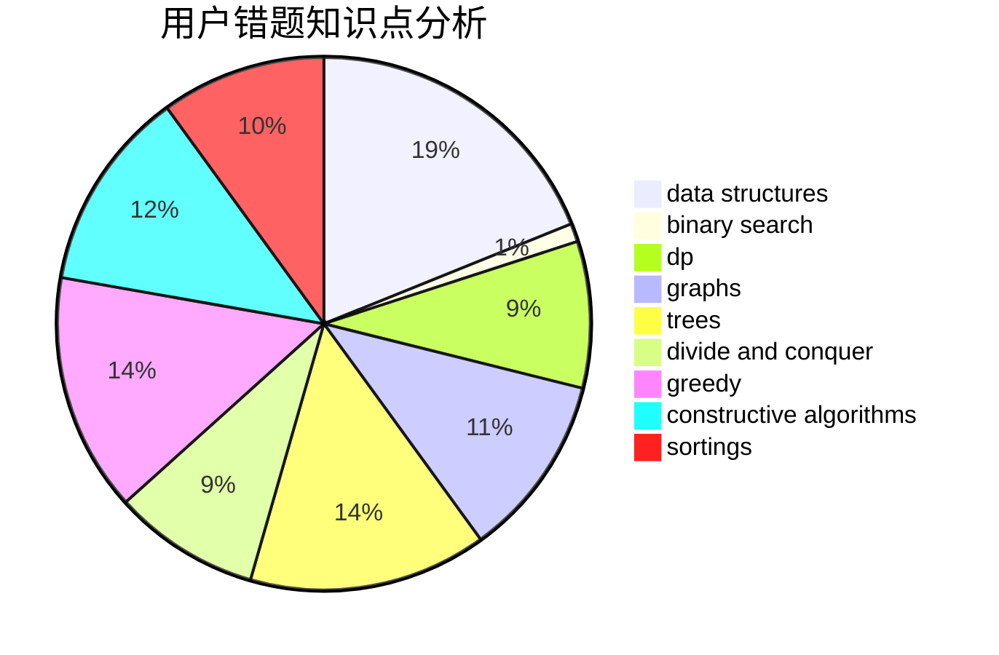

# GoRed
<!-- tabs:start -->
#### **用户提交结果分析**

#### **用户做题类型偏好分析**

#### **用户错题知识点分析**

<!-- tabs:end -->
# 推荐题目
[198B](http://codeforces.com/problemset/problem/198/B)		shortest paths		  
[460D](http://codeforces.com/problemset/problem/460/D)		brute force,
                        constructive algorithms,
                        math		  
[1140F](http://codeforces.com/problemset/problem/1140/F)		data structures,
                        divide and conquer,
                        dsu		  
[875F](http://codeforces.com/problemset/problem/875/F)		dsu,
                        graphs,
                        greedy		  
[543E](http://codeforces.com/problemset/problem/543/E)		constructive algorithms,
                        data structures		  
[1333E](http://codeforces.com/problemset/problem/1333/E)		brute force,
                        constructive algorithms		  
[1357A7](http://codeforces.com/problemset/problem/1357/A7)		nan		  
[888C](http://codeforces.com/problemset/problem/888/C)		binary search,
                        implementation,
                        two pointers		  
[1029B](http://codeforces.com/problemset/problem/1029/B)		dp,
                        greedy,
                        math		  
[841A](http://codeforces.com/problemset/problem/841/A)		brute force,
                        implementation		  
<!-- tabs:start -->
#### **data structures**
[1140F](http://codeforces.com/problemset/problem/1140/F)		data structures,
                        divide and conquer,
                        dsu		  
[543E](http://codeforces.com/problemset/problem/543/E)		constructive algorithms,
                        data structures		  
[1400E](http://codeforces.com/problemset/problem/1400/E)		data structures,
                        divide and conquer,
                        dp,
                        greedy		  
[1492C](http://codeforces.com/problemset/problem/1492/C)		binary search,
                        data structures,
                        dp,
                        greedy,
                        two pointers		  
[1490G](http://codeforces.com/problemset/problem/1490/G)		binary search,
                        data structures,
                        math		  
[1479D](http://codeforces.com/problemset/problem/1479/D)		binary search,
                        bitmasks,
                        brute force,
                        data structures,
                        probabilities,
                        trees		  
[1497A](http://codeforces.com/problemset/problem/1497/A)		brute force,
                        data structures,
                        greedy,
                        sortings		  
[1491C](http://codeforces.com/problemset/problem/1491/C)		brute force,
                        data structures,
                        dp,
                        greedy,
                        implementation		  
[1492B](http://codeforces.com/problemset/problem/1492/B)		data structures,
                        greedy,
                        math		  
[1436E](http://codeforces.com/problemset/problem/1436/E)		binary search,
                        data structures,
                        two pointers		  
#### **binary search**
[888C](http://codeforces.com/problemset/problem/888/C)		binary search,
                        implementation,
                        two pointers		  
[1315F](https://codeforces.com/contest/1315/problem/F)		binary search,
                        dp,
                        strings		  
[1492C](http://codeforces.com/problemset/problem/1492/C)		binary search,
                        data structures,
                        dp,
                        greedy,
                        two pointers		  
[1463D](http://codeforces.com/problemset/problem/1463/D)		binary search,
                        constructive algorithms,
                        greedy,
                        two pointers		  
[1490G](http://codeforces.com/problemset/problem/1490/G)		binary search,
                        data structures,
                        math		  
[1479D](http://codeforces.com/problemset/problem/1479/D)		binary search,
                        bitmasks,
                        brute force,
                        data structures,
                        probabilities,
                        trees		  
[1436E](http://codeforces.com/problemset/problem/1436/E)		binary search,
                        data structures,
                        two pointers		  
[1461D](http://codeforces.com/problemset/problem/1461/D)		binary search,
                        brute force,
                        data structures,
                        divide and conquer,
                        implementation,
                        sortings		  
[1493C](http://codeforces.com/problemset/problem/1493/C)		binary search,
                        brute force,
                        constructive algorithms,
                        greedy,
                        strings		  
[1487D](http://codeforces.com/problemset/problem/1487/D)		binary search,
                        brute force,
                        math,
                        number theory		  
#### **dp**
[1029B](http://codeforces.com/problemset/problem/1029/B)		dp,
                        greedy,
                        math		  
[1315F](https://codeforces.com/contest/1315/problem/F)		binary search,
                        dp,
                        strings		  
[2B](http://codeforces.com/problemset/problem/2/B)		dp,
                        math		  
[1342F](http://codeforces.com/problemset/problem/1342/F)		bitmasks,
                        brute force,
                        dp		  
[1420C1](http://codeforces.com/problemset/problem/1420/C1)		constructive algorithms,
                        dp,
                        greedy		  
[1312E](http://codeforces.com/problemset/problem/1312/E)		dp,
                        greedy		  
[1060F](http://codeforces.com/problemset/problem/1060/F)		combinatorics,
                        dp		  
[1433F](http://codeforces.com/problemset/problem/1433/F)		dp		  
[1458B](http://codeforces.com/problemset/problem/1458/B)		dp		  
[1245B](http://codeforces.com/problemset/problem/1245/B)		constructive algorithms,
                        dp,
                        greedy		  
#### **graph**
[875F](http://codeforces.com/problemset/problem/875/F)		dsu,
                        graphs,
                        greedy		  
[602C](https://codeforces.com/contest/602/problem/C)		graphs,
                        shortest paths		  
[863C](http://codeforces.com/problemset/problem/863/C)		graphs,
                        implementation		  
[505B](http://codeforces.com/problemset/problem/505/B)		dfs and similar,
                        dp,
                        dsu,
                        graphs		  
[1487C](http://codeforces.com/problemset/problem/1487/C)		brute force,
                        constructive algorithms,
                        dfs and similar,
                        graphs,
                        greedy,
                        implementation,
                        math		  
[1437C](http://codeforces.com/problemset/problem/1437/C)		dp,
                        flows,
                        graph matchings,
                        greedy,
                        math,
                        sortings		  
[1470D](http://codeforces.com/problemset/problem/1470/D)		constructive algorithms,
                        dfs and similar,
                        graph matchings,
                        graphs,
                        greedy		  
[1476C](http://codeforces.com/problemset/problem/1476/C)		dp,
                        graphs,
                        greedy		  
[1304D](http://codeforces.com/problemset/problem/1304/D)		constructive algorithms,
                        graphs,
                        greedy,
                        two pointers		  
[1475C](http://codeforces.com/problemset/problem/1475/C)		combinatorics,
                        graphs,
                        math		  
#### **trees**
[1479D](http://codeforces.com/problemset/problem/1479/D)		binary search,
                        bitmasks,
                        brute force,
                        data structures,
                        probabilities,
                        trees		  
[1511C](http://codeforces.com/problemset/problem/1511/C)		brute force,
                        data structures,
                        implementation,
                        trees		  
[1499F](http://codeforces.com/problemset/problem/1499/F)		combinatorics,
                        dfs and similar,
                        dp,
                        trees		  
[1491E](http://codeforces.com/problemset/problem/1491/E)		brute force,
                        dfs and similar,
                        divide and conquer,
                        number theory,
                        trees		  
[1466D](http://codeforces.com/problemset/problem/1466/D)		data structures,
                        greedy,
                        sortings,
                        trees		  
[1495D](http://codeforces.com/problemset/problem/1495/D)		combinatorics,
                        dfs and similar,
                        graphs,
                        math,
                        shortest paths,
                        trees		  
[1303G](http://codeforces.com/problemset/problem/1303/G)		data structures,
                        divide and conquer,
                        geometry,
                        trees		  
[1454E](http://codeforces.com/problemset/problem/1454/E)		combinatorics,
                        dfs and similar,
                        graphs,
                        trees		  
[1494D](http://codeforces.com/problemset/problem/1494/D)		constructive algorithms,
                        data structures,
                        dfs and similar,
                        divide and conquer,
                        dsu,
                        greedy,
                        sortings,
                        trees		  
[1292C](http://codeforces.com/problemset/problem/1292/C)		combinatorics,
                        dfs and similar,
                        dp,
                        greedy,
                        trees		  
#### **divide and conquer**
[1140F](http://codeforces.com/problemset/problem/1140/F)		data structures,
                        divide and conquer,
                        dsu		  
[1400E](http://codeforces.com/problemset/problem/1400/E)		data structures,
                        divide and conquer,
                        dp,
                        greedy		  
[1461D](http://codeforces.com/problemset/problem/1461/D)		binary search,
                        brute force,
                        data structures,
                        divide and conquer,
                        implementation,
                        sortings		  
[1466G](http://codeforces.com/problemset/problem/1466/G)		combinatorics,
                        divide and conquer,
                        hashing,
                        math,
                        string suffix structures,
                        strings		  
[1490D](http://codeforces.com/problemset/problem/1490/D)		dfs and similar,
                        divide and conquer,
                        implementation		  
[1483C](https://codeforces.com/contest/1483/problem/C)		data structures,
                        divide and conquer,
                        dp		  
[1491E](http://codeforces.com/problemset/problem/1491/E)		brute force,
                        dfs and similar,
                        divide and conquer,
                        number theory,
                        trees		  
[1303G](http://codeforces.com/problemset/problem/1303/G)		data structures,
                        divide and conquer,
                        geometry,
                        trees		  
[1494D](http://codeforces.com/problemset/problem/1494/D)		constructive algorithms,
                        data structures,
                        dfs and similar,
                        divide and conquer,
                        dsu,
                        greedy,
                        sortings,
                        trees		  
[1482E](http://codeforces.com/problemset/problem/1482/E)		data structures,
                        divide and conquer,
                        dp		  
#### **greedy**
[875F](http://codeforces.com/problemset/problem/875/F)		dsu,
                        graphs,
                        greedy		  
[1029B](http://codeforces.com/problemset/problem/1029/B)		dp,
                        greedy,
                        math		  
[337A](http://codeforces.com/problemset/problem/337/A)		greedy		  
[1420C1](http://codeforces.com/problemset/problem/1420/C1)		constructive algorithms,
                        dp,
                        greedy		  
[1312E](http://codeforces.com/problemset/problem/1312/E)		dp,
                        greedy		  
[1447B](http://codeforces.com/problemset/problem/1447/B)		greedy,
                        math		  
[888B](http://codeforces.com/problemset/problem/888/B)		greedy		  
[1245B](http://codeforces.com/problemset/problem/1245/B)		constructive algorithms,
                        dp,
                        greedy		  
[1400E](http://codeforces.com/problemset/problem/1400/E)		data structures,
                        divide and conquer,
                        dp,
                        greedy		  
[1492C](http://codeforces.com/problemset/problem/1492/C)		binary search,
                        data structures,
                        dp,
                        greedy,
                        two pointers		  
#### **constructive algorithms**
[460D](http://codeforces.com/problemset/problem/460/D)		brute force,
                        constructive algorithms,
                        math		  
[543E](http://codeforces.com/problemset/problem/543/E)		constructive algorithms,
                        data structures		  
[1333E](http://codeforces.com/problemset/problem/1333/E)		brute force,
                        constructive algorithms		  
[118B](http://codeforces.com/problemset/problem/118/B)		constructive algorithms,
                        implementation		  
[1420C1](http://codeforces.com/problemset/problem/1420/C1)		constructive algorithms,
                        dp,
                        greedy		  
[1245B](http://codeforces.com/problemset/problem/1245/B)		constructive algorithms,
                        dp,
                        greedy		  
[1237H](http://codeforces.com/problemset/problem/1237/H)		constructive algorithms		  
[1493A](http://codeforces.com/problemset/problem/1493/A)		constructive algorithms,
                        greedy		  
[1463D](http://codeforces.com/problemset/problem/1463/D)		binary search,
                        constructive algorithms,
                        greedy,
                        two pointers		  
[1456B](https://codeforces.com/contest/1456/problem/B)		bitmasks,
                        brute force,
                        constructive algorithms		  
#### **sortings**
[811B](http://codeforces.com/problemset/problem/811/B)		implementation,
                        sortings		  
[1496C](https://codeforces.com/contest/1496/problem/C)		geometry,
                        greedy,
                        math,
                        sortings		  
[1495A](http://codeforces.com/problemset/problem/1495/A)		geometry,
                        greedy,
                        math,
                        sortings		  
[1497A](http://codeforces.com/problemset/problem/1497/A)		brute force,
                        data structures,
                        greedy,
                        sortings		  
[1427A](http://codeforces.com/problemset/problem/1427/A)		math,
                        sortings		  
[1461D](http://codeforces.com/problemset/problem/1461/D)		binary search,
                        brute force,
                        data structures,
                        divide and conquer,
                        implementation,
                        sortings		  
[1437C](http://codeforces.com/problemset/problem/1437/C)		dp,
                        flows,
                        graph matchings,
                        greedy,
                        math,
                        sortings		  
[1473A](http://codeforces.com/problemset/problem/1473/A)		greedy,
                        implementation,
                        math,
                        sortings		  
[1486B](http://codeforces.com/problemset/problem/1486/B)		binary search,
                        geometry,
                        shortest paths,
                        sortings		  
[1480B](http://codeforces.com/problemset/problem/1480/B)		greedy,
                        implementation,
                        sortings		  
<!-- tabs:end -->
