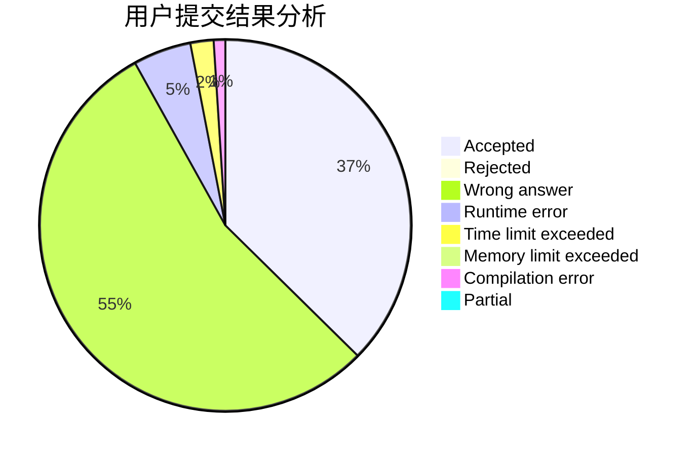
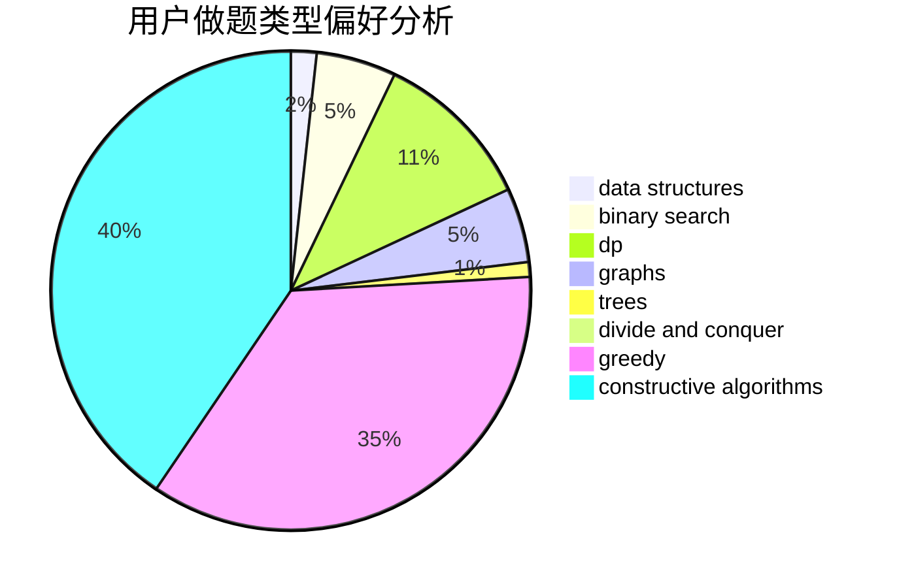
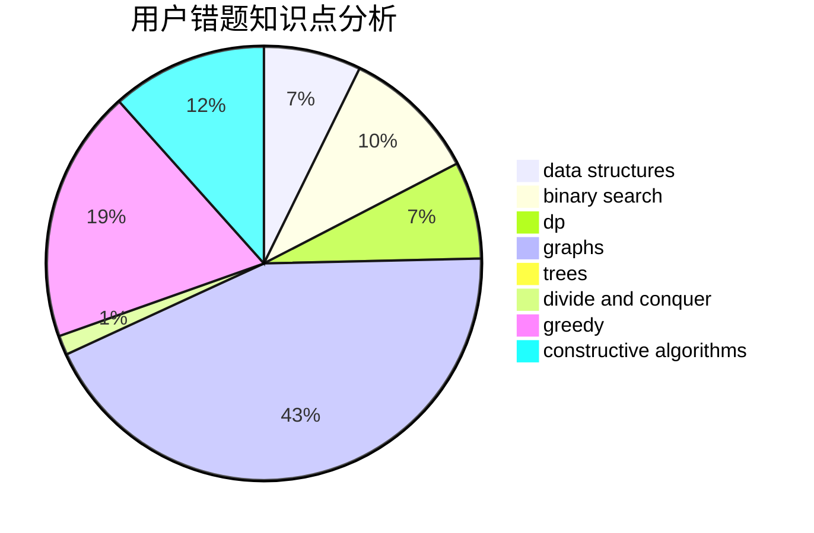

# Godknows...
<!-- tabs:start -->
#### **用户提交结果分析**

#### **用户做题类型偏好分析**

#### **用户错题知识点分析**

<!-- tabs:end -->
# 推荐题目
[XOR-gun](https://codeforces.com/contest/1457/problem/D)		bitmasks,
                        brute force,
                        constructive algorithms		  
[Speckled Band](http://codeforces.com/problemset/problem/1043/G)		data structures,
                        divide and conquer,
                        hashing,
                        string suffix structures,
                        strings		  
[Almost Identity Permutations](http://codeforces.com/problemset/problem/888/D)		combinatorics,
                        dp,
                        math		  
[Deja Vu](http://codeforces.com/problemset/problem/331/E2)		constructive algorithms,
                        dp		  
[Alyona and Numbers](http://codeforces.com/problemset/problem/682/A)		constructive algorithms,
                        math,
                        number theory		  
[Timofey and cubes](http://codeforces.com/problemset/problem/764/B)		constructive algorithms,
                        implementation		  
[Party](http://codeforces.com/problemset/problem/23/B)		constructive algorithms,
                        graphs,
                        math		  
[Free Ice Cream](http://codeforces.com/problemset/problem/686/A)		constructive algorithms,
                        implementation		  
[Maximum Subsequence](http://codeforces.com/problemset/problem/888/E)		bitmasks,
                        divide and conquer,
                        meet-in-the-middle		  
[Guess Divisors Count](http://codeforces.com/problemset/problem/1355/F)		constructive algorithms,
                        interactive,
                        number theory		  
<!-- tabs:start -->
#### **data structures**
[XOR-gun](http://codeforces.com/problemset/problem/1043/G)		data structures,
                        divide and conquer,
                        hashing,
                        string suffix structures,
                        strings		  
[Speckled Band](http://codeforces.com/problemset/problem/1004/F)		bitmasks,
                        data structures,
                        divide and conquer		  
[Almost Identity Permutations](http://codeforces.com/problemset/problem/198/E)		binary search,
                        data structures,
                        sortings		  
[Deja Vu](http://codeforces.com/problemset/problem/571/D)		binary search,
                        data structures,
                        dsu,
                        trees		  
[Alyona and Numbers](http://codeforces.com/problemset/problem/1039/A)		constructive algorithms,
                        data structures,
                        greedy,
                        math		  
[Timofey and cubes](http://codeforces.com/problemset/problem/888/G)		bitmasks,
                        constructive algorithms,
                        data structures		  
[Party](http://codeforces.com/problemset/problem/1200/A)		brute force,
                        data structures,
                        implementation		  
[Free Ice Cream](http://codeforces.com/problemset/problem/665/E)		data structures,
                        divide and conquer,
                        strings,
                        trees		  
[Maximum Subsequence](http://codeforces.com/problemset/problem/1450/D)		binary search,
                        data structures,
                        greedy,
                        implementation,
                        two pointers		  
[Guess Divisors Count](http://codeforces.com/problemset/problem/1508/C)		data structures,
                        dfs and similar,
                        dsu,
                        graphs,
                        greedy,
                        math		  
#### **binary search**
[XOR-gun](http://codeforces.com/problemset/problem/198/E)		binary search,
                        data structures,
                        sortings		  
[Speckled Band](http://codeforces.com/problemset/problem/571/D)		binary search,
                        data structures,
                        dsu,
                        trees		  
[Almost Identity Permutations](http://codeforces.com/problemset/problem/147/B)		binary search,
                        graphs,
                        matrices		  
[Deja Vu](http://codeforces.com/problemset/problem/1450/D)		binary search,
                        data structures,
                        greedy,
                        implementation,
                        two pointers		  
[Alyona and Numbers](http://codeforces.com/problemset/problem/825/D)		binary search,
                        greedy,
                        implementation		  
[Timofey and cubes](http://codeforces.com/problemset/problem/1237/C2)		binary search,
                        constructive algorithms,
                        divide and conquer,
                        greedy,
                        implementation,
                        sortings		  
[Party](http://codeforces.com/problemset/problem/1359/C)		binary search,
                        math		  
[Free Ice Cream](http://codeforces.com/problemset/problem/1131/C)		binary search,
                        greedy,
                        sortings		  
[Maximum Subsequence](http://codeforces.com/problemset/problem/1492/C)		binary search,
                        data structures,
                        dp,
                        greedy,
                        two pointers		  
[Guess Divisors Count](http://codeforces.com/problemset/problem/1463/D)		binary search,
                        constructive algorithms,
                        greedy,
                        two pointers		  
#### **dp**
[XOR-gun](http://codeforces.com/problemset/problem/888/D)		combinatorics,
                        dp,
                        math		  
[Speckled Band](http://codeforces.com/problemset/problem/331/E2)		constructive algorithms,
                        dp		  
[Almost Identity Permutations](https://codeforces.com/contest/483/problem/E)		bitmasks,
                        dp,
                        probabilities		  
[Deja Vu](http://codeforces.com/problemset/problem/526/E)		dp,
                        implementation		  
[Alyona and Numbers](http://codeforces.com/problemset/problem/540/D)		dp,
                        probabilities		  
[Timofey and cubes](http://codeforces.com/problemset/problem/888/F)		dp,
                        graphs		  
[Party](http://codeforces.com/problemset/problem/1404/B)		dfs and similar,
                        dp,
                        games,
                        trees		  
[Free Ice Cream](http://codeforces.com/problemset/problem/1492/C)		binary search,
                        data structures,
                        dp,
                        greedy,
                        two pointers		  
[Maximum Subsequence](https://codeforces.com/contest/1457/problem/C)		brute force,
                        dp,
                        implementation		  
[Guess Divisors Count](http://codeforces.com/problemset/problem/1491/C)		brute force,
                        data structures,
                        dp,
                        greedy,
                        implementation		  
#### **graph**
[XOR-gun](http://codeforces.com/problemset/problem/23/B)		constructive algorithms,
                        graphs,
                        math		  
[Speckled Band](http://codeforces.com/problemset/problem/46/F)		dsu,
                        graphs		  
[Almost Identity Permutations](http://codeforces.com/problemset/problem/147/B)		binary search,
                        graphs,
                        matrices		  
[Deja Vu](http://codeforces.com/problemset/problem/1508/C)		data structures,
                        dfs and similar,
                        dsu,
                        graphs,
                        greedy,
                        math		  
[Alyona and Numbers](http://codeforces.com/problemset/problem/888/F)		dp,
                        graphs		  
[Timofey and cubes](https://codeforces.com/contest/1464/problem/A)		dfs and similar,
                        dsu,
                        graphs		  
[Party](http://codeforces.com/problemset/problem/1381/C)		constructive algorithms,
                        graph matchings,
                        greedy,
                        implementation,
                        sortings,
                        two pointers		  
[Free Ice Cream](http://codeforces.com/problemset/problem/1487/C)		brute force,
                        constructive algorithms,
                        dfs and similar,
                        graphs,
                        greedy,
                        implementation,
                        math		  
[Maximum Subsequence](http://codeforces.com/problemset/problem/1437/C)		dp,
                        flows,
                        graph matchings,
                        greedy,
                        math,
                        sortings		  
[Guess Divisors Count](http://codeforces.com/problemset/problem/1470/D)		constructive algorithms,
                        dfs and similar,
                        graph matchings,
                        graphs,
                        greedy		  
#### **trees**
[XOR-gun](http://codeforces.com/problemset/problem/571/D)		binary search,
                        data structures,
                        dsu,
                        trees		  
[Speckled Band](http://codeforces.com/problemset/problem/665/E)		data structures,
                        divide and conquer,
                        strings,
                        trees		  
[Almost Identity Permutations](http://codeforces.com/problemset/problem/1404/B)		dfs and similar,
                        dp,
                        games,
                        trees		  
[Deja Vu](http://codeforces.com/problemset/problem/1479/D)		binary search,
                        bitmasks,
                        brute force,
                        data structures,
                        probabilities,
                        trees		  
[Alyona and Numbers](http://codeforces.com/problemset/problem/1511/C)		brute force,
                        data structures,
                        implementation,
                        trees		  
[Timofey and cubes](http://codeforces.com/problemset/problem/1499/F)		combinatorics,
                        dfs and similar,
                        dp,
                        trees		  
[Party](http://codeforces.com/problemset/problem/1491/E)		brute force,
                        dfs and similar,
                        divide and conquer,
                        number theory,
                        trees		  
[Free Ice Cream](http://codeforces.com/problemset/problem/1466/D)		data structures,
                        greedy,
                        sortings,
                        trees		  
[Maximum Subsequence](http://codeforces.com/problemset/problem/1495/D)		combinatorics,
                        dfs and similar,
                        graphs,
                        math,
                        shortest paths,
                        trees		  
[Guess Divisors Count](http://codeforces.com/problemset/problem/1303/G)		data structures,
                        divide and conquer,
                        geometry,
                        trees		  
#### **divide and conquer**
[XOR-gun](http://codeforces.com/problemset/problem/1043/G)		data structures,
                        divide and conquer,
                        hashing,
                        string suffix structures,
                        strings		  
[Speckled Band](http://codeforces.com/problemset/problem/888/E)		bitmasks,
                        divide and conquer,
                        meet-in-the-middle		  
[Almost Identity Permutations](http://codeforces.com/problemset/problem/1004/F)		bitmasks,
                        data structures,
                        divide and conquer		  
[Deja Vu](http://codeforces.com/problemset/problem/665/E)		data structures,
                        divide and conquer,
                        strings,
                        trees		  
[Alyona and Numbers](http://codeforces.com/problemset/problem/1237/C2)		binary search,
                        constructive algorithms,
                        divide and conquer,
                        greedy,
                        implementation,
                        sortings		  
[Timofey and cubes](http://codeforces.com/problemset/problem/1461/D)		binary search,
                        brute force,
                        data structures,
                        divide and conquer,
                        implementation,
                        sortings		  
[Party](http://codeforces.com/problemset/problem/1466/G)		combinatorics,
                        divide and conquer,
                        hashing,
                        math,
                        string suffix structures,
                        strings		  
[Free Ice Cream](http://codeforces.com/problemset/problem/1490/D)		dfs and similar,
                        divide and conquer,
                        implementation		  
[Maximum Subsequence](https://codeforces.com/contest/1483/problem/C)		data structures,
                        divide and conquer,
                        dp		  
[Guess Divisors Count](http://codeforces.com/problemset/problem/1491/E)		brute force,
                        dfs and similar,
                        divide and conquer,
                        number theory,
                        trees		  
#### **greedy**
[XOR-gun](http://codeforces.com/problemset/problem/859/A)		greedy,
                        implementation		  
[Speckled Band](http://codeforces.com/problemset/problem/1062/A)		greedy,
                        implementation		  
[Almost Identity Permutations](http://codeforces.com/problemset/problem/1039/A)		constructive algorithms,
                        data structures,
                        greedy,
                        math		  
[Deja Vu](http://codeforces.com/problemset/problem/1367/C)		constructive algorithms,
                        greedy,
                        math		  
[Alyona and Numbers](http://codeforces.com/problemset/problem/853/A)		greedy		  
[Timofey and cubes](http://codeforces.com/problemset/problem/1119/A)		greedy,
                        implementation		  
[Party](http://codeforces.com/problemset/problem/1450/D)		binary search,
                        data structures,
                        greedy,
                        implementation,
                        two pointers		  
[Free Ice Cream](http://codeforces.com/problemset/problem/825/D)		binary search,
                        greedy,
                        implementation		  
[Maximum Subsequence](http://codeforces.com/problemset/problem/1508/C)		data structures,
                        dfs and similar,
                        dsu,
                        graphs,
                        greedy,
                        math		  
[Guess Divisors Count](http://codeforces.com/problemset/problem/1237/C2)		binary search,
                        constructive algorithms,
                        divide and conquer,
                        greedy,
                        implementation,
                        sortings		  
#### **constructive algorithms**
[XOR-gun](https://codeforces.com/contest/1457/problem/D)		bitmasks,
                        brute force,
                        constructive algorithms		  
[Speckled Band](http://codeforces.com/problemset/problem/331/E2)		constructive algorithms,
                        dp		  
[Almost Identity Permutations](http://codeforces.com/problemset/problem/682/A)		constructive algorithms,
                        math,
                        number theory		  
[Deja Vu](http://codeforces.com/problemset/problem/764/B)		constructive algorithms,
                        implementation		  
[Alyona and Numbers](http://codeforces.com/problemset/problem/23/B)		constructive algorithms,
                        graphs,
                        math		  
[Timofey and cubes](http://codeforces.com/problemset/problem/686/A)		constructive algorithms,
                        implementation		  
[Party](http://codeforces.com/problemset/problem/1355/F)		constructive algorithms,
                        interactive,
                        number theory		  
[Free Ice Cream](http://codeforces.com/problemset/problem/1168/E)		constructive algorithms,
                        math		  
[Maximum Subsequence](http://codeforces.com/problemset/problem/1039/A)		constructive algorithms,
                        data structures,
                        greedy,
                        math		  
[Guess Divisors Count](http://codeforces.com/problemset/problem/1367/C)		constructive algorithms,
                        greedy,
                        math		  
#### **sortings**
[XOR-gun](http://codeforces.com/problemset/problem/12/B)		implementation,
                        sortings		  
[Speckled Band](http://codeforces.com/problemset/problem/198/E)		binary search,
                        data structures,
                        sortings		  
[Almost Identity Permutations](http://codeforces.com/problemset/problem/1237/C2)		binary search,
                        constructive algorithms,
                        divide and conquer,
                        greedy,
                        implementation,
                        sortings		  
[Deja Vu](http://codeforces.com/problemset/problem/1381/C)		constructive algorithms,
                        graph matchings,
                        greedy,
                        implementation,
                        sortings,
                        two pointers		  
[Alyona and Numbers](http://codeforces.com/problemset/problem/1131/C)		binary search,
                        greedy,
                        sortings		  
[Timofey and cubes](https://codeforces.com/contest/1496/problem/C)		geometry,
                        greedy,
                        math,
                        sortings		  
[Party](http://codeforces.com/problemset/problem/1495/A)		geometry,
                        greedy,
                        math,
                        sortings		  
[Free Ice Cream](http://codeforces.com/problemset/problem/1497/A)		brute force,
                        data structures,
                        greedy,
                        sortings		  
[Maximum Subsequence](http://codeforces.com/problemset/problem/1427/A)		math,
                        sortings		  
[Guess Divisors Count](http://codeforces.com/problemset/problem/1461/D)		binary search,
                        brute force,
                        data structures,
                        divide and conquer,
                        implementation,
                        sortings		  
<!-- tabs:end -->
