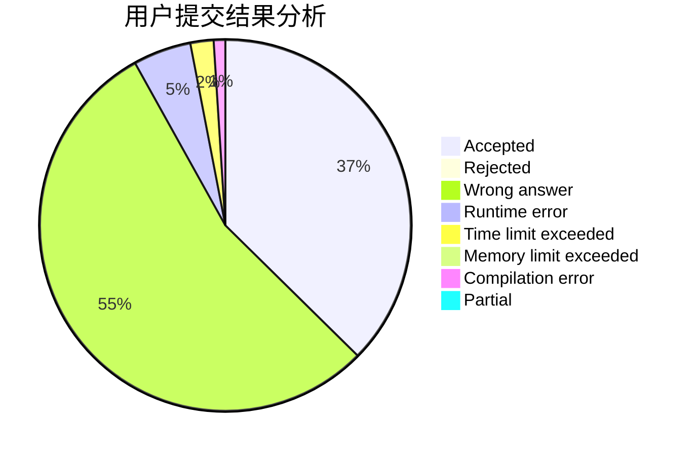
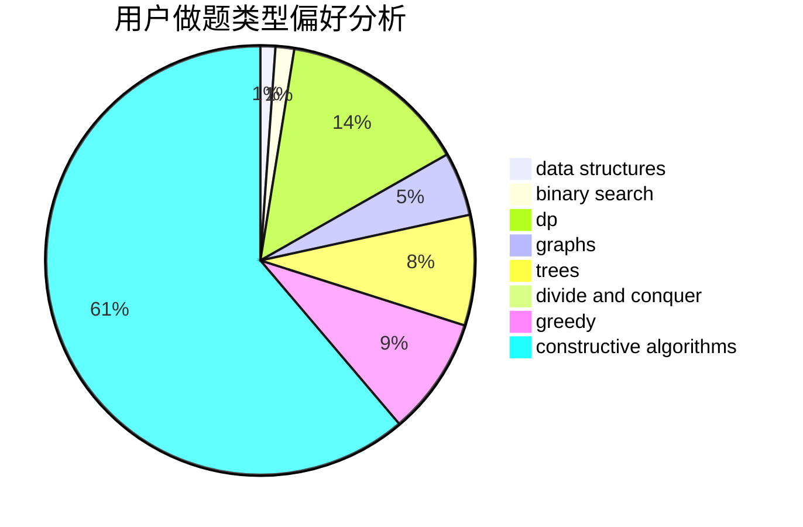
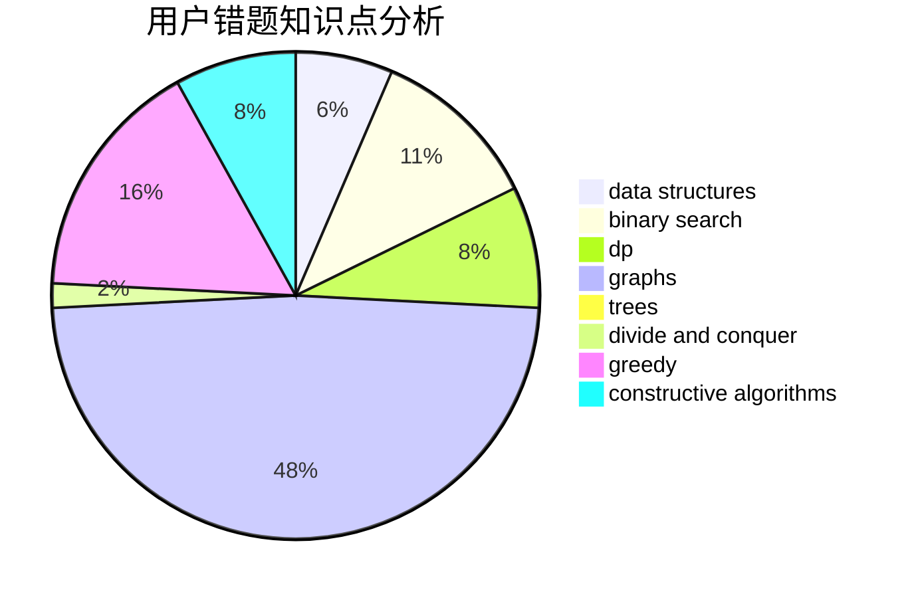

# Godknows...

<!-- tabs:start -->

#### **用户提交结果分析**

#### **用户做题类型偏好分析**

#### **用户错题知识点分析**

<!-- tabs:end -->
# 推荐题目
[1466G](https://codeforces.com/contest/1466/problem/G)		combinatorics,
                        divide and conquer,
                        hashing,
                        math,
                        string suffix structures,
                        strings		  
[1044D](https://codeforces.com/contest/1044/problem/D)		data structures,
                        dsu		  
[782E](https://codeforces.com/contest/782/problem/E)		dsu,graphs,sortings,trees		  
[908B](https://codeforces.com/contest/908/problem/B)		brute force,
                        implementation		  
[592A](https://codeforces.com/contest/592/problem/A)		implementation		  
[708A](https://codeforces.com/contest/708/problem/A)		constructive algorithms,
                        greedy,
                        implementation,
                        strings		  
[260D](https://codeforces.com/contest/260/problem/D)		constructive algorithms,
                        dsu,
                        graphs,
                        greedy,
                        trees		  
[908C](https://codeforces.com/contest/908/problem/C)		brute force,
                        geometry,
                        implementation,
                        math		  
[772C](https://codeforces.com/contest/772/problem/C)		constructive algorithms,
                        dp,
                        graphs,
                        math,
                        number theory		  
[1173A](https://codeforces.com/contest/1173/problem/A)		greedy		  
