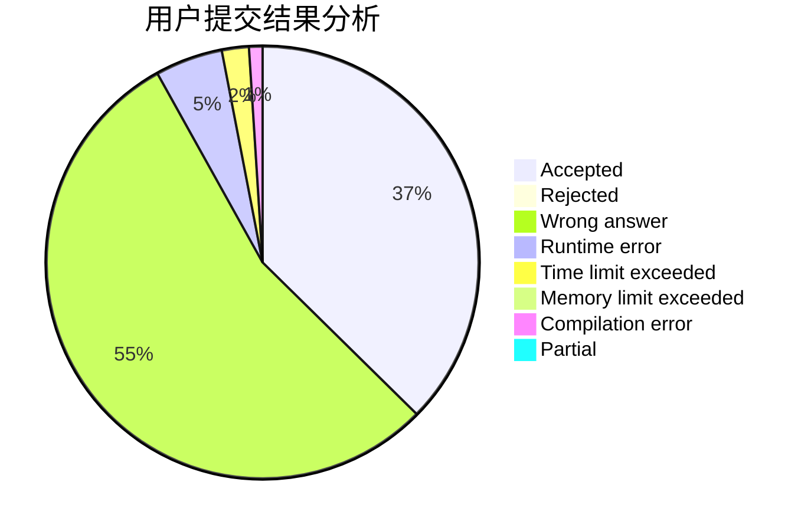
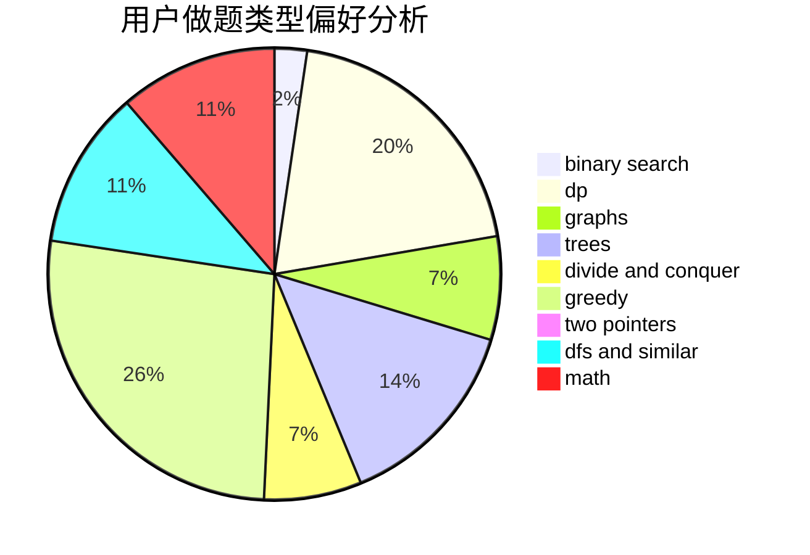

# Godknows...

<!-- tabs:start -->

#### **用户提交结果分析**

#### **用户做题类型偏好分析**

<!-- tabs:end -->
# 推荐题目
[1466G](https://codeforces.com/contest/1466/problem/G)
[1044D](https://codeforces.com/contest/1044/problem/D)
[782E](https://codeforces.com/contest/782/problem/E)
[908B](https://codeforces.com/contest/908/problem/B)
[592A](https://codeforces.com/contest/592/problem/A)
[708A](https://codeforces.com/contest/708/problem/A)
[260D](https://codeforces.com/contest/260/problem/D)
[908C](https://codeforces.com/contest/908/problem/C)
[772C](https://codeforces.com/contest/772/problem/C)
[1173A](https://codeforces.com/contest/1173/problem/A)
