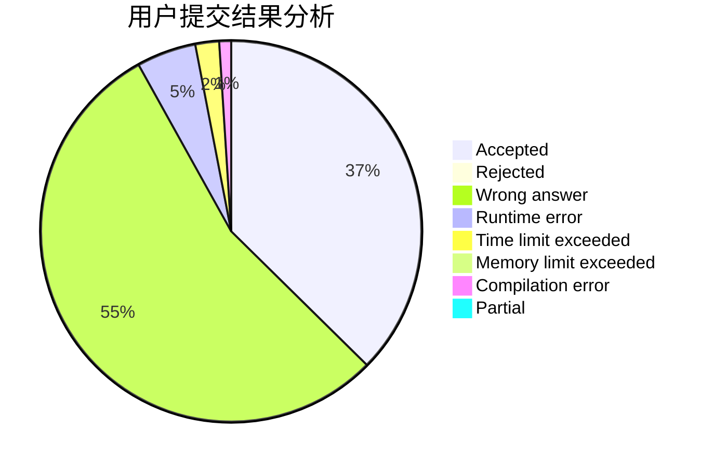
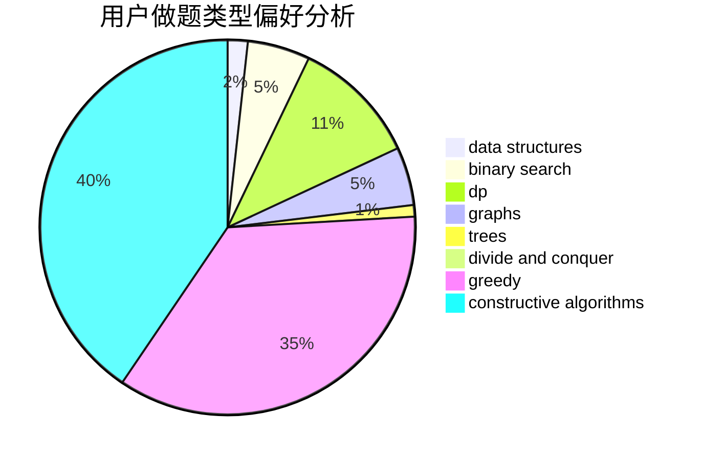
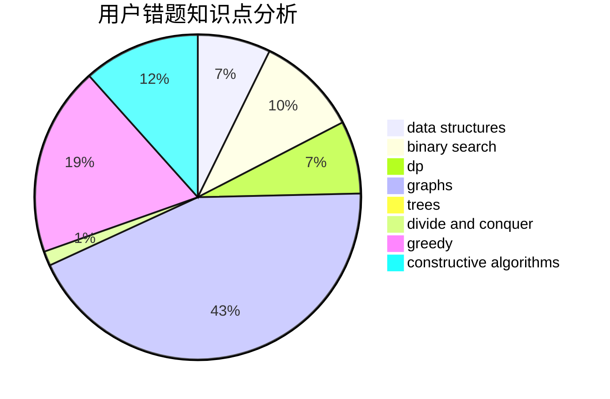

# Godknows...

<!-- tabs:start -->

#### **用户提交结果分析**

#### **用户做题类型偏好分析**

#### **用户错题知识点分析**

<!-- tabs:end -->
# 推荐题目
[1457D](https://codeforces.com/contest/1457/problem/D)		dsu,graphs,sortings,trees		  
[1043G](https://codeforces.com/contest/1043/problem/G)		data structures,
                        divide and conquer,
                        hashing,
                        string suffix structures,
                        strings		  
[764B](https://codeforces.com/contest/764/problem/B)		constructive algorithms,
                        implementation		  
[888D](https://codeforces.com/contest/888/problem/D)		combinatorics,
                        dp,
                        math		  
[571D](https://codeforces.com/contest/571/problem/D)		binary search,
                        data structures,
                        dsu,
                        trees		  
[686A](https://codeforces.com/contest/686/problem/A)		constructive algorithms,
                        implementation		  
[23B](https://codeforces.com/contest/23/problem/B)		constructive algorithms,
                        graphs,
                        math		  
[888E](https://codeforces.com/contest/888/problem/E)		bitmasks,
                        divide and conquer,
                        meet-in-the-middle		  
[754B](https://codeforces.com/contest/754/problem/B)		brute force,
                        implementation		  
[1168E](https://codeforces.com/contest/1168/problem/E)		constructive algorithms,
                        math		  
