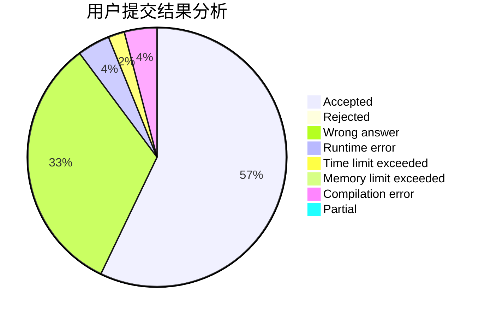
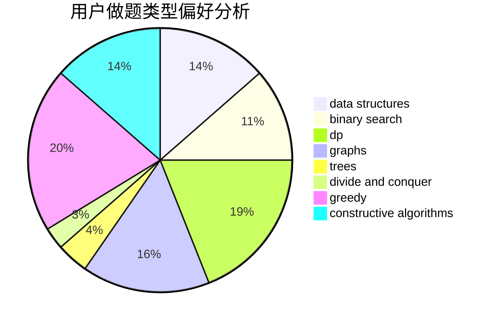

# GordonLee
<!-- tabs:start -->
#### **用户提交结果分析**

#### **用户做题类型偏好分析**

#### **用户错题知识点分析**

<!-- tabs:end -->
# 推荐题目
[Vasya and Templates](https://codeforces.com/contest/1087/problem/E)		greedy,
                        implementation,
                        strings		  
[Vika and Squares](http://codeforces.com/problemset/problem/610/B)		constructive algorithms,
                        implementation		  
[Binary Numbers AND Sum](http://codeforces.com/problemset/problem/1066/E)		data structures,
                        implementation,
                        math		  
[New Year  and Forgotten Tree](http://codeforces.com/problemset/problem/611/H)		constructive algorithms,
                        flows,
                        graphs		  
[Unlucky Ticket](http://codeforces.com/problemset/problem/160/B)		greedy,
                        sortings		  
[Inversions problem](http://codeforces.com/problemset/problem/513/G1)		brute force,
                        dfs and similar,
                        dp,
                        meet-in-the-middle		  
[Skills](https://codeforces.com/contest/614/problem/D)		binary search,
                        brute force,
                        dp,
                        greedy,
                        sortings,
                        two pointers		  
[Vasya and Triangle](https://codeforces.com/contest/1053/problem/A)		geometry,
                        number theory		  
[Bingo!](http://codeforces.com/problemset/problem/457/D)		combinatorics,
                        math,
                        probabilities		  
[Palindrome XOR](http://codeforces.com/problemset/problem/1147/D)		dfs and similar,
                        graphs		  
<!-- tabs:start -->
#### **data structures**
[Vasya and Templates](http://codeforces.com/problemset/problem/1066/E)		data structures,
                        implementation,
                        math		  
[Vika and Squares](http://codeforces.com/problemset/problem/527/C)		binary search,
                        data structures,
                        implementation		  
[Binary Numbers AND Sum](http://codeforces.com/problemset/problem/1252/K)		data structures,
                        math,
                        matrices		  
[New Year  and Forgotten Tree](http://codeforces.com/problemset/problem/1490/G)		binary search,
                        data structures,
                        math		  
[Unlucky Ticket](http://codeforces.com/problemset/problem/1042/D)		data structures,
                        divide and conquer,
                        two pointers		  
[Inversions problem](http://codeforces.com/problemset/problem/1492/C)		binary search,
                        data structures,
                        dp,
                        greedy,
                        two pointers		  
[Skills](http://codeforces.com/problemset/problem/1490/G)		binary search,
                        data structures,
                        math		  
[Vasya and Triangle](http://codeforces.com/problemset/problem/1479/D)		binary search,
                        bitmasks,
                        brute force,
                        data structures,
                        probabilities,
                        trees		  
[Bingo!](http://codeforces.com/problemset/problem/1497/A)		brute force,
                        data structures,
                        greedy,
                        sortings		  
[Palindrome XOR](http://codeforces.com/problemset/problem/1491/C)		brute force,
                        data structures,
                        dp,
                        greedy,
                        implementation		  
#### **binary search**
[Vasya and Templates](https://codeforces.com/contest/614/problem/D)		binary search,
                        brute force,
                        dp,
                        greedy,
                        sortings,
                        two pointers		  
[Vika and Squares](http://codeforces.com/problemset/problem/1354/G)		binary search,
                        interactive,
                        probabilities		  
[Binary Numbers AND Sum](http://codeforces.com/problemset/problem/527/C)		binary search,
                        data structures,
                        implementation		  
[New Year  and Forgotten Tree](http://codeforces.com/problemset/problem/1468/L)		binary search,
                        greedy,
                        math,
                        number theory		  
[Unlucky Ticket](http://codeforces.com/problemset/problem/1394/C)		binary search,
                        geometry,
                        ternary search		  
[Inversions problem](http://codeforces.com/problemset/problem/1490/G)		binary search,
                        data structures,
                        math		  
[Skills](http://codeforces.com/problemset/problem/1492/C)		binary search,
                        data structures,
                        dp,
                        greedy,
                        two pointers		  
[Vasya and Triangle](http://codeforces.com/problemset/problem/1463/D)		binary search,
                        constructive algorithms,
                        greedy,
                        two pointers		  
[Bingo!](http://codeforces.com/problemset/problem/1490/G)		binary search,
                        data structures,
                        math		  
[Palindrome XOR](http://codeforces.com/problemset/problem/1479/D)		binary search,
                        bitmasks,
                        brute force,
                        data structures,
                        probabilities,
                        trees		  
#### **dp**
[Vasya and Templates](http://codeforces.com/problemset/problem/513/G1)		brute force,
                        dfs and similar,
                        dp,
                        meet-in-the-middle		  
[Vika and Squares](https://codeforces.com/contest/614/problem/D)		binary search,
                        brute force,
                        dp,
                        greedy,
                        sortings,
                        two pointers		  
[Binary Numbers AND Sum](http://codeforces.com/problemset/problem/76/D)		dp,
                        greedy,
                        math		  
[New Year  and Forgotten Tree](http://codeforces.com/problemset/problem/212/E)		dfs and similar,
                        dp,
                        trees		  
[Unlucky Ticket](http://codeforces.com/problemset/problem/201/D)		bitmasks,
                        brute force,
                        dp		  
[Inversions problem](http://codeforces.com/problemset/problem/632/E)		divide and conquer,
                        dp,
                        fft,
                        math		  
[Skills](http://codeforces.com/problemset/problem/1117/F)		bitmasks,
                        dp		  
[Vasya and Triangle](http://codeforces.com/problemset/problem/1492/C)		binary search,
                        data structures,
                        dp,
                        greedy,
                        two pointers		  
[Bingo!](https://codeforces.com/contest/1457/problem/C)		brute force,
                        dp,
                        implementation		  
[Palindrome XOR](http://codeforces.com/problemset/problem/1491/C)		brute force,
                        data structures,
                        dp,
                        greedy,
                        implementation		  
#### **graph**
[Vasya and Templates](http://codeforces.com/problemset/problem/611/H)		constructive algorithms,
                        flows,
                        graphs		  
[Vika and Squares](http://codeforces.com/problemset/problem/1147/D)		dfs and similar,
                        graphs		  
[Binary Numbers AND Sum](http://codeforces.com/problemset/problem/1023/F)		dfs and similar,
                        dsu,
                        graphs,
                        trees		  
[New Year  and Forgotten Tree](http://codeforces.com/problemset/problem/1487/C)		brute force,
                        constructive algorithms,
                        dfs and similar,
                        graphs,
                        greedy,
                        implementation,
                        math		  
[Unlucky Ticket](http://codeforces.com/problemset/problem/1437/C)		dp,
                        flows,
                        graph matchings,
                        greedy,
                        math,
                        sortings		  
[Inversions problem](http://codeforces.com/problemset/problem/1470/D)		constructive algorithms,
                        dfs and similar,
                        graph matchings,
                        graphs,
                        greedy		  
[Skills](http://codeforces.com/problemset/problem/1476/C)		dp,
                        graphs,
                        greedy		  
[Vasya and Triangle](http://codeforces.com/problemset/problem/1304/D)		constructive algorithms,
                        graphs,
                        greedy,
                        two pointers		  
[Bingo!](http://codeforces.com/problemset/problem/1475/C)		combinatorics,
                        graphs,
                        math		  
[Palindrome XOR](http://codeforces.com/problemset/problem/553/E)		dp,
                        fft,
                        graphs,
                        math,
                        probabilities		  
#### **trees**
[Vasya and Templates](https://codeforces.com/contest/1230/problem/E)		math,
                        number theory,
                        trees		  
[Vika and Squares](http://codeforces.com/problemset/problem/212/E)		dfs and similar,
                        dp,
                        trees		  
[Binary Numbers AND Sum](http://codeforces.com/problemset/problem/1023/F)		dfs and similar,
                        dsu,
                        graphs,
                        trees		  
[New Year  and Forgotten Tree](http://codeforces.com/problemset/problem/1479/D)		binary search,
                        bitmasks,
                        brute force,
                        data structures,
                        probabilities,
                        trees		  
[Unlucky Ticket](http://codeforces.com/problemset/problem/1511/C)		brute force,
                        data structures,
                        implementation,
                        trees		  
[Inversions problem](http://codeforces.com/problemset/problem/1499/F)		combinatorics,
                        dfs and similar,
                        dp,
                        trees		  
[Skills](http://codeforces.com/problemset/problem/1491/E)		brute force,
                        dfs and similar,
                        divide and conquer,
                        number theory,
                        trees		  
[Vasya and Triangle](http://codeforces.com/problemset/problem/1466/D)		data structures,
                        greedy,
                        sortings,
                        trees		  
[Bingo!](http://codeforces.com/problemset/problem/1495/D)		combinatorics,
                        dfs and similar,
                        graphs,
                        math,
                        shortest paths,
                        trees		  
[Palindrome XOR](http://codeforces.com/problemset/problem/1303/G)		data structures,
                        divide and conquer,
                        geometry,
                        trees		  
#### **divide and conquer**
[Vasya and Templates](http://codeforces.com/problemset/problem/632/E)		divide and conquer,
                        dp,
                        fft,
                        math		  
[Vika and Squares](http://codeforces.com/problemset/problem/1042/D)		data structures,
                        divide and conquer,
                        two pointers		  
[Binary Numbers AND Sum](http://codeforces.com/problemset/problem/1461/D)		binary search,
                        brute force,
                        data structures,
                        divide and conquer,
                        implementation,
                        sortings		  
[New Year  and Forgotten Tree](http://codeforces.com/problemset/problem/1466/G)		combinatorics,
                        divide and conquer,
                        hashing,
                        math,
                        string suffix structures,
                        strings		  
[Unlucky Ticket](http://codeforces.com/problemset/problem/1490/D)		dfs and similar,
                        divide and conquer,
                        implementation		  
[Inversions problem](https://codeforces.com/contest/1483/problem/C)		data structures,
                        divide and conquer,
                        dp		  
[Skills](http://codeforces.com/problemset/problem/1491/E)		brute force,
                        dfs and similar,
                        divide and conquer,
                        number theory,
                        trees		  
[Vasya and Triangle](http://codeforces.com/problemset/problem/1303/G)		data structures,
                        divide and conquer,
                        geometry,
                        trees		  
[Bingo!](http://codeforces.com/problemset/problem/1494/D)		constructive algorithms,
                        data structures,
                        dfs and similar,
                        divide and conquer,
                        dsu,
                        greedy,
                        sortings,
                        trees		  
[Palindrome XOR](http://codeforces.com/problemset/problem/1482/E)		data structures,
                        divide and conquer,
                        dp		  
#### **greedy**
[Vasya and Templates](https://codeforces.com/contest/1087/problem/E)		greedy,
                        implementation,
                        strings		  
[Vika and Squares](http://codeforces.com/problemset/problem/160/B)		greedy,
                        sortings		  
[Binary Numbers AND Sum](https://codeforces.com/contest/614/problem/D)		binary search,
                        brute force,
                        dp,
                        greedy,
                        sortings,
                        two pointers		  
[New Year  and Forgotten Tree](http://codeforces.com/problemset/problem/76/D)		dp,
                        greedy,
                        math		  
[Unlucky Ticket](http://codeforces.com/problemset/problem/540/B)		greedy,
                        implementation		  
[Inversions problem](http://codeforces.com/problemset/problem/1468/L)		binary search,
                        greedy,
                        math,
                        number theory		  
[Skills](http://codeforces.com/problemset/problem/1433/B)		greedy,
                        implementation		  
[Vasya and Triangle](http://codeforces.com/problemset/problem/1114/A)		brute force,
                        greedy,
                        implementation		  
[Bingo!](http://codeforces.com/problemset/problem/1492/C)		binary search,
                        data structures,
                        dp,
                        greedy,
                        two pointers		  
[Palindrome XOR](https://codeforces.com/contest/1496/problem/C)		geometry,
                        greedy,
                        math,
                        sortings		  
#### **constructive algorithms**
[Vasya and Templates](http://codeforces.com/problemset/problem/610/B)		constructive algorithms,
                        implementation		  
[Vika and Squares](http://codeforces.com/problemset/problem/611/H)		constructive algorithms,
                        flows,
                        graphs		  
[Binary Numbers AND Sum](http://codeforces.com/problemset/problem/1152/B)		bitmasks,
                        constructive algorithms,
                        dfs and similar,
                        math		  
[New Year  and Forgotten Tree](http://codeforces.com/problemset/problem/421/A)		constructive algorithms,
                        implementation		  
[Unlucky Ticket](http://codeforces.com/problemset/problem/1493/A)		constructive algorithms,
                        greedy		  
[Inversions problem](http://codeforces.com/problemset/problem/1463/D)		binary search,
                        constructive algorithms,
                        greedy,
                        two pointers		  
[Skills](https://codeforces.com/contest/1456/problem/B)		bitmasks,
                        brute force,
                        constructive algorithms		  
[Vasya and Triangle](http://codeforces.com/problemset/problem/1492/D)		bitmasks,
                        constructive algorithms,
                        greedy,
                        math		  
[Bingo!](https://codeforces.com/contest/1504/problem/D)		constructive algorithms,
                        games,
                        interactive		  
[Palindrome XOR](https://codeforces.com/contest/1483/problem/A)		brute force,
                        constructive algorithms,
                        greedy,
                        implementation		  
#### **sortings**
[Vasya and Templates](http://codeforces.com/problemset/problem/160/B)		greedy,
                        sortings		  
[Vika and Squares](https://codeforces.com/contest/614/problem/D)		binary search,
                        brute force,
                        dp,
                        greedy,
                        sortings,
                        two pointers		  
[Binary Numbers AND Sum](https://codeforces.com/contest/1496/problem/C)		geometry,
                        greedy,
                        math,
                        sortings		  
[New Year  and Forgotten Tree](http://codeforces.com/problemset/problem/1495/A)		geometry,
                        greedy,
                        math,
                        sortings		  
[Unlucky Ticket](http://codeforces.com/problemset/problem/1497/A)		brute force,
                        data structures,
                        greedy,
                        sortings		  
[Inversions problem](http://codeforces.com/problemset/problem/1427/A)		math,
                        sortings		  
[Skills](http://codeforces.com/problemset/problem/1461/D)		binary search,
                        brute force,
                        data structures,
                        divide and conquer,
                        implementation,
                        sortings		  
[Vasya and Triangle](http://codeforces.com/problemset/problem/1437/C)		dp,
                        flows,
                        graph matchings,
                        greedy,
                        math,
                        sortings		  
[Bingo!](http://codeforces.com/problemset/problem/1473/A)		greedy,
                        implementation,
                        math,
                        sortings		  
[Palindrome XOR](http://codeforces.com/problemset/problem/1486/B)		binary search,
                        geometry,
                        shortest paths,
                        sortings		  
<!-- tabs:end -->
