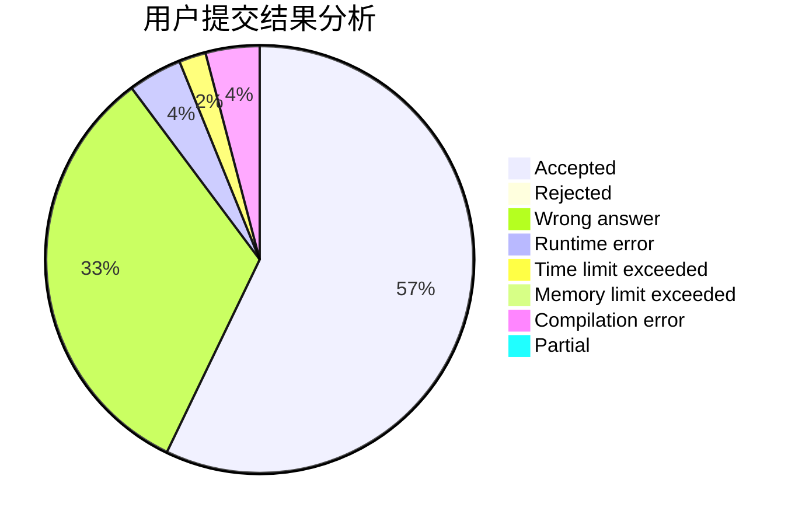
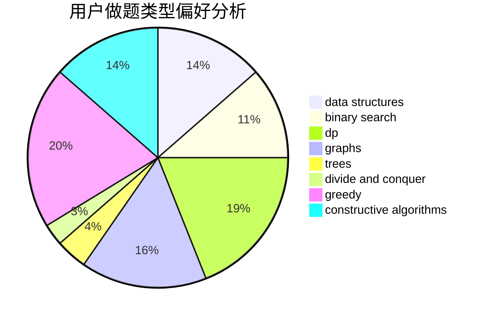

# GordonLee

<!-- tabs:start -->

#### **用户提交结果分析**

#### **用户做题类型偏好分析**

#### **用户错题知识点分析**

<!-- tabs:end -->
# 推荐题目
[1252K](https://codeforces.com/contest/1252/problem/K)		data structures,
                        math,
                        matrices		  
[160B](https://codeforces.com/contest/160/problem/B)		greedy,
                        sortings		  
[1087E](https://codeforces.com/contest/1087/problem/E)		dsu,graphs,sortings,trees		  
[1053A](https://codeforces.com/contest/1053/problem/A)		dsu,graphs,sortings,trees		  
[1066E](https://codeforces.com/contest/1066/problem/E)		data structures,
                        implementation,
                        math		  
[76D](https://codeforces.com/contest/76/problem/D)		dp,
                        greedy,
                        math		  
[1468L](https://codeforces.com/contest/1468/problem/L)		binary search,
                        greedy,
                        math,
                        number theory		  
[1230E](https://codeforces.com/contest/1230/problem/E)		dsu,graphs,sortings,trees		  
[457D](https://codeforces.com/contest/457/problem/D)		combinatorics,
                        math,
                        probabilities		  
[527C](https://codeforces.com/contest/527/problem/C)		binary search,
                        data structures,
                        implementation		  
