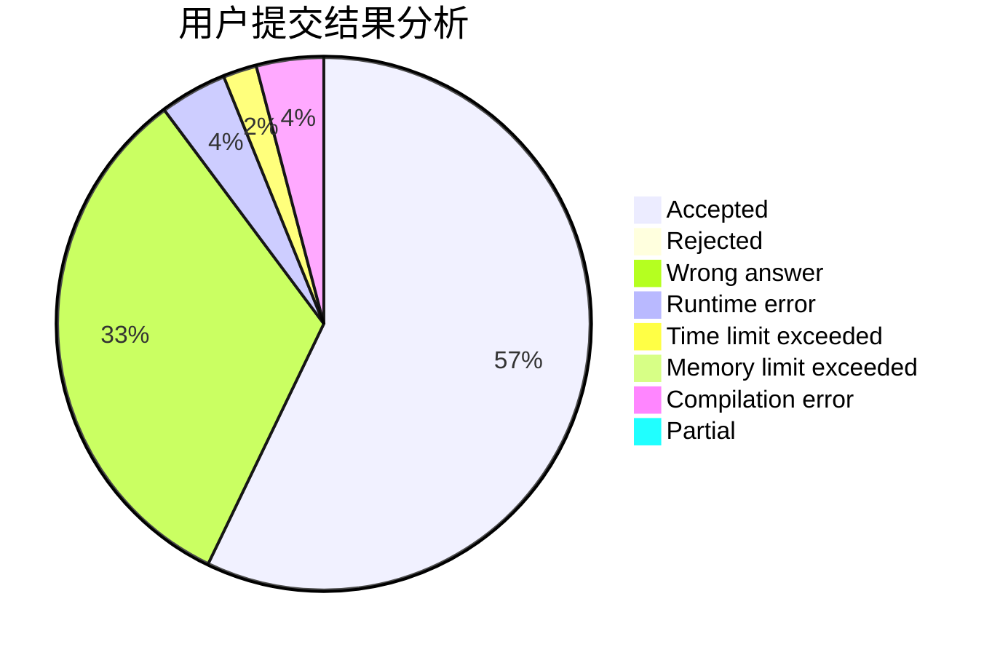
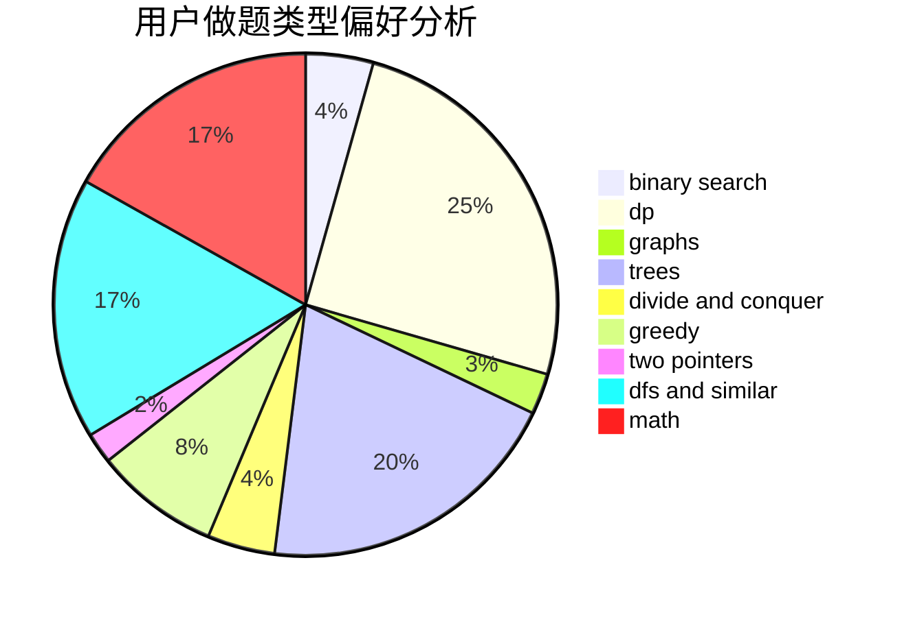

# GordonLee

<!-- tabs:start -->

#### **用户提交结果分析**

#### **用户做题类型偏好分析**

<!-- tabs:end -->
# 推荐题目
[1260A](https://codeforces.com/contest/1260/problem/A)
[185A](https://codeforces.com/contest/185/problem/A)
[1088B](https://codeforces.com/contest/1088/problem/B)
[1053E](https://codeforces.com/contest/1053/problem/E)
[1067B](https://codeforces.com/contest/1067/problem/B)
[78C](https://codeforces.com/contest/78/problem/C)
[1476F](https://codeforces.com/contest/1476/problem/F)
[1239B](https://codeforces.com/contest/1239/problem/B)
[477D](https://codeforces.com/contest/477/problem/D)
[551C](https://codeforces.com/contest/551/problem/C)
