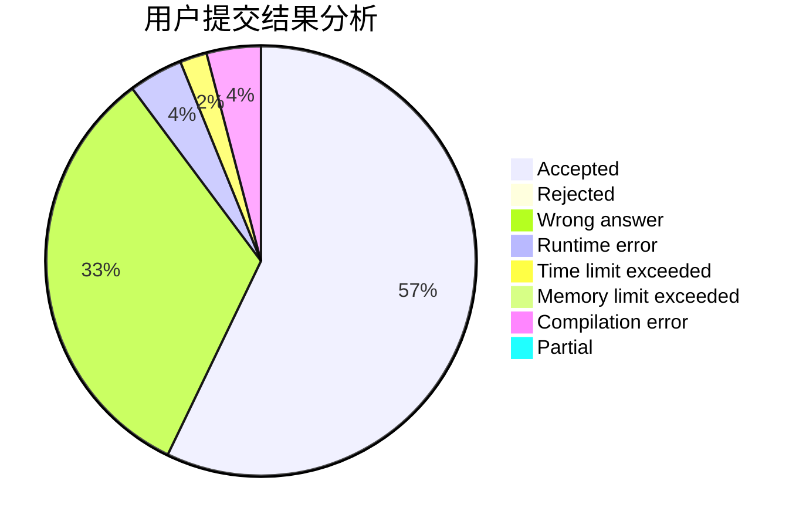
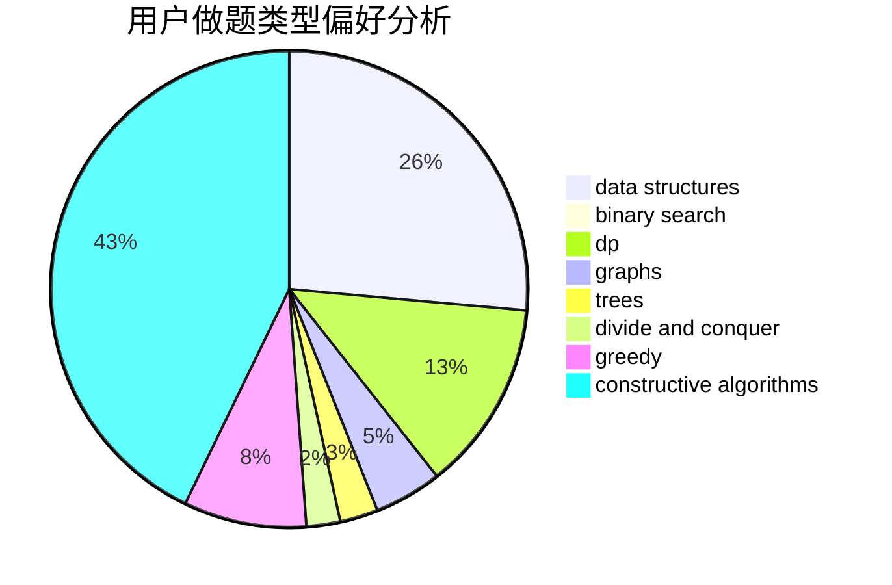

# GordonLee

<!-- tabs:start -->

#### **用户提交结果分析**

#### **用户做题类型偏好分析**

#### **用户错题知识点分析**

<!-- tabs:end -->
# 推荐题目
[1260A](https://codeforces.com/contest/1260/problem/A)		math		  
[185A](https://codeforces.com/contest/185/problem/A)		math		  
[1088B](https://codeforces.com/contest/1088/problem/B)		implementation,
                        sortings		  
[1053E](https://codeforces.com/contest/1053/problem/E)		constructive algorithms,
                        trees		  
[1067B](https://codeforces.com/contest/1067/problem/B)		dfs and similar,
                        graphs,
                        shortest paths		  
[78C](https://codeforces.com/contest/78/problem/C)		dp,
                        games,
                        number theory		  
[1476F](https://codeforces.com/contest/1476/problem/F)		binary search,
                        data structures,
                        dp		  
[1239B](https://codeforces.com/contest/1239/problem/B)		implementation		  
[477D](https://codeforces.com/contest/477/problem/D)		dp,
                        strings		  
[551C](https://codeforces.com/contest/551/problem/C)		binary search,
                        greedy		  
