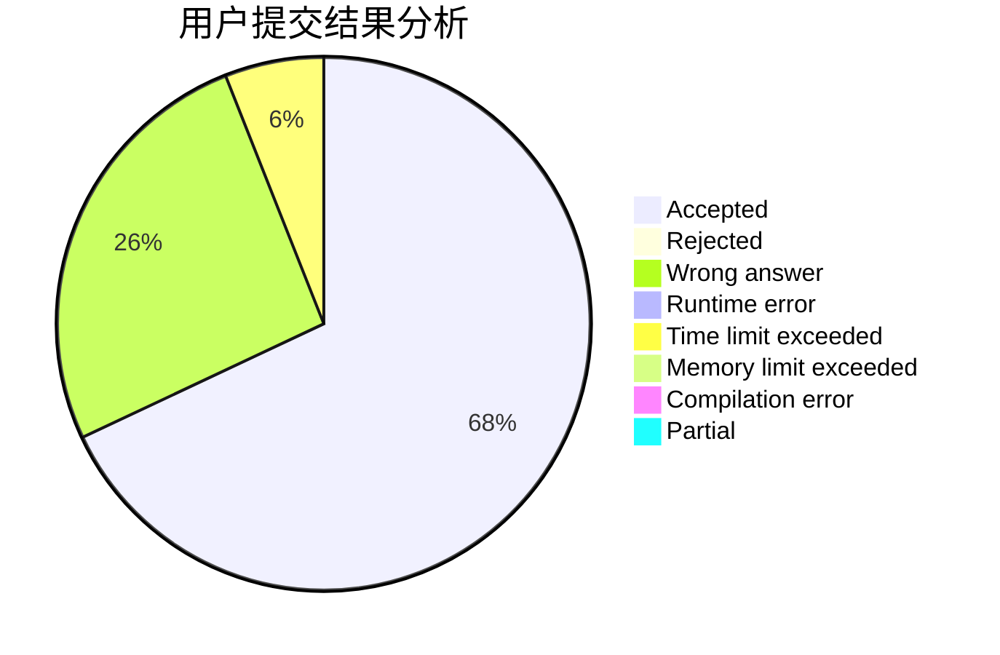
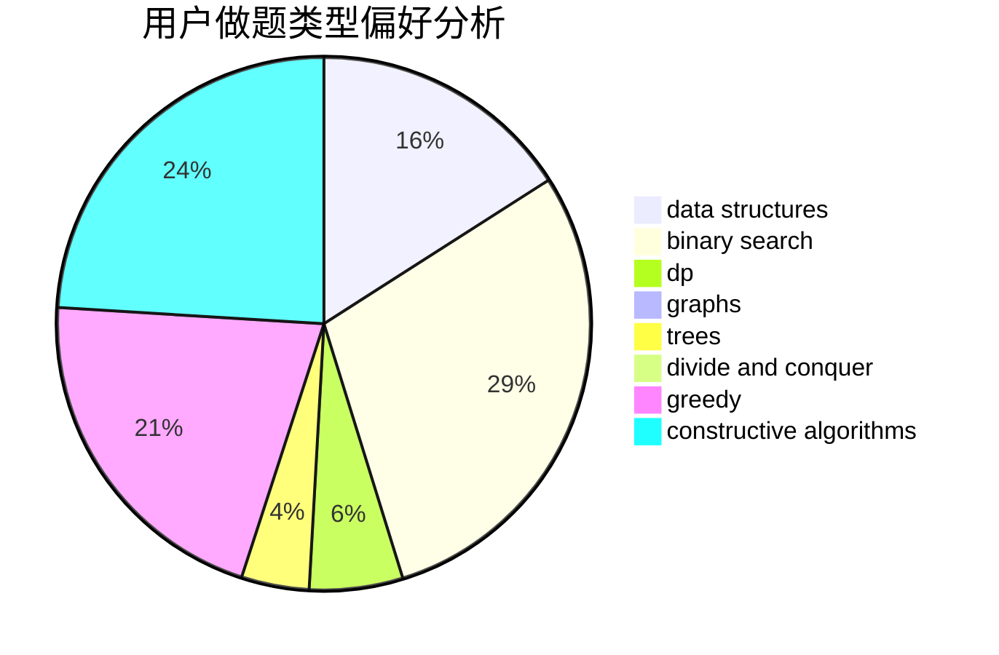

# Great_wall

<!-- tabs:start -->

#### **用户提交结果分析**

#### **用户做题类型偏好分析**

#### **用户错题知识点分析**

<!-- tabs:end -->
# 推荐题目
[1157E](https://codeforces.com/contest/1157/problem/E)		binary search,
                        data structures,
                        greedy		  
[1165E](https://codeforces.com/contest/1165/problem/E)		greedy,
                        math,
                        sortings		  
[724C](https://codeforces.com/contest/724/problem/C)		greedy,
                        hashing,
                        implementation,
                        math,
                        number theory,
                        sortings		  
[1394C](https://codeforces.com/contest/1394/problem/C)		binary search,
                        geometry,
                        ternary search		  
[670A](https://codeforces.com/contest/670/problem/A)		brute force,
                        constructive algorithms,
                        greedy,
                        math		  
[730J](https://codeforces.com/contest/730/problem/J)		dp		  
[277D](https://codeforces.com/contest/277/problem/D)		dp,
                        probabilities		  
[1186A](https://codeforces.com/contest/1186/problem/A)		implementation		  
[1192B](https://codeforces.com/contest/1192/problem/B)		*special problem,
                        data structures,
                        dfs and similar,
                        divide and conquer,
                        trees		  
[698D](https://codeforces.com/contest/698/problem/D)		brute force,
                        geometry,
                        math		  
