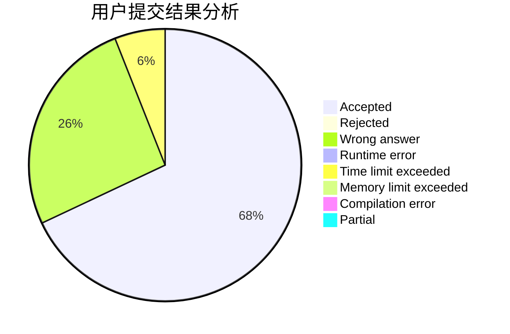
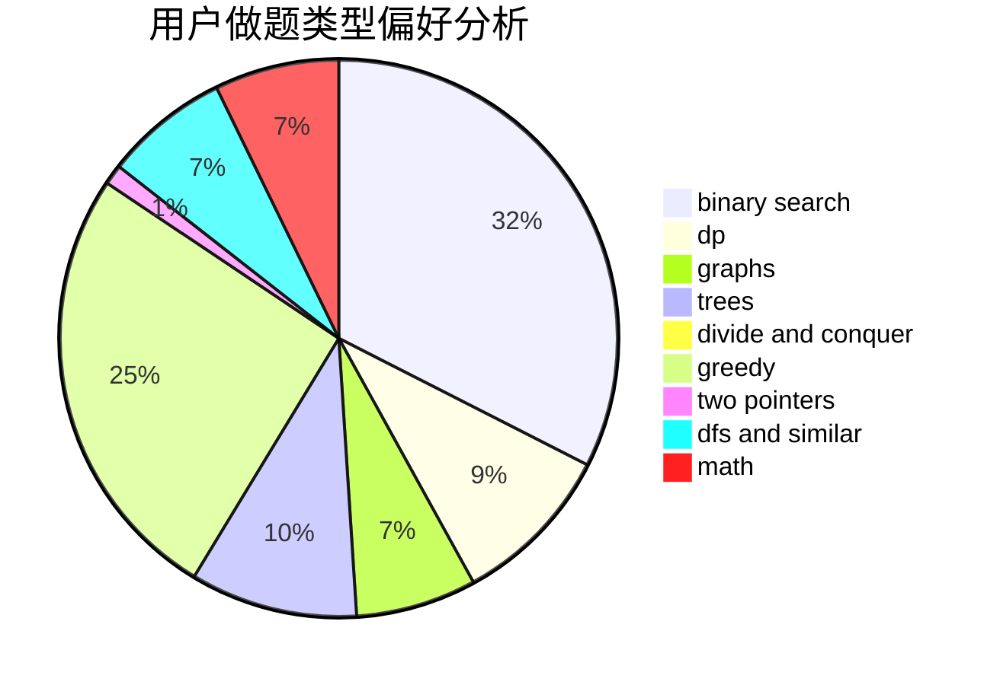

# Great_wall

<!-- tabs:start -->

#### **用户提交结果分析**

#### **用户做题类型偏好分析**

<!-- tabs:end -->
# 推荐题目
[1157E](https://codeforces.com/contest/1157/problem/E)
[1165E](https://codeforces.com/contest/1165/problem/E)
[724C](https://codeforces.com/contest/724/problem/C)
[1394C](https://codeforces.com/contest/1394/problem/C)
[670A](https://codeforces.com/contest/670/problem/A)
[730J](https://codeforces.com/contest/730/problem/J)
[277D](https://codeforces.com/contest/277/problem/D)
[1186A](https://codeforces.com/contest/1186/problem/A)
[1192B](https://codeforces.com/contest/1192/problem/B)
[698D](https://codeforces.com/contest/698/problem/D)
