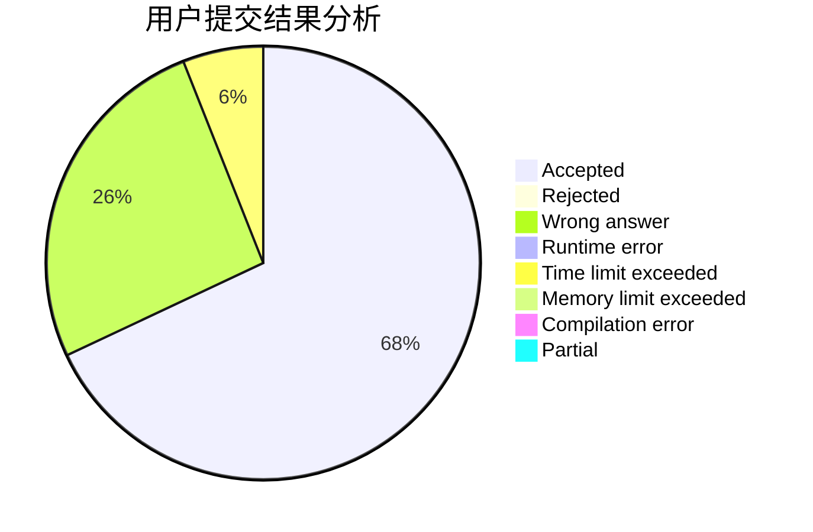
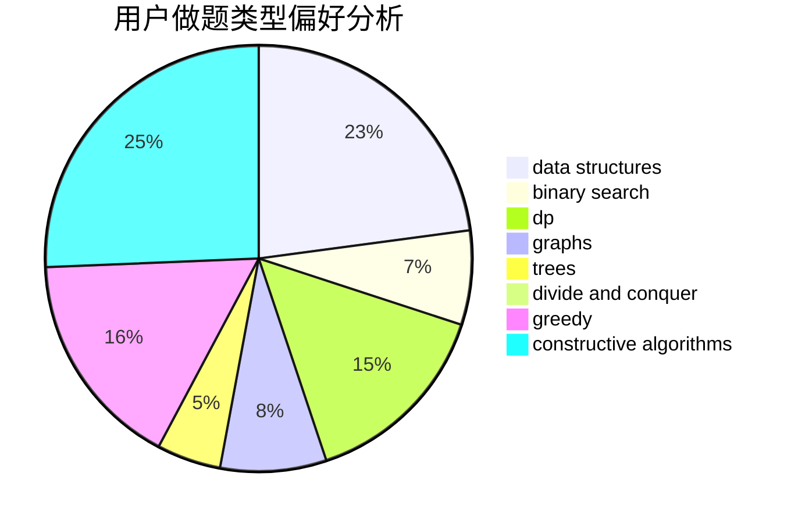

# Great_wall
<!-- tabs:start -->
#### **用户提交结果分析**

#### **用户做题类型偏好分析**

#### **用户错题知识点分析**

<!-- tabs:end -->
# 推荐题目
[Random Task](http://codeforces.com/problemset/problem/431/D)		binary search,
                        bitmasks,
                        combinatorics,
                        dp,
                        math		  
[Vika and Squares](http://codeforces.com/problemset/problem/610/B)		constructive algorithms,
                        implementation		  
[String Set Queries](http://codeforces.com/problemset/problem/710/F)		brute force,
                        data structures,
                        hashing,
                        interactive,
                        string suffix structures,
                        strings		  
[Years](http://codeforces.com/problemset/problem/1424/G)		data structures,
                        sortings		  
[Chord](http://codeforces.com/problemset/problem/88/A)		brute force,
                        implementation		  
[Chip 'n Dale Rescue Rangers](https://codeforces.com/contest/591/problem/D)		binary search,
                        geometry,
                        math		  
[Roads not only in Berland](http://codeforces.com/problemset/problem/25/D)		dsu,
                        graphs,
                        trees		  
[Spider Man](http://codeforces.com/problemset/problem/705/B)		games,
                        math		  
[Superhero Battle](http://codeforces.com/problemset/problem/1141/E)		math		  
[Collective Mindsets (easy)](http://codeforces.com/problemset/problem/690/A1)		nan		  
<!-- tabs:start -->
#### **data structures**
[Random Task](http://codeforces.com/problemset/problem/710/F)		brute force,
                        data structures,
                        hashing,
                        interactive,
                        string suffix structures,
                        strings		  
[Vika and Squares](http://codeforces.com/problemset/problem/1424/G)		data structures,
                        sortings		  
[String Set Queries](http://codeforces.com/problemset/problem/338/E)		data structures		  
[Years](http://codeforces.com/problemset/problem/407/E)		data structures		  
[Chord](http://codeforces.com/problemset/problem/877/F)		data structures,
                        flows,
                        hashing		  
[Chip 'n Dale Rescue Rangers](http://codeforces.com/problemset/problem/875/D)		binary search,
                        bitmasks,
                        combinatorics,
                        data structures,
                        divide and conquer		  
[Roads not only in Berland](https://codeforces.com/contest/759/problem/C)		data structures		  
[Spider Man](http://codeforces.com/problemset/problem/368/B)		data structures,
                        dp		  
[Superhero Battle](http://codeforces.com/problemset/problem/482/E)		data structures,
                        trees		  
[Collective Mindsets (easy)](http://codeforces.com/problemset/problem/1495/E)		brute force,
                        data structures,
                        greedy,
                        implementation		  
#### **binary search**
[Random Task](http://codeforces.com/problemset/problem/431/D)		binary search,
                        bitmasks,
                        combinatorics,
                        dp,
                        math		  
[Vika and Squares](https://codeforces.com/contest/591/problem/D)		binary search,
                        geometry,
                        math		  
[String Set Queries](https://codeforces.com/contest/831/problem/D)		binary search,
                        brute force,
                        dp,
                        greedy,
                        sortings		  
[Years](http://codeforces.com/problemset/problem/237/C)		binary search,
                        number theory,
                        two pointers		  
[Chord](http://codeforces.com/problemset/problem/875/D)		binary search,
                        bitmasks,
                        combinatorics,
                        data structures,
                        divide and conquer		  
[Chip 'n Dale Rescue Rangers](http://codeforces.com/problemset/problem/889/E)		binary search,
                        dp,
                        math		  
[Roads not only in Berland](http://codeforces.com/problemset/problem/1492/C)		binary search,
                        data structures,
                        dp,
                        greedy,
                        two pointers		  
[Spider Man](http://codeforces.com/problemset/problem/1463/D)		binary search,
                        constructive algorithms,
                        greedy,
                        two pointers		  
[Superhero Battle](http://codeforces.com/problemset/problem/1490/G)		binary search,
                        data structures,
                        math		  
[Collective Mindsets (easy)](http://codeforces.com/problemset/problem/1479/D)		binary search,
                        bitmasks,
                        brute force,
                        data structures,
                        probabilities,
                        trees		  
#### **dp**
[Random Task](http://codeforces.com/problemset/problem/431/D)		binary search,
                        bitmasks,
                        combinatorics,
                        dp,
                        math		  
[Vika and Squares](http://codeforces.com/problemset/problem/331/E2)		constructive algorithms,
                        dp		  
[String Set Queries](http://codeforces.com/problemset/problem/1155/F)		brute force,
                        dp,
                        graphs		  
[Years](http://codeforces.com/problemset/problem/313/D)		dp		  
[Chord](https://codeforces.com/contest/831/problem/D)		binary search,
                        brute force,
                        dp,
                        greedy,
                        sortings		  
[Chip 'n Dale Rescue Rangers](http://codeforces.com/problemset/problem/368/B)		data structures,
                        dp		  
[Roads not only in Berland](https://codeforces.com/contest/672/problem/C)		dp,
                        geometry,
                        greedy,
                        implementation		  
[Spider Man](http://codeforces.com/problemset/problem/889/E)		binary search,
                        dp,
                        math		  
[Superhero Battle](http://codeforces.com/problemset/problem/1028/G)		dp,
                        interactive		  
[Collective Mindsets (easy)](http://codeforces.com/problemset/problem/1492/C)		binary search,
                        data structures,
                        dp,
                        greedy,
                        two pointers		  
#### **graph**
[Random Task](http://codeforces.com/problemset/problem/25/D)		dsu,
                        graphs,
                        trees		  
[Vika and Squares](https://codeforces.com/contest/1384/problem/C)		dsu,
                        graphs,
                        greedy,
                        sortings,
                        strings,
                        trees,
                        two pointers		  
[String Set Queries](http://codeforces.com/problemset/problem/1155/F)		brute force,
                        dp,
                        graphs		  
[Years](https://codeforces.com/contest/791/problem/B)		dfs and similar,
                        dsu,
                        graphs		  
[Chord](https://codeforces.com/contest/197/problem/D)		dfs and similar,
                        graphs		  
[Chip 'n Dale Rescue Rangers](https://codeforces.com/contest/403/problem/C)		graphs,
                        math		  
[Roads not only in Berland](http://codeforces.com/problemset/problem/1055/A)		graphs		  
[Spider Man](http://codeforces.com/problemset/problem/858/F)		constructive algorithms,
                        dfs and similar,
                        graphs		  
[Superhero Battle](http://codeforces.com/problemset/problem/164/C)		flows,
                        graphs		  
[Collective Mindsets (easy)](http://codeforces.com/problemset/problem/1205/B)		bitmasks,
                        brute force,
                        graphs,
                        shortest paths		  
#### **trees**
[Random Task](http://codeforces.com/problemset/problem/25/D)		dsu,
                        graphs,
                        trees		  
[Vika and Squares](https://codeforces.com/contest/1384/problem/C)		dsu,
                        graphs,
                        greedy,
                        sortings,
                        strings,
                        trees,
                        two pointers		  
[String Set Queries](http://codeforces.com/problemset/problem/482/E)		data structures,
                        trees		  
[Years](http://codeforces.com/problemset/problem/1479/D)		binary search,
                        bitmasks,
                        brute force,
                        data structures,
                        probabilities,
                        trees		  
[Chord](http://codeforces.com/problemset/problem/1511/C)		brute force,
                        data structures,
                        implementation,
                        trees		  
[Chip 'n Dale Rescue Rangers](http://codeforces.com/problemset/problem/1499/F)		combinatorics,
                        dfs and similar,
                        dp,
                        trees		  
[Roads not only in Berland](http://codeforces.com/problemset/problem/1491/E)		brute force,
                        dfs and similar,
                        divide and conquer,
                        number theory,
                        trees		  
[Spider Man](http://codeforces.com/problemset/problem/1466/D)		data structures,
                        greedy,
                        sortings,
                        trees		  
[Superhero Battle](http://codeforces.com/problemset/problem/1495/D)		combinatorics,
                        dfs and similar,
                        graphs,
                        math,
                        shortest paths,
                        trees		  
[Collective Mindsets (easy)](http://codeforces.com/problemset/problem/1303/G)		data structures,
                        divide and conquer,
                        geometry,
                        trees		  
#### **divide and conquer**
[Random Task](http://codeforces.com/problemset/problem/559/B)		divide and conquer,
                        hashing,
                        sortings,
                        strings		  
[Vika and Squares](http://codeforces.com/problemset/problem/875/D)		binary search,
                        bitmasks,
                        combinatorics,
                        data structures,
                        divide and conquer		  
[String Set Queries](http://codeforces.com/problemset/problem/1461/D)		binary search,
                        brute force,
                        data structures,
                        divide and conquer,
                        implementation,
                        sortings		  
[Years](http://codeforces.com/problemset/problem/1466/G)		combinatorics,
                        divide and conquer,
                        hashing,
                        math,
                        string suffix structures,
                        strings		  
[Chord](http://codeforces.com/problemset/problem/1490/D)		dfs and similar,
                        divide and conquer,
                        implementation		  
[Chip 'n Dale Rescue Rangers](https://codeforces.com/contest/1483/problem/C)		data structures,
                        divide and conquer,
                        dp		  
[Roads not only in Berland](http://codeforces.com/problemset/problem/1491/E)		brute force,
                        dfs and similar,
                        divide and conquer,
                        number theory,
                        trees		  
[Spider Man](http://codeforces.com/problemset/problem/1303/G)		data structures,
                        divide and conquer,
                        geometry,
                        trees		  
[Superhero Battle](http://codeforces.com/problemset/problem/1494/D)		constructive algorithms,
                        data structures,
                        dfs and similar,
                        divide and conquer,
                        dsu,
                        greedy,
                        sortings,
                        trees		  
[Collective Mindsets (easy)](http://codeforces.com/problemset/problem/1482/E)		data structures,
                        divide and conquer,
                        dp		  
#### **greedy**
[Random Task](https://codeforces.com/contest/1384/problem/C)		dsu,
                        graphs,
                        greedy,
                        sortings,
                        strings,
                        trees,
                        two pointers		  
[Vika and Squares](http://codeforces.com/problemset/problem/1292/E)		constructive algorithms,
                        greedy,
                        interactive,
                        math		  
[String Set Queries](http://codeforces.com/problemset/problem/847/K)		greedy,
                        implementation,
                        sortings		  
[Years](https://codeforces.com/contest/831/problem/D)		binary search,
                        brute force,
                        dp,
                        greedy,
                        sortings		  
[Chord](http://codeforces.com/problemset/problem/333/B)		greedy		  
[Chip 'n Dale Rescue Rangers](http://codeforces.com/problemset/problem/1088/C)		constructive algorithms,
                        greedy,
                        math		  
[Roads not only in Berland](http://codeforces.com/problemset/problem/1183/D)		greedy,
                        sortings		  
[Spider Man](https://codeforces.com/contest/672/problem/C)		dp,
                        geometry,
                        greedy,
                        implementation		  
[Superhero Battle](http://codeforces.com/problemset/problem/1311/A)		greedy,
                        implementation,
                        math		  
[Collective Mindsets (easy)](http://codeforces.com/problemset/problem/1495/E)		brute force,
                        data structures,
                        greedy,
                        implementation		  
#### **constructive algorithms**
[Random Task](http://codeforces.com/problemset/problem/610/B)		constructive algorithms,
                        implementation		  
[Vika and Squares](http://codeforces.com/problemset/problem/331/E2)		constructive algorithms,
                        dp		  
[String Set Queries](http://codeforces.com/problemset/problem/1292/E)		constructive algorithms,
                        greedy,
                        interactive,
                        math		  
[Years](http://codeforces.com/problemset/problem/430/A)		constructive algorithms,
                        sortings		  
[Chord](http://codeforces.com/problemset/problem/1088/C)		constructive algorithms,
                        greedy,
                        math		  
[Chip 'n Dale Rescue Rangers](http://codeforces.com/problemset/problem/858/F)		constructive algorithms,
                        dfs and similar,
                        graphs		  
[Roads not only in Berland](http://codeforces.com/problemset/problem/1493/A)		constructive algorithms,
                        greedy		  
[Spider Man](http://codeforces.com/problemset/problem/1463/D)		binary search,
                        constructive algorithms,
                        greedy,
                        two pointers		  
[Superhero Battle](https://codeforces.com/contest/1456/problem/B)		bitmasks,
                        brute force,
                        constructive algorithms		  
[Collective Mindsets (easy)](http://codeforces.com/problemset/problem/1492/D)		bitmasks,
                        constructive algorithms,
                        greedy,
                        math		  
#### **sortings**
[Random Task](http://codeforces.com/problemset/problem/1424/G)		data structures,
                        sortings		  
[Vika and Squares](https://codeforces.com/contest/1384/problem/C)		dsu,
                        graphs,
                        greedy,
                        sortings,
                        strings,
                        trees,
                        two pointers		  
[String Set Queries](http://codeforces.com/problemset/problem/430/A)		constructive algorithms,
                        sortings		  
[Years](http://codeforces.com/problemset/problem/847/K)		greedy,
                        implementation,
                        sortings		  
[Chord](http://codeforces.com/problemset/problem/559/B)		divide and conquer,
                        hashing,
                        sortings,
                        strings		  
[Chip 'n Dale Rescue Rangers](https://codeforces.com/contest/831/problem/D)		binary search,
                        brute force,
                        dp,
                        greedy,
                        sortings		  
[Roads not only in Berland](http://codeforces.com/problemset/problem/1183/D)		greedy,
                        sortings		  
[Spider Man](https://codeforces.com/contest/1496/problem/C)		geometry,
                        greedy,
                        math,
                        sortings		  
[Superhero Battle](http://codeforces.com/problemset/problem/1495/A)		geometry,
                        greedy,
                        math,
                        sortings		  
[Collective Mindsets (easy)](http://codeforces.com/problemset/problem/1497/A)		brute force,
                        data structures,
                        greedy,
                        sortings		  
<!-- tabs:end -->
