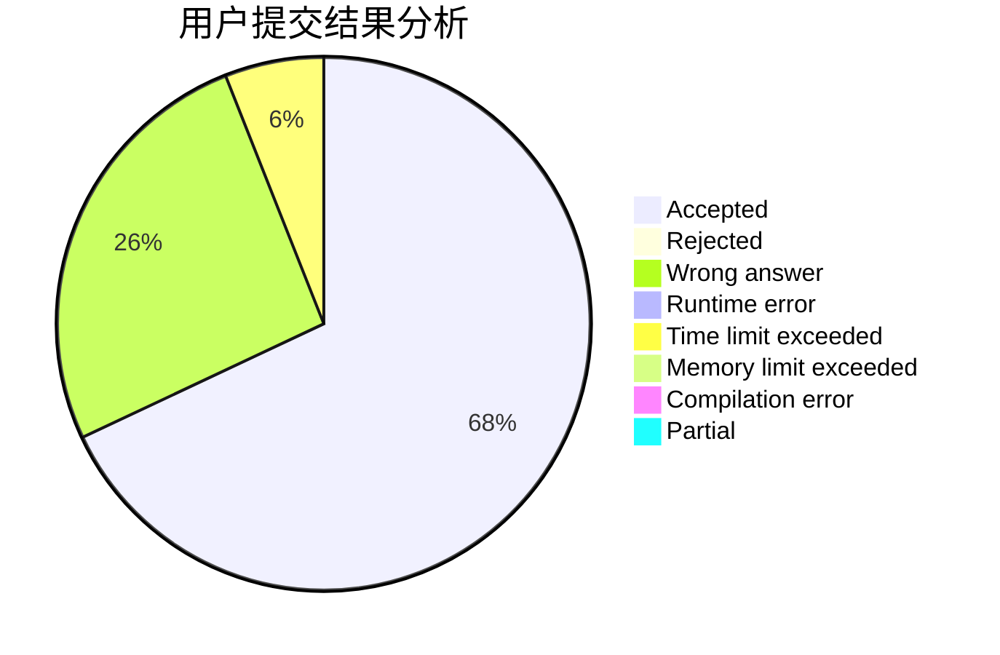
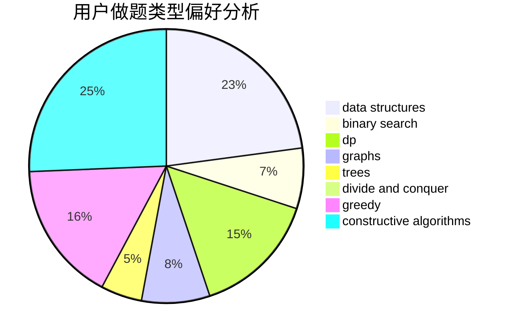

# Great_wall

<!-- tabs:start -->

#### **用户提交结果分析**

#### **用户做题类型偏好分析**

#### **用户错题知识点分析**

<!-- tabs:end -->
# 推荐题目
[1155F](https://codeforces.com/contest/1155/problem/F)		brute force,
                        dp,
                        graphs		  
[1164H](https://codeforces.com/contest/1164/problem/H)		dsu,graphs,sortings,trees		  
[705B](https://codeforces.com/contest/705/problem/B)		games,
                        math		  
[1384C](https://codeforces.com/contest/1384/problem/C)		dsu,graphs,sortings,trees		  
[641F](https://codeforces.com/contest/641/problem/F)		nan		  
[710F](https://codeforces.com/contest/710/problem/F)		brute force,
                        data structures,
                        hashing,
                        interactive,
                        string suffix structures,
                        strings		  
[25D](https://codeforces.com/contest/25/problem/D)		dsu,
                        graphs,
                        trees		  
[1183D](https://codeforces.com/contest/1183/problem/D)		greedy,
                        sortings		  
[1188B](https://codeforces.com/contest/1188/problem/B)		math,
                        matrices,
                        number theory,
                        two pointers		  
[672C](https://codeforces.com/contest/672/problem/C)		dsu,graphs,sortings,trees		  
