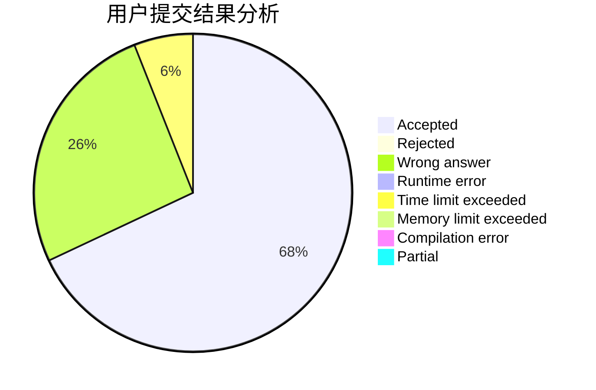
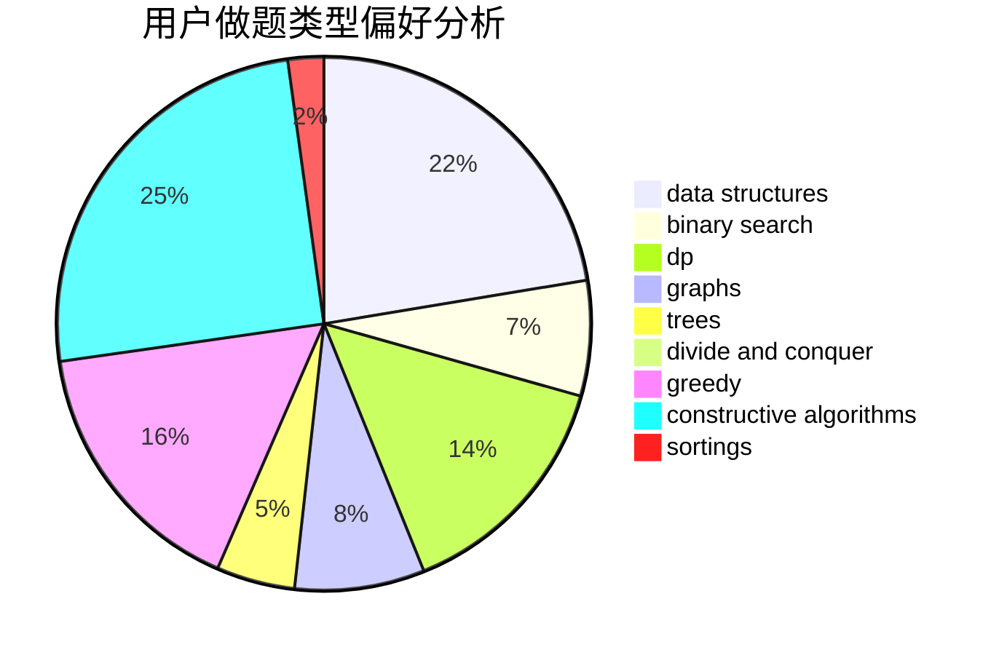

# Great_wall
<!-- tabs:start -->
#### **用户提交结果分析**

#### **用户做题类型偏好分析**

#### **用户错题知识点分析**

<!-- tabs:end -->
# 推荐题目
[431D](http://codeforces.com/problemset/problem/431/D)		binary search,
                        bitmasks,
                        combinatorics,
                        dp,
                        math		  
[610B](http://codeforces.com/problemset/problem/610/B)		constructive algorithms,
                        implementation		  
[710F](http://codeforces.com/problemset/problem/710/F)		brute force,
                        data structures,
                        hashing,
                        interactive,
                        string suffix structures,
                        strings		  
[1424G](http://codeforces.com/problemset/problem/1424/G)		data structures,
                        sortings		  
[88A](http://codeforces.com/problemset/problem/88/A)		brute force,
                        implementation		  
[591D](https://codeforces.com/contest/591/problem/D)		binary search,
                        geometry,
                        math		  
[25D](http://codeforces.com/problemset/problem/25/D)		dsu,
                        graphs,
                        trees		  
[705B](http://codeforces.com/problemset/problem/705/B)		games,
                        math		  
[1141E](http://codeforces.com/problemset/problem/1141/E)		math		  
[690A1](http://codeforces.com/problemset/problem/690/A1)		nan		  
<!-- tabs:start -->
#### **data structures**
[710F](http://codeforces.com/problemset/problem/710/F)		brute force,
                        data structures,
                        hashing,
                        interactive,
                        string suffix structures,
                        strings		  
[1424G](http://codeforces.com/problemset/problem/1424/G)		data structures,
                        sortings		  
[338E](http://codeforces.com/problemset/problem/338/E)		data structures		  
[407E](http://codeforces.com/problemset/problem/407/E)		data structures		  
[877F](http://codeforces.com/problemset/problem/877/F)		data structures,
                        flows,
                        hashing		  
[875D](http://codeforces.com/problemset/problem/875/D)		binary search,
                        bitmasks,
                        combinatorics,
                        data structures,
                        divide and conquer		  
[759C](https://codeforces.com/contest/759/problem/C)		data structures		  
[368B](http://codeforces.com/problemset/problem/368/B)		data structures,
                        dp		  
[482E](http://codeforces.com/problemset/problem/482/E)		data structures,
                        trees		  
[1495E](http://codeforces.com/problemset/problem/1495/E)		brute force,
                        data structures,
                        greedy,
                        implementation		  
#### **binary search**
[431D](http://codeforces.com/problemset/problem/431/D)		binary search,
                        bitmasks,
                        combinatorics,
                        dp,
                        math		  
[591D](https://codeforces.com/contest/591/problem/D)		binary search,
                        geometry,
                        math		  
[831D](https://codeforces.com/contest/831/problem/D)		binary search,
                        brute force,
                        dp,
                        greedy,
                        sortings		  
[237C](http://codeforces.com/problemset/problem/237/C)		binary search,
                        number theory,
                        two pointers		  
[875D](http://codeforces.com/problemset/problem/875/D)		binary search,
                        bitmasks,
                        combinatorics,
                        data structures,
                        divide and conquer		  
[889E](http://codeforces.com/problemset/problem/889/E)		binary search,
                        dp,
                        math		  
[1492C](http://codeforces.com/problemset/problem/1492/C)		binary search,
                        data structures,
                        dp,
                        greedy,
                        two pointers		  
[1463D](http://codeforces.com/problemset/problem/1463/D)		binary search,
                        constructive algorithms,
                        greedy,
                        two pointers		  
[1490G](http://codeforces.com/problemset/problem/1490/G)		binary search,
                        data structures,
                        math		  
[1479D](http://codeforces.com/problemset/problem/1479/D)		binary search,
                        bitmasks,
                        brute force,
                        data structures,
                        probabilities,
                        trees		  
#### **dp**
[431D](http://codeforces.com/problemset/problem/431/D)		binary search,
                        bitmasks,
                        combinatorics,
                        dp,
                        math		  
[331E2](http://codeforces.com/problemset/problem/331/E2)		constructive algorithms,
                        dp		  
[1155F](http://codeforces.com/problemset/problem/1155/F)		brute force,
                        dp,
                        graphs		  
[313D](http://codeforces.com/problemset/problem/313/D)		dp		  
[831D](https://codeforces.com/contest/831/problem/D)		binary search,
                        brute force,
                        dp,
                        greedy,
                        sortings		  
[368B](http://codeforces.com/problemset/problem/368/B)		data structures,
                        dp		  
[672C](https://codeforces.com/contest/672/problem/C)		dp,
                        geometry,
                        greedy,
                        implementation		  
[889E](http://codeforces.com/problemset/problem/889/E)		binary search,
                        dp,
                        math		  
[1028G](http://codeforces.com/problemset/problem/1028/G)		dp,
                        interactive		  
[1492C](http://codeforces.com/problemset/problem/1492/C)		binary search,
                        data structures,
                        dp,
                        greedy,
                        two pointers		  
#### **graph**
[25D](http://codeforces.com/problemset/problem/25/D)		dsu,
                        graphs,
                        trees		  
[1384C](https://codeforces.com/contest/1384/problem/C)		dsu,
                        graphs,
                        greedy,
                        sortings,
                        strings,
                        trees,
                        two pointers		  
[1155F](http://codeforces.com/problemset/problem/1155/F)		brute force,
                        dp,
                        graphs		  
[791B](https://codeforces.com/contest/791/problem/B)		dfs and similar,
                        dsu,
                        graphs		  
[197D](https://codeforces.com/contest/197/problem/D)		dfs and similar,
                        graphs		  
[403C](https://codeforces.com/contest/403/problem/C)		graphs,
                        math		  
[1055A](http://codeforces.com/problemset/problem/1055/A)		graphs		  
[858F](http://codeforces.com/problemset/problem/858/F)		constructive algorithms,
                        dfs and similar,
                        graphs		  
[164C](http://codeforces.com/problemset/problem/164/C)		flows,
                        graphs		  
[1205B](http://codeforces.com/problemset/problem/1205/B)		bitmasks,
                        brute force,
                        graphs,
                        shortest paths		  
#### **trees**
[25D](http://codeforces.com/problemset/problem/25/D)		dsu,
                        graphs,
                        trees		  
[1384C](https://codeforces.com/contest/1384/problem/C)		dsu,
                        graphs,
                        greedy,
                        sortings,
                        strings,
                        trees,
                        two pointers		  
[482E](http://codeforces.com/problemset/problem/482/E)		data structures,
                        trees		  
[1479D](http://codeforces.com/problemset/problem/1479/D)		binary search,
                        bitmasks,
                        brute force,
                        data structures,
                        probabilities,
                        trees		  
[1511C](http://codeforces.com/problemset/problem/1511/C)		brute force,
                        data structures,
                        implementation,
                        trees		  
[1499F](http://codeforces.com/problemset/problem/1499/F)		combinatorics,
                        dfs and similar,
                        dp,
                        trees		  
[1491E](http://codeforces.com/problemset/problem/1491/E)		brute force,
                        dfs and similar,
                        divide and conquer,
                        number theory,
                        trees		  
[1466D](http://codeforces.com/problemset/problem/1466/D)		data structures,
                        greedy,
                        sortings,
                        trees		  
[1495D](http://codeforces.com/problemset/problem/1495/D)		combinatorics,
                        dfs and similar,
                        graphs,
                        math,
                        shortest paths,
                        trees		  
[1303G](http://codeforces.com/problemset/problem/1303/G)		data structures,
                        divide and conquer,
                        geometry,
                        trees		  
#### **divide and conquer**
[559B](http://codeforces.com/problemset/problem/559/B)		divide and conquer,
                        hashing,
                        sortings,
                        strings		  
[875D](http://codeforces.com/problemset/problem/875/D)		binary search,
                        bitmasks,
                        combinatorics,
                        data structures,
                        divide and conquer		  
[1461D](http://codeforces.com/problemset/problem/1461/D)		binary search,
                        brute force,
                        data structures,
                        divide and conquer,
                        implementation,
                        sortings		  
[1466G](http://codeforces.com/problemset/problem/1466/G)		combinatorics,
                        divide and conquer,
                        hashing,
                        math,
                        string suffix structures,
                        strings		  
[1490D](http://codeforces.com/problemset/problem/1490/D)		dfs and similar,
                        divide and conquer,
                        implementation		  
[1483C](https://codeforces.com/contest/1483/problem/C)		data structures,
                        divide and conquer,
                        dp		  
[1491E](http://codeforces.com/problemset/problem/1491/E)		brute force,
                        dfs and similar,
                        divide and conquer,
                        number theory,
                        trees		  
[1303G](http://codeforces.com/problemset/problem/1303/G)		data structures,
                        divide and conquer,
                        geometry,
                        trees		  
[1494D](http://codeforces.com/problemset/problem/1494/D)		constructive algorithms,
                        data structures,
                        dfs and similar,
                        divide and conquer,
                        dsu,
                        greedy,
                        sortings,
                        trees		  
[1482E](http://codeforces.com/problemset/problem/1482/E)		data structures,
                        divide and conquer,
                        dp		  
#### **greedy**
[1384C](https://codeforces.com/contest/1384/problem/C)		dsu,
                        graphs,
                        greedy,
                        sortings,
                        strings,
                        trees,
                        two pointers		  
[1292E](http://codeforces.com/problemset/problem/1292/E)		constructive algorithms,
                        greedy,
                        interactive,
                        math		  
[847K](http://codeforces.com/problemset/problem/847/K)		greedy,
                        implementation,
                        sortings		  
[831D](https://codeforces.com/contest/831/problem/D)		binary search,
                        brute force,
                        dp,
                        greedy,
                        sortings		  
[333B](http://codeforces.com/problemset/problem/333/B)		greedy		  
[1088C](http://codeforces.com/problemset/problem/1088/C)		constructive algorithms,
                        greedy,
                        math		  
[1183D](http://codeforces.com/problemset/problem/1183/D)		greedy,
                        sortings		  
[672C](https://codeforces.com/contest/672/problem/C)		dp,
                        geometry,
                        greedy,
                        implementation		  
[1311A](http://codeforces.com/problemset/problem/1311/A)		greedy,
                        implementation,
                        math		  
[1495E](http://codeforces.com/problemset/problem/1495/E)		brute force,
                        data structures,
                        greedy,
                        implementation		  
#### **constructive algorithms**
[610B](http://codeforces.com/problemset/problem/610/B)		constructive algorithms,
                        implementation		  
[331E2](http://codeforces.com/problemset/problem/331/E2)		constructive algorithms,
                        dp		  
[1292E](http://codeforces.com/problemset/problem/1292/E)		constructive algorithms,
                        greedy,
                        interactive,
                        math		  
[430A](http://codeforces.com/problemset/problem/430/A)		constructive algorithms,
                        sortings		  
[1088C](http://codeforces.com/problemset/problem/1088/C)		constructive algorithms,
                        greedy,
                        math		  
[858F](http://codeforces.com/problemset/problem/858/F)		constructive algorithms,
                        dfs and similar,
                        graphs		  
[1493A](http://codeforces.com/problemset/problem/1493/A)		constructive algorithms,
                        greedy		  
[1463D](http://codeforces.com/problemset/problem/1463/D)		binary search,
                        constructive algorithms,
                        greedy,
                        two pointers		  
[1456B](https://codeforces.com/contest/1456/problem/B)		bitmasks,
                        brute force,
                        constructive algorithms		  
[1492D](http://codeforces.com/problemset/problem/1492/D)		bitmasks,
                        constructive algorithms,
                        greedy,
                        math		  
#### **sortings**
[1424G](http://codeforces.com/problemset/problem/1424/G)		data structures,
                        sortings		  
[1384C](https://codeforces.com/contest/1384/problem/C)		dsu,
                        graphs,
                        greedy,
                        sortings,
                        strings,
                        trees,
                        two pointers		  
[430A](http://codeforces.com/problemset/problem/430/A)		constructive algorithms,
                        sortings		  
[847K](http://codeforces.com/problemset/problem/847/K)		greedy,
                        implementation,
                        sortings		  
[559B](http://codeforces.com/problemset/problem/559/B)		divide and conquer,
                        hashing,
                        sortings,
                        strings		  
[831D](https://codeforces.com/contest/831/problem/D)		binary search,
                        brute force,
                        dp,
                        greedy,
                        sortings		  
[1183D](http://codeforces.com/problemset/problem/1183/D)		greedy,
                        sortings		  
[1496C](https://codeforces.com/contest/1496/problem/C)		geometry,
                        greedy,
                        math,
                        sortings		  
[1495A](http://codeforces.com/problemset/problem/1495/A)		geometry,
                        greedy,
                        math,
                        sortings		  
[1497A](http://codeforces.com/problemset/problem/1497/A)		brute force,
                        data structures,
                        greedy,
                        sortings		  
<!-- tabs:end -->
