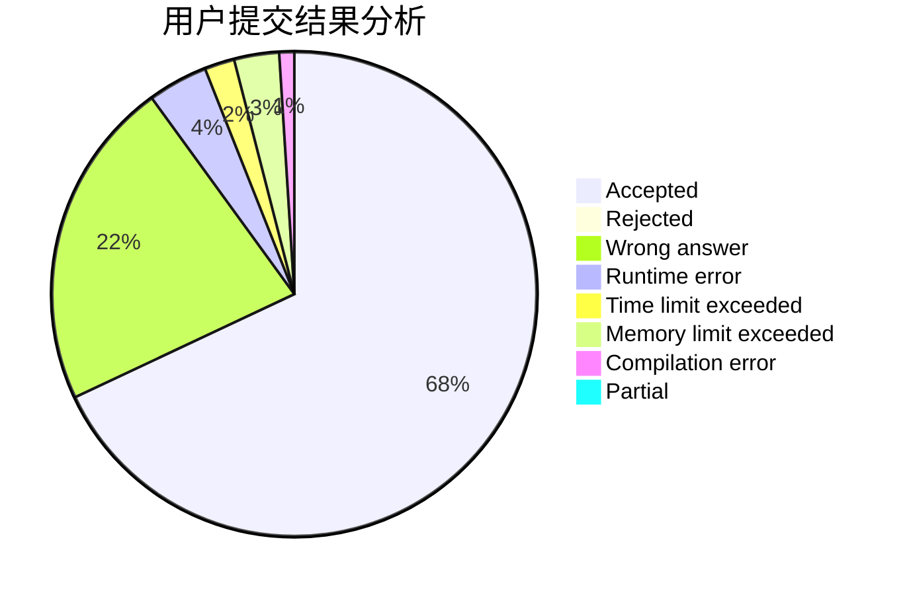
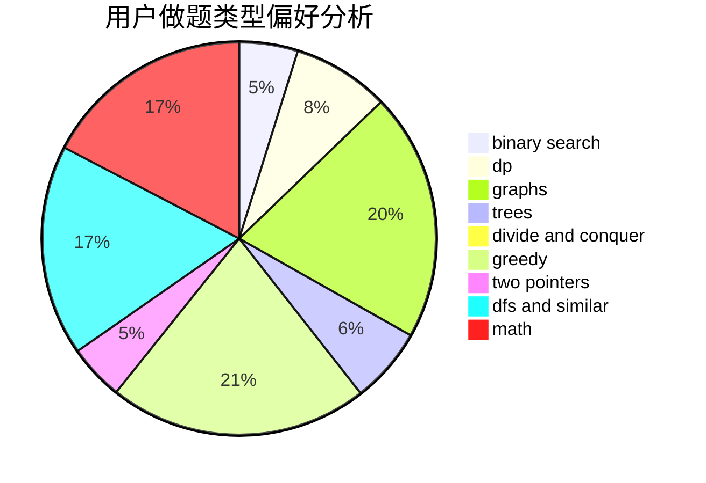

# 04lrw

<!-- tabs:start -->

#### **用户提交结果分析**

#### **用户做题类型偏好分析**

<!-- tabs:end -->
# 推荐题目
[1034A](https://codeforces.com/contest/1034/problem/A)
[1037H](https://codeforces.com/contest/1037/problem/H)
[1039B](https://codeforces.com/contest/1039/problem/B)
[1036B](https://codeforces.com/contest/1036/problem/B)
[1033F](https://codeforces.com/contest/1033/problem/F)
[1033G](https://codeforces.com/contest/1033/problem/G)
[1037C](https://codeforces.com/contest/1037/problem/C)
[1033E](https://codeforces.com/contest/1033/problem/E)
[1007A](https://codeforces.com/contest/1007/problem/A)
[1038D](https://codeforces.com/contest/1038/problem/D)
